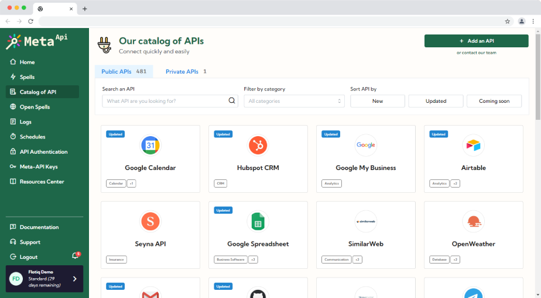

title: Flotiq and Meta-API integration | Flotiq docs
description: Use Flotiq and Meta-API to integrate your data with any API 

# What is Meta-API

[Meta-API](https://meta-api.io) is a platform for integrating and automating APIs. 
It uses a Connectors to represent API endpoint and a Spells to define automation and data exchange between Connectors. 
You can define workflows for data mixing predefined APIs. 

There are over 480 public APIs in Catalog, including popular apps like Gmail, Google Calendar,
Google Spreadsheet, Twitter, etc.

Integration with Meta-Api allows you to create better workflow with much easier volume of data exchange and implementation of business logic.

