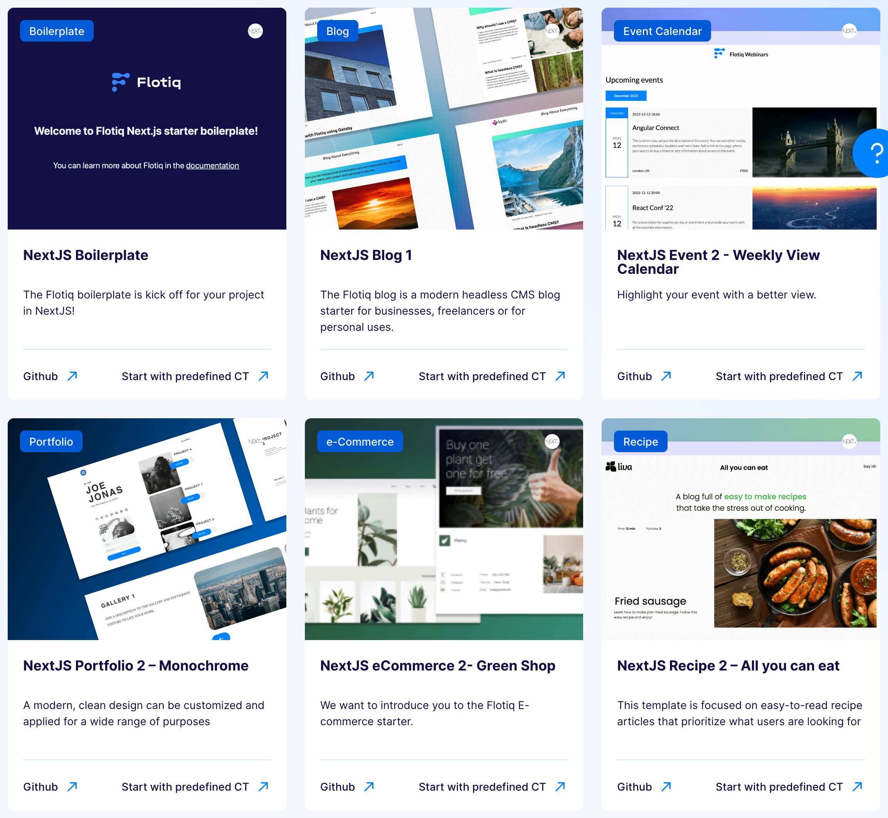

title: Flotiq NextJS starters | Flotiq docs
description: Jump-start your projects with React NextJS Starters.

# NextJS starters

{: .center .width75 .border}

Explore our specially crafted [starters](https://flotiq.com/starters/){:target="_blank"} designed to streamline your web development process. These starters are not only ready to use but also easily customizable to suit your unique requirements.

Preview each Next.js starter on our [GitHub](https://github.com/flotiq){:target="_blank"} to witness its functionality. Building it locally is a breeze with our step-by-step instructions.

This should save you some time in creating your website and help you create a visually appealing page. Additionally, we have created two versions of starters using Gatsby and NextJS - depending on which framework you prefer. This page is dedicated to NextJS starters. You can check out our Gatsby starters [here](../gatsby/).

Discover our range of starters [here](https://flotiq.com/starters/){:target="_blank"}.

## Starter for the blog 1

NextJS starter for creating a blog with Flotiq

{: .center .width75 .border}

[GitHub](https://github.com/flotiq/flotiq-nextjs-blog-1){:target="_blank"}

[Working example](https://flotiq-nextjs-blog.netlify.app){:target="_blank"}

## Starter for event calendar 2

NextJS Starter to display information about events from Flotiq Events with Calendars

{: .center .width75 .border}

[GitHub](https://github.com/flotiq/flotiq-nextjs-event-2){:target="_blank"}

[Working example](https://flotiq-nextjs-event-2.netlify.app){:target="_blank"}

## Starter for shop 2

A boilerplate repository to jumpstart your next e-commerce project, using Snipcart, Flotiq and Next.js.

{: .center .width75 .border}

[GitHub](https://github.com/flotiq/flotiq-nextjs-shop-2){:target="_blank"}

[Working example](https://flotiq-nextjs-shop-2.netlify.app){:target="_blank"}

## Starter for portfolio 2

A free, open-source, image-concentric starter for NextJS.

{: .center .width75 .border}

[GitHub](https://github.com/flotiq/flotiq-nextjs-portfolio-2){:target="_blank"}

[Working example](https://flotiq-nextjs-portfolio-2.netlify.app){:target="_blank"}

## Starter for recipe 2

A starter to build your own recipes page with Flotiq and NextJS.

{: .center .width75 .border}

[GitHub](https://github.com/flotiq/flotiq-nextjs-recipe-2){:target="_blank"}

[Working example](https://flotiq-nextjs-recipe-2.netlify.app/){:target="_blank"}

## Boilerplate for you

If you want to start from scratch with a prepared boilerplate, we have also created it for you.

{: .center .width75 .border}

[GitHub](https://github.com/flotiq/nextjs-starter-boilerplate){:target="_blank"}

[Working example](https://flotiq-nextjs-boilerplate.netlify.app/){:target="_blank"}

[Register to start your project today](https://editor.flotiq.com/register.html){: .flotiq-button}
