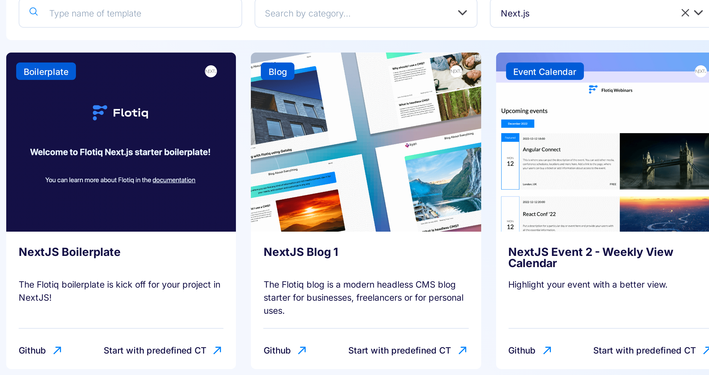
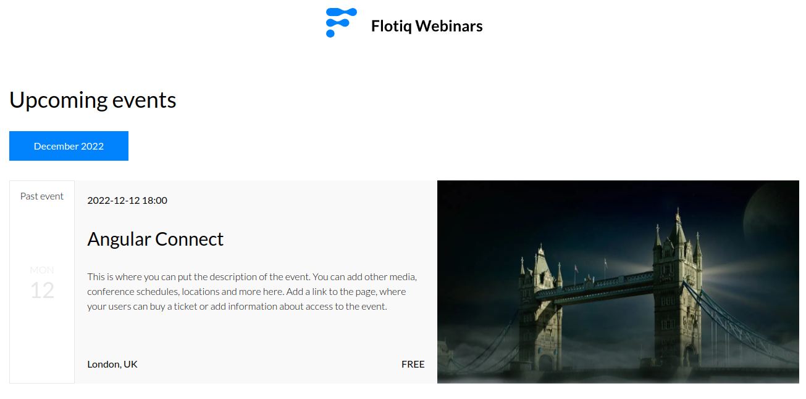
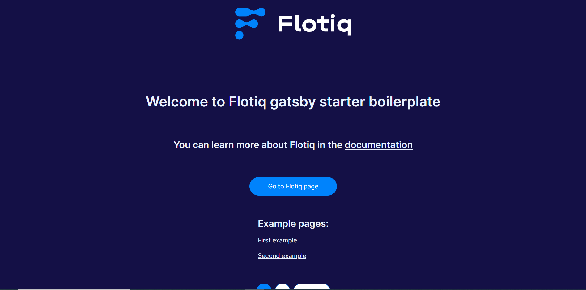

---
tags:
  - Developer
---

title: Flotiq NextJS starters | Flotiq docs
description: Jump-start your projects with React NextJS Starters.

# NextJS starters

{: .center .width75 .border}

Explore our specially crafted [starters](https://flotiq.com/starters/){:target="_blank"} designed to streamline your web development process. These starters are not only ready to use but also easily customizable to suit your unique requirements.

Preview each Next.js starter on our [GitHub](https://github.com/flotiq){:target="_blank"} to witness its functionality. Building it locally is a breeze with our step-by-step instructions.

This should save you some time in creating your website and help you create a visually appealing page. Additionally, we have created two versions of starters using Gatsby and NextJS - depending on which framework you prefer. This page is dedicated to NextJS starters. You can check out our Gatsby starters [here](../gatsby/).

On top of using a starter that is ready to kick-start your project development, we recommend adding **Flotiq Node.js integration and SDK**. More on that in [Flotiq SDK section](#flotiq-sdk).

Discover our range of starters [here](https://flotiq.com/starters/){:target="_blank"}.

## Starter for the blog 1

NextJS starter for creating a blog with Flotiq

{: .center .width75 .border}

[GitHub](https://github.com/flotiq/flotiq-nextjs-blog-1){:target="_blank"}

[Working example](https://flotiq-nextjs-blog.netlify.app){:target="_blank"}

## Starter for event calendar 2

NextJS Starter to display information about events from Flotiq Events with Calendars

{: .center .width75 .border}

[GitHub](https://github.com/flotiq/flotiq-nextjs-event-2){:target="_blank"}

[Working example](https://flotiq-nextjs-event-2.netlify.app){:target="_blank"}

## Starter for shop 2

A boilerplate repository to jumpstart your next e-commerce project, using Snipcart, Flotiq and Next.js.

{: .center .width75 .border}

[GitHub](https://github.com/flotiq/flotiq-nextjs-shop-2){:target="_blank"}

[Working example](https://flotiq-nextjs-shop-2.netlify.app){:target="_blank"}

## Starter for portfolio 2

A free, open-source, image-concentric starter for NextJS.

{: .center .width75 .border}

[GitHub](https://github.com/flotiq/flotiq-nextjs-portfolio-2){:target="_blank"}

[Working example](https://flotiq-nextjs-portfolio-2.netlify.app){:target="_blank"}

## Starter for recipe 2

A starter to build your own recipes page with Flotiq and NextJS.

{: .center .width75 .border}

[GitHub](https://github.com/flotiq/flotiq-nextjs-recipe-2){:target="_blank"}

[Working example](https://flotiq-nextjs-recipe-2.netlify.app/){:target="_blank"}

## Boilerplate for you

If you want to start from scratch with a prepared boilerplate, we have also created it for you.

{: .center .width75 .border}

[GitHub](https://github.com/flotiq/nextjs-starter-boilerplate){:target="_blank"}

[Working example](https://flotiq-nextjs-boilerplate.netlify.app/){:target="_blank"}

[Register to start your project today](https://editor.flotiq.com/register?plan=1ef44daa-fdc3-6790-960e-cb20a0848bfa){: .flotiq-button}

# Flotiq SDK

The Flotiq SDK is a powerful tool designed to simplify the integration of Flotiq content into your Next.js projects. It provides an auto-generated, type-safe API client tailored to your specific content types, allowing you to focus on building your application rather than dealing with low-level API requests.

## Installing Flotiq SDK

The best way to install the Flotiq SDK for your Next.js project is to use our flotiq-nextjs-setup CLI, which will automatically generate SDK for your content and integrate it in your project, add content cache revalidation endpoint, handle draft mode for unpublished content on Flotiq and more.

On how to setup Flotiq Next.js integration with the flotiq-nextjs-setup CLI refer to our [page about integrating Flotiq and Next.js with CLI](/docs/Universe/nextjs/nextjs-setup.md#flotiq-nextjs-setup).

If you prefer to just install Flotiq SDK and handle everything else by yourself, refer to the [Flotiq SDK page](/docs/API/generate-package.md).
