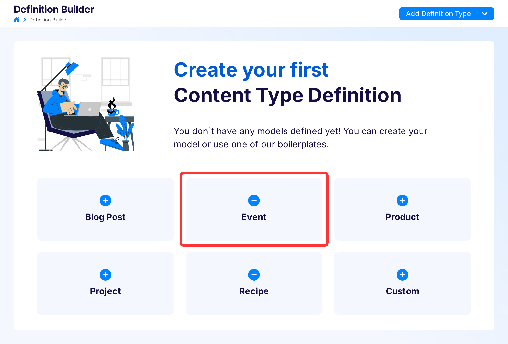
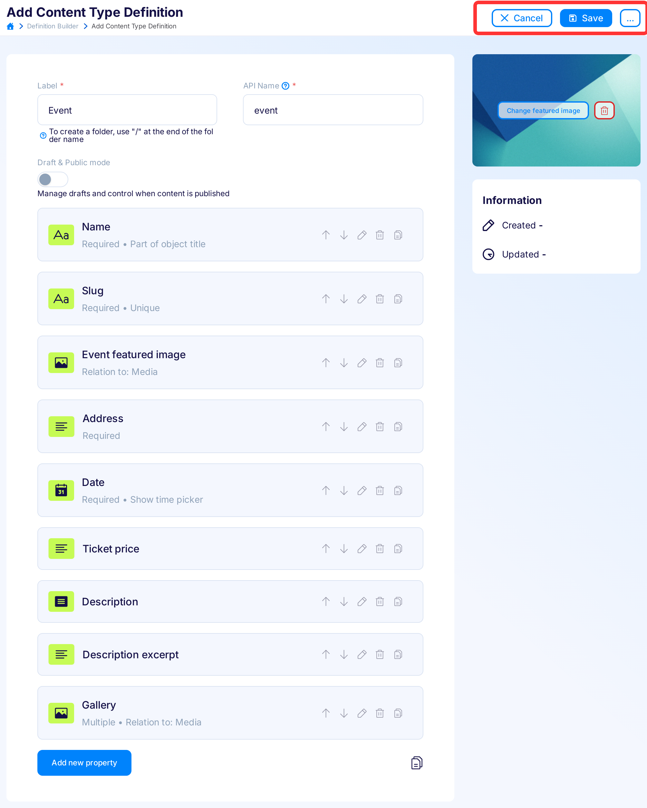
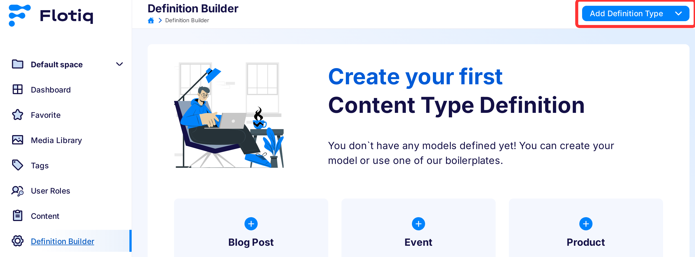
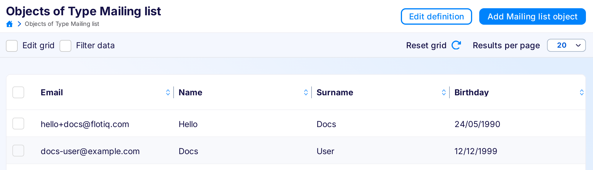
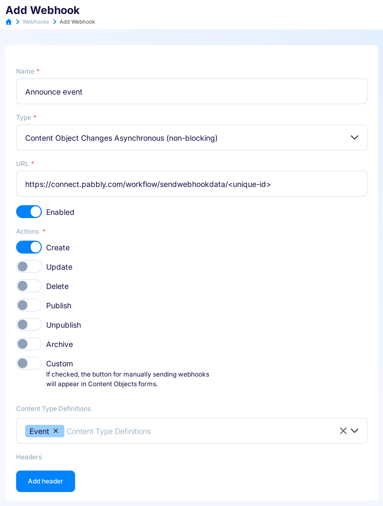
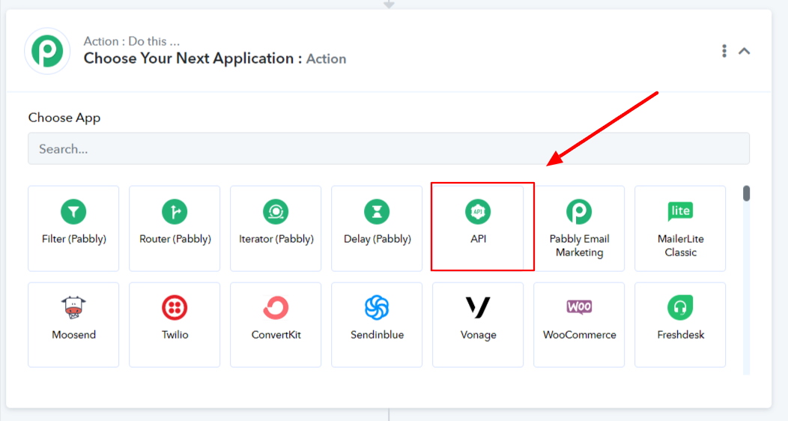

title: Flotiq Pabbly integration | Flotiq docs
description: Flotiq allows you to integrate your content with any system easily.

# Flotiq and Pabbly integration

## Introduction

For the purposes of this tutorial, we will create a pipeline that sends an email with the invitation for new event, when
a new event is created. We will store the email list and the list of events in Flotiq cms.
Unfortunately there is no dedicated Pabbly Connect trigger for Flotiq yet, so in this tutorial we will use Pabbly
webhook trigger with [Flotiq custom webhooks](https://flotiq.com/docs/panel/webhooks/){target="_blank"}.

## Preparation

To start working on the sample integration of Flotiq with Pabbly Connect we need to start by creating two CTDs (content
type definitions) and some sample COs (content objects)

Let's start by preparing the CTD `Event`. This CTD is one of the blueprints we have predefined, so all you have to do is
select it from the list and the CTD will be created automatically

{: .center .width75 .border}

There is nothing left to do but save our CTD for the event and move on to the next step. Don’t forget to Save your
changes.

{: .center .width75 .border}

Now we will create a CTD for the mailing list from which we will take the email addresses to which we will send our
invitations.

{: .center .width75 .border}

We will store the email, first name, last name, and date of birth on our mailing list. After creating all the fields, click "
Save".

{: .center .width75 .border}

Now, let's add some test COs to our mailing list. We've also included a line with the data to facilitate testing whether
the correct invitation emails will arrive in the inbox.

{: .center .width75 .border}

## Creating pipeline

We've successfully prepared the most basic elements on the Flotiq side. Now, let's proceed to setting up the workflow in
Pabbly Connect.

After creating an account, navigate to the dashboard and click on 'Create Workflow'.

{: .center .width75 .border}

Choose a name for your workflow and click "Create"

{: .center .width75 .border}

Now we have to choose a trigger for our workflow, in our case it will be a Webhook because Flotiq can generate a webhook
when creating a new object (in our case an event) to which we want to send invitations to people from the mailing list.

{: .center .width75 .border}

Then select the "Catch Webhook" option:

{: .center .width75 .border}

Now, it's important to save the 'Webhook URL' generated by Pabbly because we will need it when setting up the webhook in
Flotiq.

{: .center .width75 .border}

### Creating webhook in Fltoiq

Webhooks are a way to notify external systems when a specific event happens in Flotiq. They enable seamless integrations
with a wide range of other systems by triggering actions based on defined events.

!!! note
    Read more about webhook in [Flotiq documentation](https://flotiq.com/docs/panel/webhooks/){target="_blank"}

The purpose of this tutorial is to prepare a workflow in Pabbly Connect that will send emails to the mailing list every
time a new event is created in Flotiq. The ideal choice to inform Pabbly about the creation of a new CO will be
async-co-webhook, more details about async-co-webhook can be
found [in Flotiq Documentation](https://flotiq.com/docs/panel/webhooks/async-co-webhook/){target="_blank"}

To create a webhook go to `Webhooks` -> `Add new Webhook`. Enter a name, in our case it will be "announce event", as a
webhook type select "Content Object Changes Asynchronus (non blocking)". Then as the URL, paste the previously copied
from Pabbly Connect webhook "URL", enable it and select the "Create" event and as Content Type Definition select CTD "
Event", and press save.

{: .center .width75 .border}

Now create some dummy Event object in Flotiq and go to Pabbly Connect, you should see a table with data sent with
webhook similar to the one in the screenshot, and then press save.

{: .center .width75 .border}

## Getting mailing list

Now we need to retrieve data from our mailing list from Flotiq, to do this as the next step of our workflow in Pabbly
Connect we need to select "API"

{: .center .width75 .border}

Then select "Execute API request":

{: .center .width75 .border}

Select GET as action and in "endpoint URL" type "https://api.flotiq.com/api/v1/content/mailing_list" if you named CTD
with mailing list differently than in the guide you need to adjust the URL to your name, you can read how to do
it [Flotiq Documentation](https://flotiq.com/docs/API/content-type/listing-co/){target="_blank"}

{: .center .width75 .border}

Now we need to add a header with a read-only API key from Flotiq. How to generate it you can
read [in Flotiq Documentation](https://flotiq.com/docs/API/?h=api+key#application-api-keys){target="_blank"},
then we need to uncheck the "Simple Response" option and press “Save & Send Test Request".

{: .center .width75 .border}

If everything went according to plan you should see such a data table:

{: .center .width75 .border}

Then, in order to process the data returned by the Flotiq API and send an email to everyone on that list, we need to
add another element to our workflow, which will be an iterator.

{: .center .width75 .border}

Then select "Process Array":

{: .center .width75 .border}

Next, in "Choose Array" select the array labeled "Data[]" (this option should be selected automatically), Then press "
Save & Send test request". 

{: .center .width75 .border}

If everything went well then you should see a table with data as in the screenshot:

{: .center .width75 .border}

## Sending emails

Now there is nothing left to do but to go to the last step of our workflow which will be sending emails. to do this,
we select "Gmail" from the list of applications. 

{: .center .width75 .border}

Then, from the list of actions, select "Send Email".

{: .center .width75 .border}

Click "Connect With Gmail" then you will need to log into the google account from which you want to send emails.

{: .center .width75 .border}

Now, we will proceed to the configuration of the email to be sent. It's important to select personal data such as email,
first name, and last name from the 'Iterator' sub-tab. Otherwise, all emails will be sent to the same person.

{: .center .width75 .border}

You can fill in these fields as you see fit:

{: .center .width75 .border}

!!! note 
    It's important that data for the event itself, such as Excerpt, Location, Ticket Price, etc., 
    be selected from the 'Catch Webhook' tab.

{: .center .width75 .border}

Now, simply press 'Save & Send test request', then head over to Flotiq and create a new Content Object of type Event.
After that, wait a moment for the email to be sent.

{: .center .width75 .border}

## Conclusion
Now, you have the opportunity to expand your workflow by sending an email with a price reduced by half for individuals
under 18 years old.

Additionally, you can enhance the webhook with update actions to send emails containing information about changes,
such as price or venue. The integration of Flotiq CMS with Pabbly Connect provides great opportunities to automate 
many tasks.