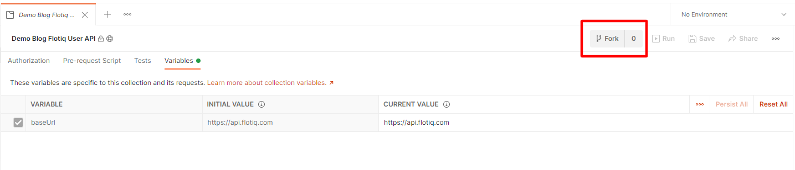
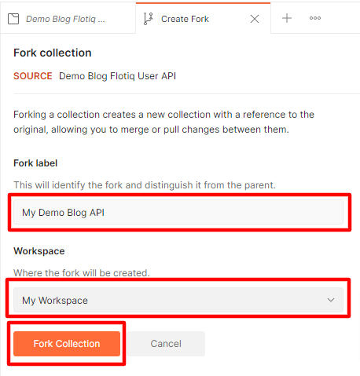
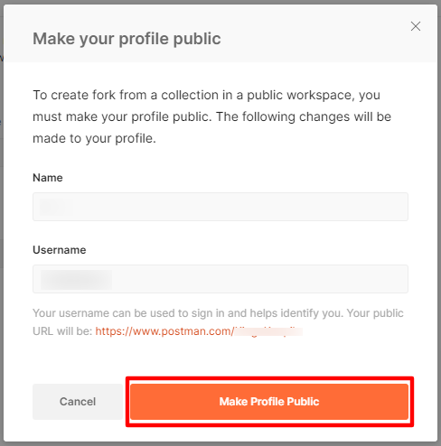
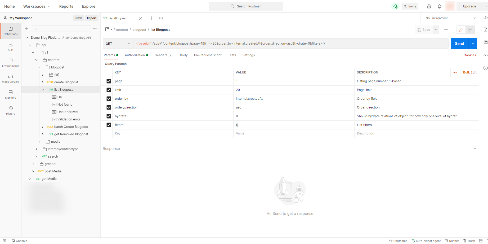

title: Flotiq Postman Sandbox Packages | Flotiq docs
description: Flotiq allows you to check how will your API looks like using Postman Public Workspaces.

# Postman Sandbox Packages

Flotiq provides Sandbox Postman Packages through Postman Public Workspaces you can see them all on [Postman Flotiq team page](https://www.postman.com/flotiq).

We provide demo packages for:

* [Blog](https://www.postman.com/flotiq/workspace/flotiq-public-workspace/collection/10599962-f1e408cb-a0fe-45b2-923e-d8d0ec7423bc?ctx=documentation)
* [Events Calendar](https://www.postman.com/flotiq/workspace/flotiq-public-workspace/collection/10599962-efcba1cd-a84c-452e-a4d5-eafb877bd2dd?ctx=documentation)
* [Products](https://www.postman.com/flotiq/workspace/flotiq-public-workspace/collection/10599962-518022c4-fc97-494a-b5d3-a8bb73487b97?ctx=documentation)
* [Projects Portfolio](https://www.postman.com/flotiq/workspace/flotiq-public-workspace/collection/10599962-e4ee6116-462a-4e86-b368-669876c1f25d?ctx=documentation)
* [Recipes](https://www.postman.com/flotiq/workspace/flotiq-public-workspace/collection/10599962-798f395f-6e56-477e-956b-bc9ec93fae42?ctx=documentation)

You can try it all by forking the API to your Postman account:
{: .center .width75 .border}

You have to specify the name of the collection, and to which workspace it should land when all is in place:
{: .center .border}

After clicking `Fork Collection` if your profile is not yet public, you have to make it public by clicking `Make Profile Public`:
{: .center .border}

Now you should have our Sandbox Package available to send requests from Postman page or from Postman app:
{: .center .width75 .border}

!!! warning
We provide Read-Only API key in our Sandbox Packages, so only `GET` and `GraphQL` requests will work, `POST`, `PUT` and `DELETE` request will all return `403 Unauthorized` response.

!!! hint
If you experience CORS errors while using Postman page, you need to install Postman agent as described in [this Postman article](https://blog.postman.com/introducing-the-postman-agent-send-api-requests-from-your-browser-without-limits/).

    Shortcuts:
    
    * Download the Postman agent for macOS [here](https://dl.pstmn.io/download/channel/agent_stable/osx).
    * Download the Postman agent for Linux [here](https://dl.pstmn.io/download/channel/agent_stable/linux).
    * Download the Postman agent for Windows 64-bit [here](https://dl.pstmn.io/download/channel/agent_stable/win64).
    * Download the Postman agent for Windows 32-bit [here](https://dl.pstmn.io/download/channel/agent_stable/win32).

[Register to send all requests with your own API today](https://editor.flotiq.com/register.html){: .flotiq-button}
