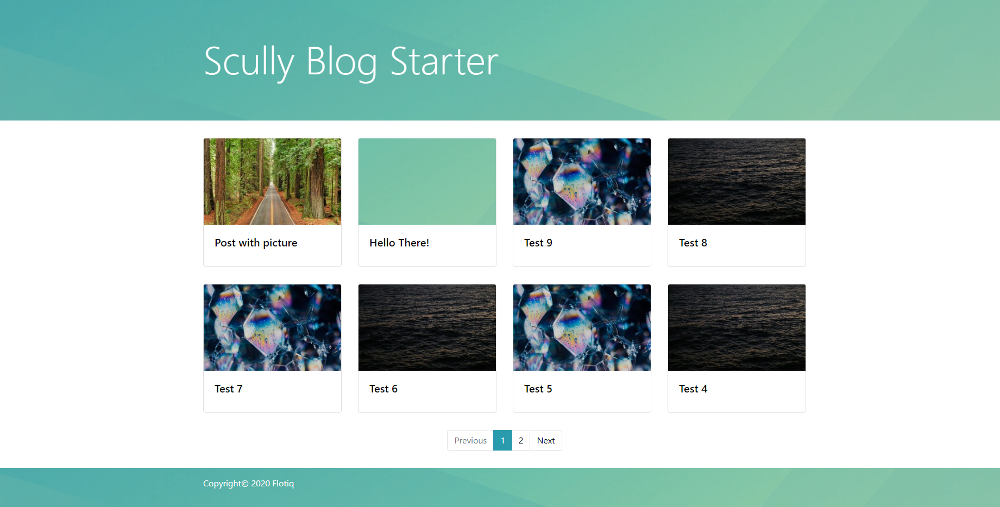
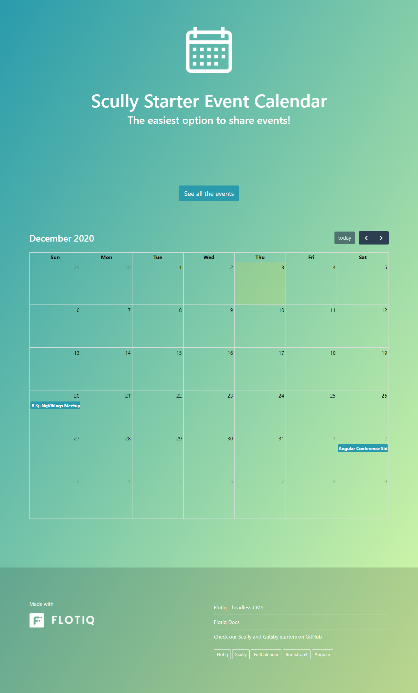
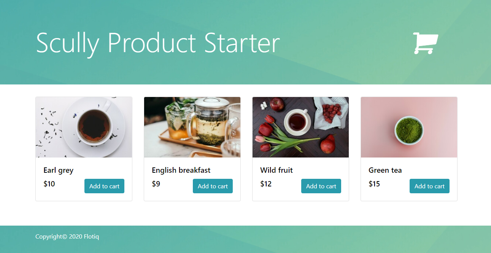
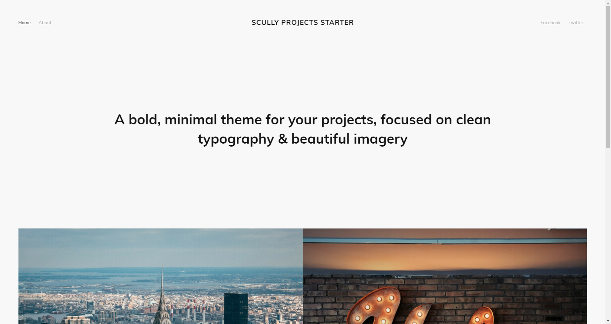
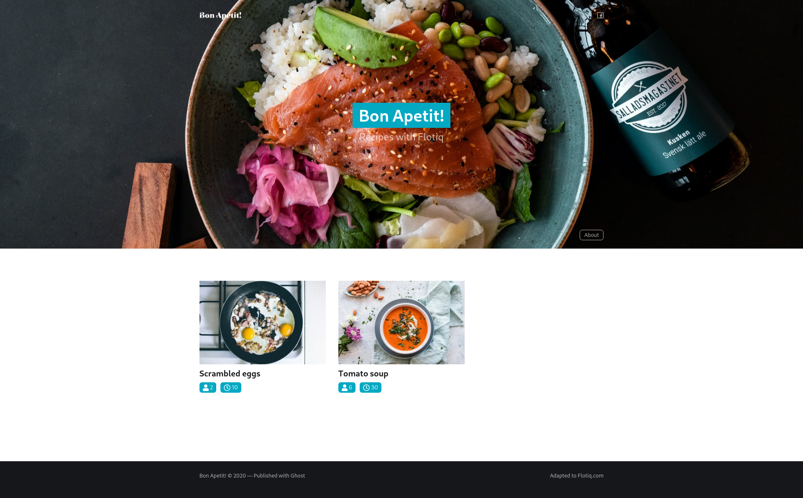

title: Flotiq Scully starters | Flotiq docs
description: Jump-start your projects with Angular Scully Starters.

<a href="/">Docs</a> / <a href="/Universe/">Flotiq Universe</a> / <a href="/Universe/scully/">Scully</a>

# Scully starters

Scully is a static page generator using Angular.

## Starter for the simple blog

Scully starter for creating a blog with Flotiq

{: .center .width75 .border}

[GitHub](https://github.com/flotiq/scully-blog-starter){:target="_blank"}

[Working example](https://thirsty-hoover-9327b3.netlify.app/){:target="_blank"}

## Starter for event calendar

Scully starter for creating an events calendar with Flotiq

{: .center .width75 .border}

[GitHub](https://github.com/flotiq/scully-event-calendar-starter){:target="_blank"}

[Working example](https://awesome-sammet-8accee.netlify.app/){:target="_blank"}

## Starter for products

E-commerce starter for Flotiq with Angular and Scully

{: .center .width75 .border}

[GitHub](https://github.com/flotiq/scully-products-starter){:target="_blank"}

[Working example](https://competent-visvesvaraya-bb732c.netlify.app/){:target="_blank"}

## Starter for projects

Scully starter for creating a projects portfolio with Flotiq

{: .center .width75 .border}

[GitHub](https://github.com/flotiq/scully-projects-starter){:target="_blank"}

[Working example](https://angry-brattain-f446a1.netlify.app/){:target="_blank"}

## Starter for recipes

Beautiful recipes website boilerplate project using Scully and Flotiq

{: .center .width75 .border}

[GitHub](https://github.com/flotiq/scully-recipes-starters){:target="_blank"}

[Working example](https://vibrant-mclean-8da635.netlify.app/){:target="_blank"}

[Register to start your project today](https://editor.flotiq.com/register.html){: .flotiq-button}
