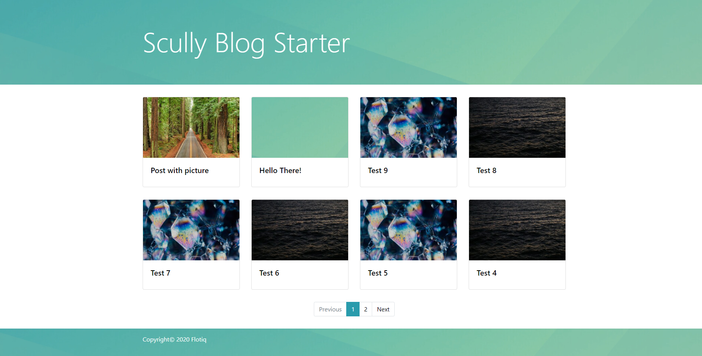
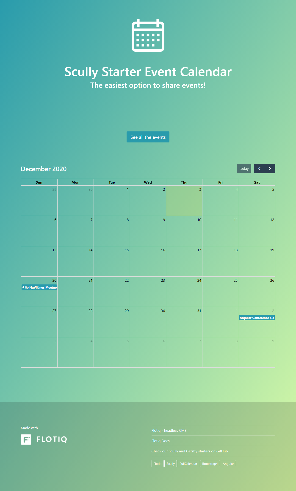
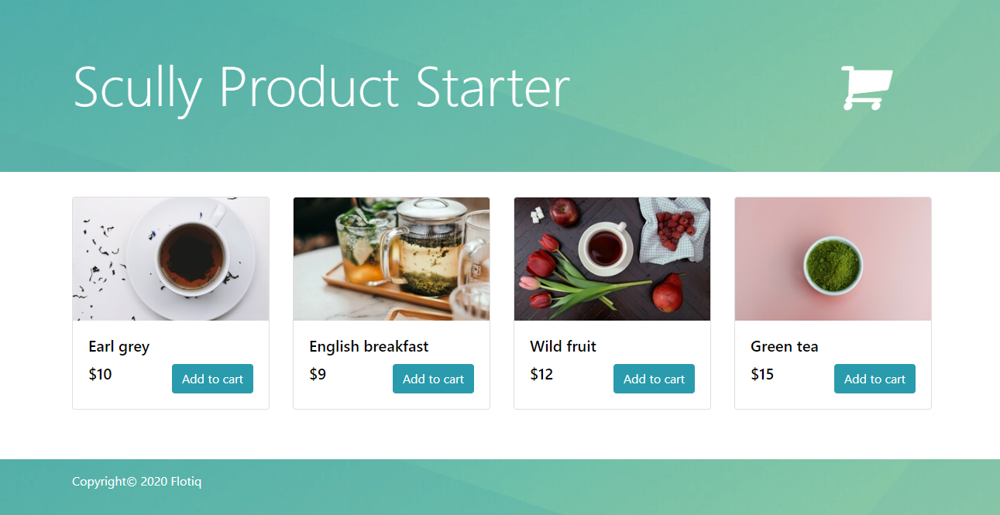
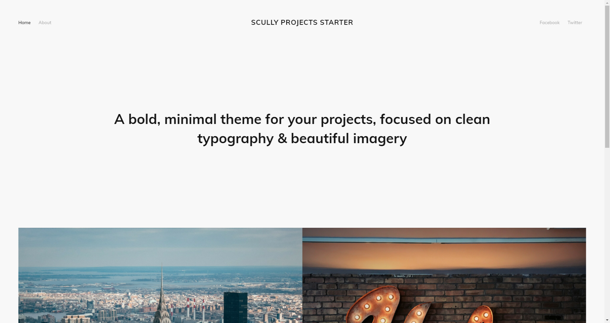
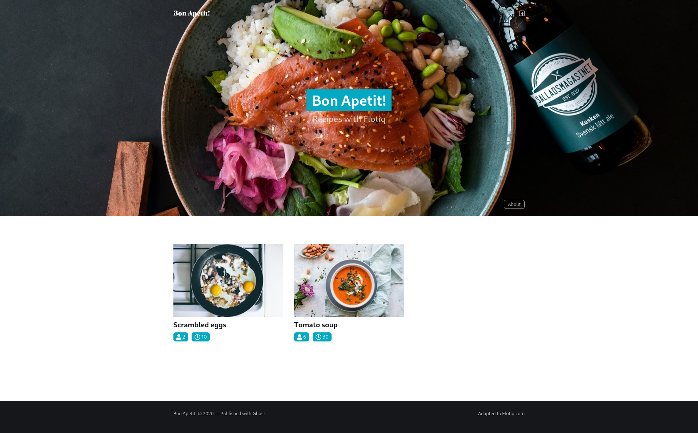

---
tags:
  - Developer
---

title: Flotiq Scully starters (legacy) | Flotiq docs
description: Scully starters are no longer supported. Use Next.js starters for active support.

# Scully starters

!!! warning
    Scully starter projects are no longer supported.
    Use the [Next.js starters](/docs/Universe/nextjs/nextjs-starters/) for active support.

Scully is a static page generator using Angular.

## Starter for the simple blog

Scully starter for creating a blog with Flotiq

{: .center .width75 .border}

[GitHub](https://github.com/flotiq/scully-blog-starter){:target="_blank"}

## Starter for event calendar

Scully starter for creating an events calendar with Flotiq

{: .center .width75 .border}

[GitHub](https://github.com/flotiq/scully-event-calendar-starter){:target="_blank"}

## Starter for products

E-commerce starter for Flotiq with Angular and Scully

{: .center .width75 .border}

[GitHub](https://github.com/flotiq/scully-products-starter){:target="_blank"}

## Starter for projects

Scully starter for creating a projects portfolio with Flotiq

{: .center .width75 .border}

[GitHub](https://github.com/flotiq/scully-projects-starter){:target="_blank"}

## Starter for recipes

Beautiful recipes website boilerplate project using Scully and Flotiq

{: .center .width75 .border}

[GitHub](https://github.com/flotiq/scully-recipes-starter){:target="_blank"}

[Register to start your project today](https://editor.flotiq.com/register?plan=1ef44daa-fdc3-6790-960e-cb20a0848bfa){: .flotiq-button}
