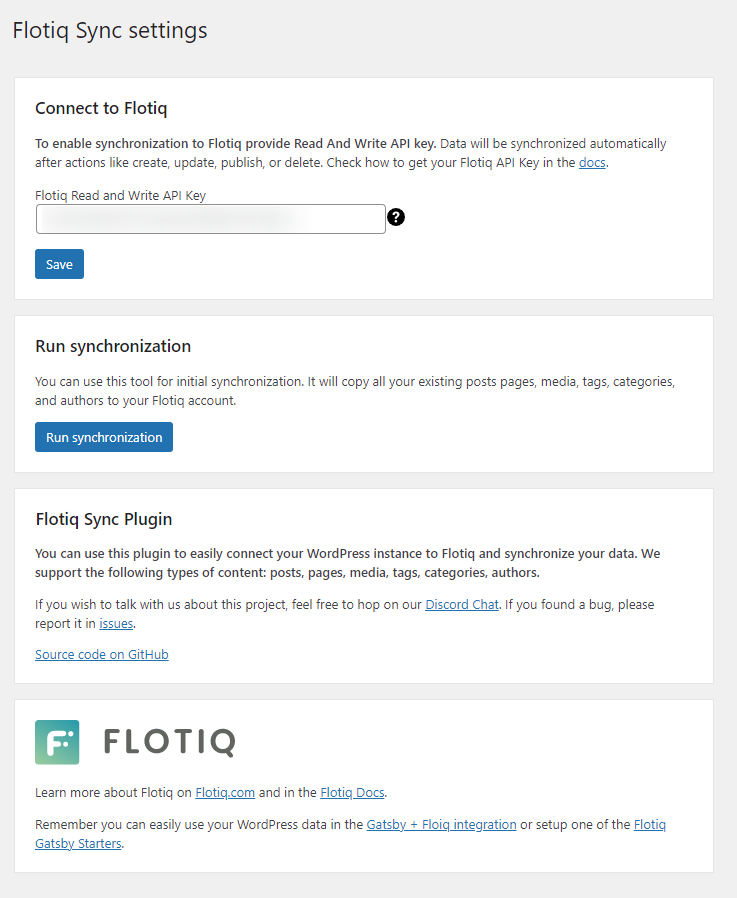
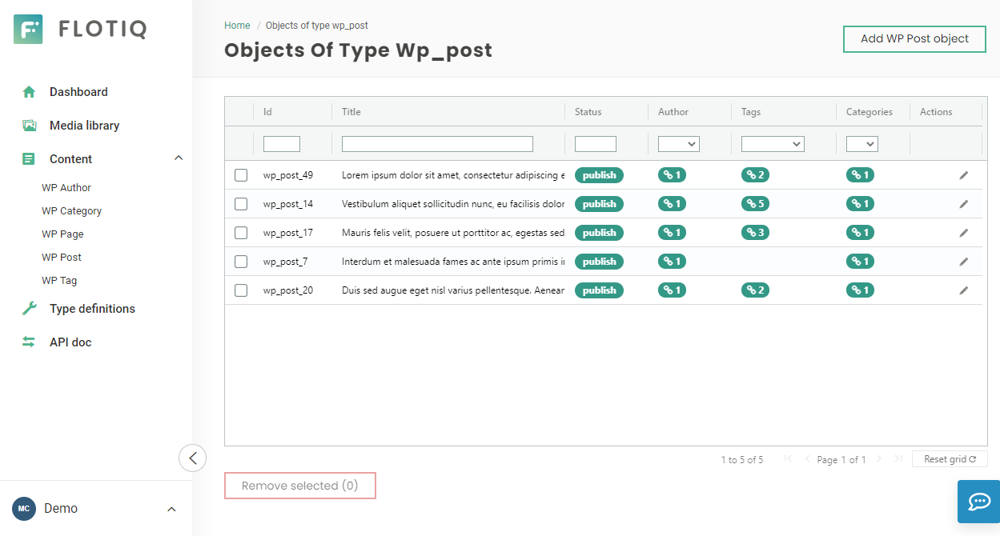
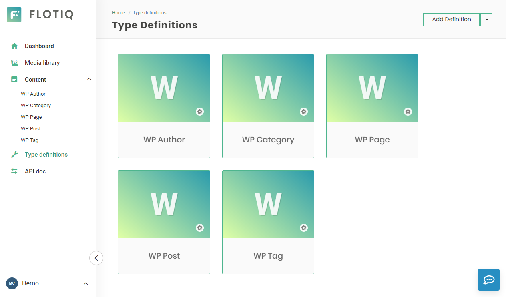

title: Flotiq WordPress sync plugin | Flotiq docs
description: Move your WordPress content pain-free to Flotiq

<a href="/">Docs</a> / <a href="/Universe/">Flotiq Universe</a> / <a href="/Universe/wordpress/">WordPress</a>

# WordPress Flotiq sync plugin

Use this [WordPress plugin](https://wordpress.org/plugins/flotiq-sync/) to connect your WordPress instance to Flotiq easily and synchronize your data.

The purpose of this plugin is to let you fill your Flotiq account with your WordPress data.
Thanks to this, you can take advantage of WordPress and dive into the Flotiq universe.
We support automatic synchronization of the following types of content: posts, pages, media, tags, categories, authors.

Flotiq store a copy of your data (posts, pages, media, tags, categories and authors) in your account.
Your data will remain private. The plugin does not affect your data stored in WordPress.

## Installation

1. Upload the plugin to your blog.
2. Activate it.
3. Go to the Settings > Flotiq Sync.
4. Provide your Flotiq Read and Write API key.
5. Click the `Run synchronization` button.

{: .center .width75 .border}

Now your existing data will be synchronized to your Flotiq account.

{: .center .width75 .border}

## Which data will be synchronized?

We support the following types of content: posts, pages, media, tags, categories, authors.

{: .center .width75 .border}

## Plugin details

* Requires at least: 5.0 WordPress version
* Tested up to: 5.7 WordPress version
* Requires PHP: 7.0
* Stable Tag: 1.0.3
