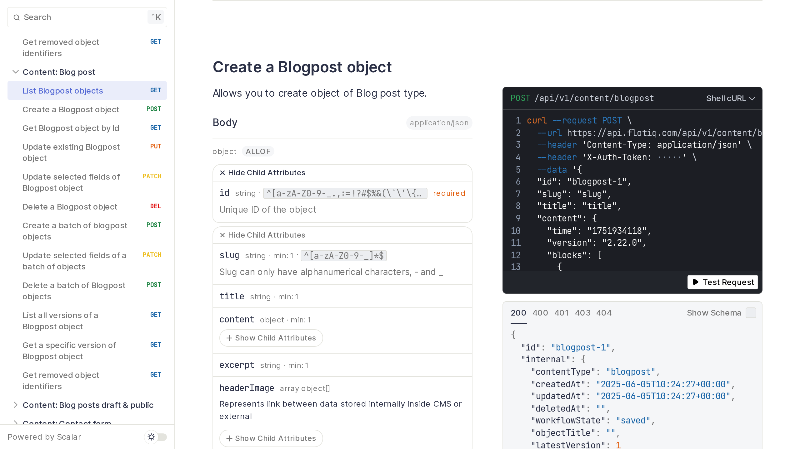

# Home

Welcome to Flotiq Documentation.

Here you will find everything you need to know about Flotiq.
Let's start right away with a quick tour of the essential elements you will need to work with the system.

## API keys

Everything you can see and do with your content in the Flotiq UI is also available through the API. Each Flotiq account has 2 API keys assigned to id - a read-write key and a read-only key. Both are accessible in the User profile view. As a best practice we recommend you start with the read-only and only plug-in the read-write key in case you make data modifications.

Read more in the [API description](API/index.md).

## Type definitions

Also referred to as Content Type Definitions - are the key part of the system, where you - the user - describe the content you will be storing in Flotiq. The Content Type builder is the tool we provide for you to easily define your Content Types, using a graphical User Interface. Type Definitions are like classes in object-oriented programming, they describe object properties. 

Read more about how to use the Content Type editor in the [Panel docs](panel/content-types)

You can also create and modify your Content Type Definitions using the API, please head to the [API description](API/index.md) for more information.

## Content Objects

For each Content Type you define - you can store multiple Content Objects. You can access these entries from the application sidebar and create new entries via the provided forms, which are automatically generated, based on the Content Type Definition you built. You can also work with your content in multiple ways through the API, please head to the [API description](API/index.md) for more information.

## Dynamic Content API

Flotiq does not force you to learn your API, instead we let you define it. Whenever you create or modify a Content Type - it will be automatically reflected in your API. On top of that - we provide beautiful API docs, SDKs and Postman collection - all based on your very own Content API. 

Read more in [Dynamic Content API](API/dynamic-content-api) section.