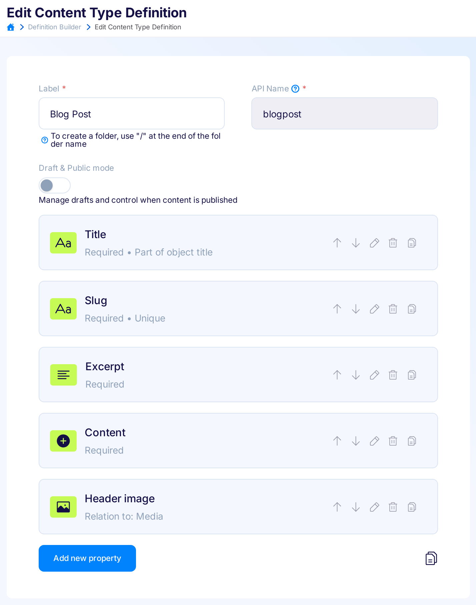

title: Flotiq Developers Documentation
description: Headless CMS documentation, tutorials, frameworks, API references, Deep Dives, plugins and integrations.

# Home

Welcome to Flotiq Documentation.

Here you will find everything you need to know about Flotiq. The documentation is organized into several sections:

- [API](API/get-started.md) - essential information about accessing Flotiq's APIs,
- [Dashboard](panel/index.md) - a quick overview of the most important features of the user interface,
- [SDK](SDK/overview.md) - explains how to use the Flotiq SDK in various programming languages,
- [CLI](CLI/index.md) - an introduction to the Flotiq CLI application and its basic use cases,
- [Flotiq Universe](Universe/overview.md) - details Flotiq integrations and tools that can be used with the Flotiq API,
- [Deep dives](Deep-Dives/index.md) - a collection of tutorials and technical documents that explore specific scenarios in depth.

## What is Flotiq?

Flotiq is an API-first content management platform. It allows you to design your own content types and automatically generates supporting API, documentation, SDKs and Postman collection that help you work with your content in any language you choose. Flotiq's aim is to make you work comfortably with your content. That's why we provide a rich set of integrations and support for different languages in order to let you work how you like. 

## How is Flotiq different from other systems?

Flotiq is one of popular headless content management systems, sharing many similiarities with tools like [Strapi](https://strapi.io), [Sanity](https://sanity.io), [Contentful](https://contentful.com) and others. There are, however, several important differences:

1. we want you to be able to use your data easily regardless of the size of your business or dataset by providing easy ways to immediately prototype, publish and share your APIs,
2. being partly an API design tool we let you define your own RESTful API based on the data model you define (read more about the [Dynamic Content API](API/dynamic-content-api.md) concept),
3. we offer native support for the OpenAPI standard to open up your content to thousands of possible integrations
4. we provide a fully managed, hosted platform backed by a professional 24/7 support
5. we are not an open-source solution, but we generously give back to the community by publishing tools, website boilerplates, etc. using a permissive MIT license
6. we natively support a powerful full-text search engine that allows you to build sophisticated systems which require fuzzy search, search result ranking or aggregation.

## Getting started with Flotiq

There are 2 primary ways to interact with Flotiq: 1. through the [user interface (dashboard)](panel/) and 2. through the [APIs](API/) we provide (RESTful and GraphQL). Whichever way you choose - when working with the system you will interact with 2 kinds of entities - 1. ones that define your **data model** and 2. ones that constitute your actual **data**.

### Data model

Data model in Flotiq is created by adding one or more Content Type Definitions (we often refer to them as CTDs). CTDs are a key part of the system, where you - the user - describe the content (data model) you will be storing in Flotiq. The [Content Type builder](panel/content-types.md) is the tool we provide for you to easily define your Content Types, using a graphical User Interface. Type Definitions are like classes in object-oriented programming, they describe object properties. 

{.center .width50 .border}

Read more about how to use the Content Type editor in the [Panel docs](panel/content-types.md)

You can also create and modify your Content Type Definitions using the API, please head to the [API description](API/index.md) for more information.

### Content Objects

For each Content Type you define - you can store multiple Content Objects, this is the data you add to the system. You can access these entries from the application sidebar and create new entries via the [provided forms](panel/ContentObjects/content-objects.md), which are automatically generated, based on the Content Type Definition you built. You can also work with your content in multiple ways through the API, please head to the [API description](API/index.md) for more information.

### Dynamic Content API

Flotiq does not force you to learn your API, instead we let you define it. Whenever you create or modify a Content Type - it will be automatically reflected in your API. On top of that - we provide beautiful API docs, SDKs and Postman collection - all based on your very own Content API. 

Read more in [Dynamic Content API](API/dynamic-content-api.md) section.
