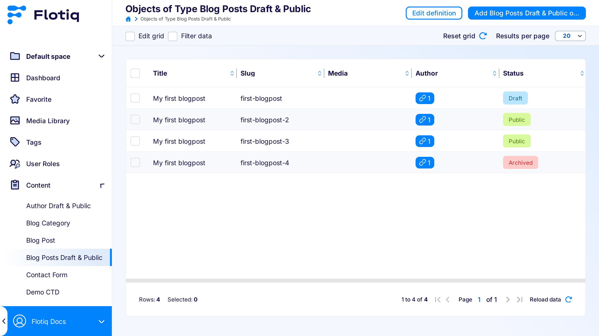
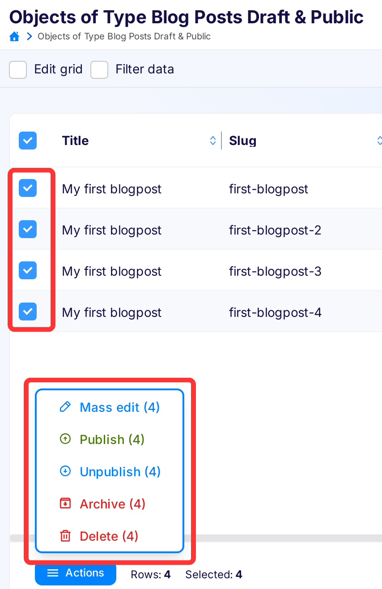
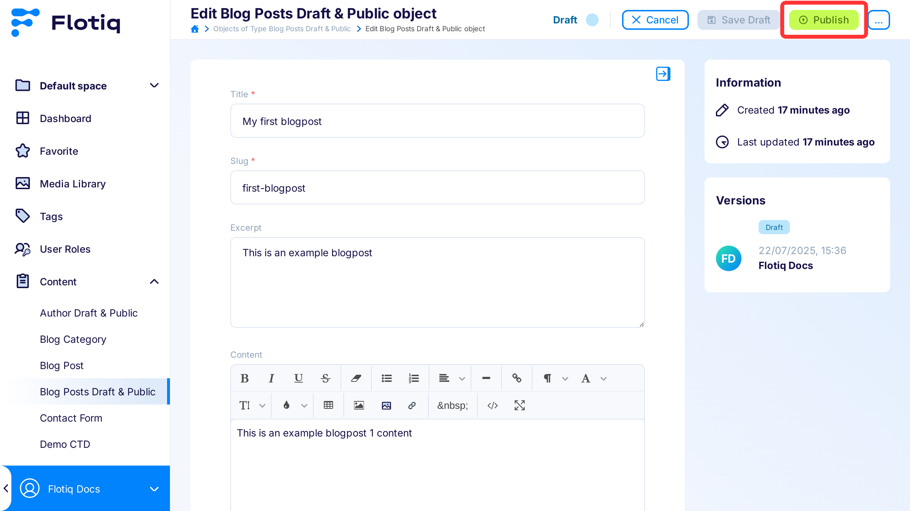
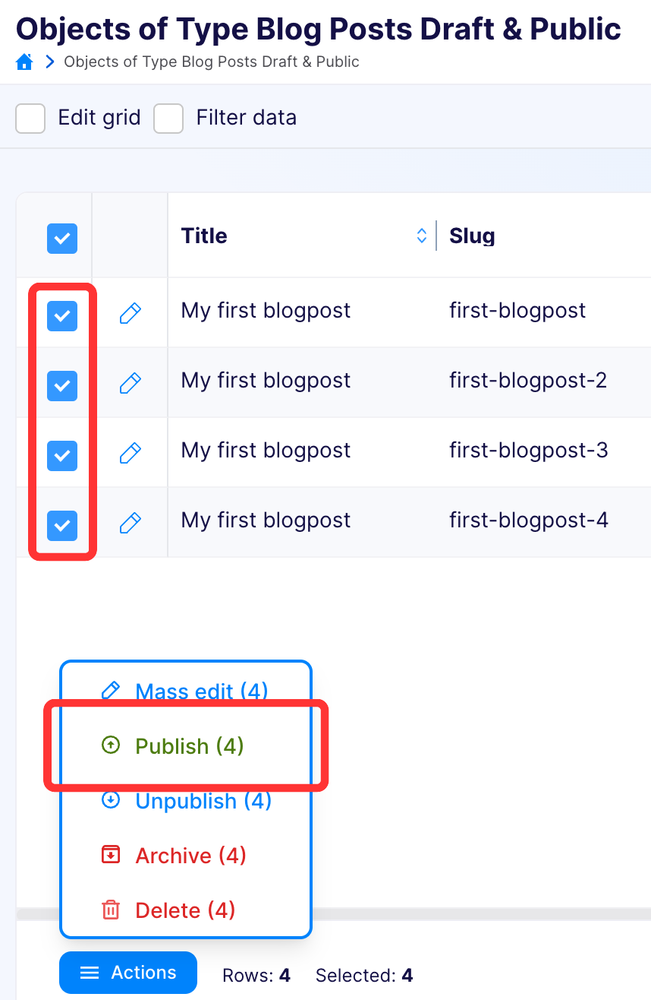
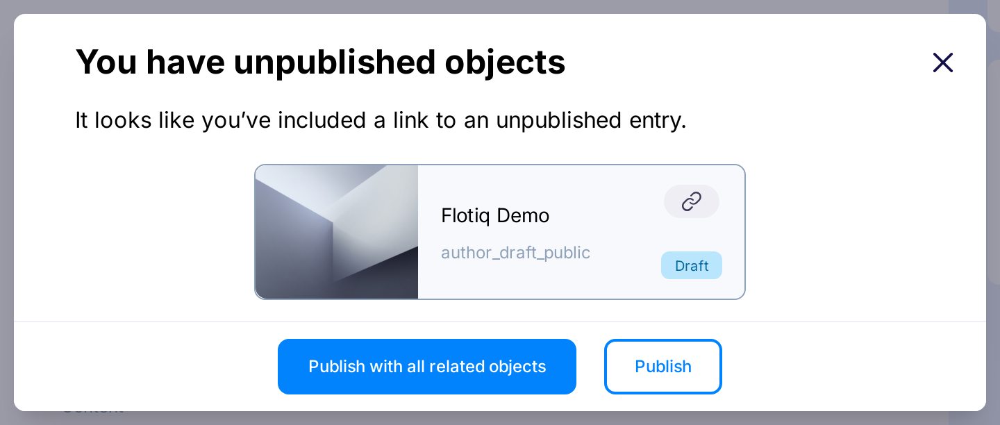
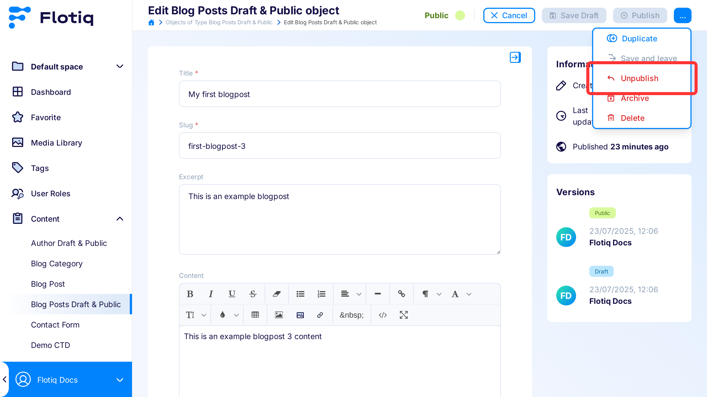
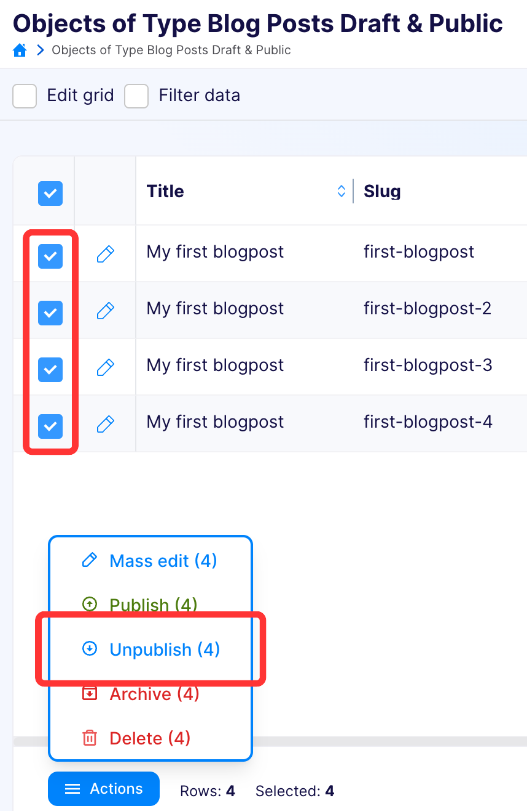
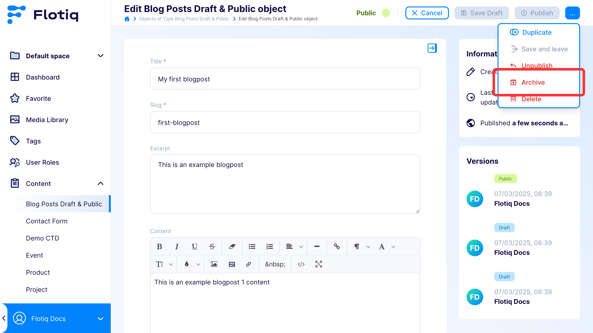
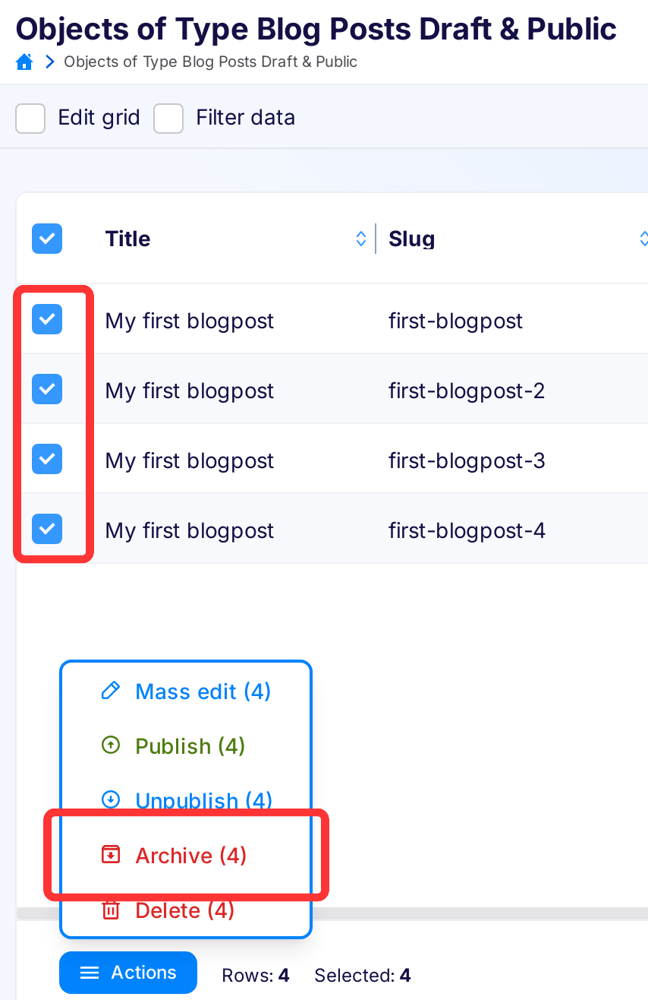

---
tags:
  - Content Creator
---

title: Draft & Public
description: Draft & Public Mode is a feature that allows teams to manage different content variants in the CTD system

# Draft & Public

The Draft & Public mode is designed to manage the visibility of content objects in the system and facilitate the
publishing process.
When enabled, users can utilize statuses such as `draft`, `public`, `modified`, and `archived` to better organize
content and control its state.

This feature is disabled by default, and all saved content objects will have their status set to `public`.

## Available content statuses

Draft & Public provide a set of content statuses to help teams manage and organize their content.
Below is a list of each status with a brief explanation:

- **Draft** - The default status for all newly created content objects.
- **Public** - Indicates content that is ready for production.
- **Modified** - When a content object with the `public` status is edited, a new `modified` version is created, while the existing `public` version remains unchanged.
- **Archived** - Assigned to content that has been withdrawn from the `public` state.

### Status flow

| Current status | Action    | Result     |
|----------------|-----------|------------|
| `draft`        | Publish   | `public`   |
| `public`       | Edit      | `modified` |
| `public`       | Unpublish | `draft`    |
| `public`       | Archive   | `archived` |
| `modified`     | Publish   | `public`   |
| `modified`     | Unpublish | `draft`    |
| `modified`     | Archive   | `archived` |
| `archived`     | Publish   | `public`   |

{: .center .width75 .border}

!!! Note
    **In the Dashboard, all content types will be visible** regardless of their status, unlike in the API.
    Read more about [Draft & Public API](/docs/API/draft-public/draft-public).

### Mass actions
In the content browser, objects of a type with draft & public mode enabled have access to bulk status change options.

{: .center .width50 .border}

!!! Note
    A bulk status change to, for example, `public` will move all selected objects to that state, regardless of their current status.

### Publishing content

To make an object that satisfies all requirements available to all users, it must be made public.
This can be achieved by clicking the green **Publish** button located in the toolbar.   

{: .center .width75 .border}

!!! Note
    Now object will have the status `public` and will be visible, by default in the [listing API](/docs/API/draft-public/draft-public).

#### Mass publishing

You can also publish multiple objects by selecting them in the content objects table and clicking `Actions` and then `Publish`:

{: .center .width50 .border}

If selected objects have relations to other objects that are not public yet, Flotiq may display an additional warning
modal: **You have unpublished objects**. This means that the selected objects reference content that has not been
published yet, and you need to decide how Flotiq should handle those related objects. Read more about this choice in the
[Cascading publication](#cascading-publication) section.

!!! note
    For a single object, Flotiq may show a detailed list of related unpublished content. For multiple selected objects,
    Flotiq shows a general message because the full list could be long and difficult to read.

!!! warning
    When you select a large number of objects (>20), Flotiq does not check objects references before publication. Instead, it informs you
    that you are publishing many objects and asks whether you also want to publish their related unpublished content if such
    content exists.

#### Cascading publication

When a Content Object is linked to others using Draft & Public mode, publishing actions can influence linked objects. 
When initiating the publishing process for such content, a confirmation modal will appear to guide the action. This modal presents two options:

* **Publish both the object and related objects** – Choosing this option will simultaneously publish the primary content object as well as all linked objects.
* **Publish the selected object only** – This option restricts the publishing action to the chosen object, leaving all associated linked objects unaffected.

{: .center .width75 .border}

If the confirmation modal is **closed without making a selection**, no publication action will take place, and the current statuses of all objects will remain unchanged.

The modal appears when publishing an object and has linked objects in states other than public.

### Unpublishing content

If you wish to revert the public version to a draft to make some adjustments,
you can use the **Unpublish** button located in the Extras menu.

{: .center .width75 .border}

!!! Note
    Now object will be reverted from `public` state into the `draft` and will not be visible, by default in the [listing API](/docs/API/draft-public/draft-public).

#### Mass unpublishing

You can also unpublish multiple objects by selecting them in the content objects table and clicking `Actions` and then `Unpublish`:

{: .center .width50 .border}

### Archiving content

If you wish to archive the public version, withdrawing it from the public state and marking it as archived,
you can use the **Archive** button located in the Extras menu.

{: .center .width75 .border}

!!! Note
    Now object will have the status `archived` and will not be visible, by default in the [listing API](/docs/API/draft-public/draft-public).

#### Mass archiving

You can also archive multiple objects by selecting them in the content objects table and clicking `Actions` and then `Archive`:

{: .center .width50 .border}

### Restoring archived content

To restore archived content, use the **Publish** action on the archived object.

!!! Note
    Publishing an archived object changes its status to `public`.

You can do this from the object form (toolbar) or from the content browser using `Actions` -> `Publish`.
