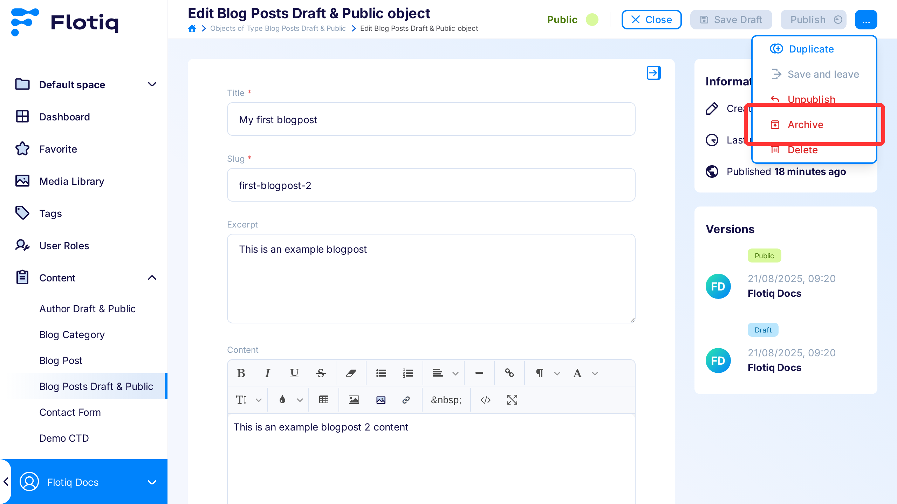

---
tags:
  - Content Creator
---

title: Draft & Public
description: Draft & Public Mode is a feature that allows teams to manage different content variants in the CTD system

# Draft & Public

The Draft & Public mode is designed to manage the visibility of content objects in the system and facilitate the
publishing process.
When enabled, users can utilize statuses such as `draft`, `public`, `modified`, and `archived` to better organize
content and control its state.

This feature is disabled by default, and all saved content objects will have their status set to `public`.

## Available content statuses

Draft & Public provides sets of content statuses to help teams manage and organize their content,
the list of each status with a brief explanation has been written below:

- **Draft** default status for all newly created content objects.
- **Public** is a status for your production ready content.
- **Modified** When object in the status `public`, is edited then a new version with a `public` status will be created
- **Archived** Status for content withdrawn from `public` state

{: .center .width75 .border}

!!! Note
    **In the Dashboard, all content types will be visible** regardless of their status, unlike in the API.
    [read more](/docs/API/draft-public/draft-public).

### Publishing content

To make an object that satisfies all requirements available to all users, it must be made public.
This can be achieved by clicking the green **Publish** button located in the toolbar.   

{: .center .width75 .border}

!!! Note
    Now object  **will have the status `public` and will be visible, by default in the listing API**
    [read more](/docs/API/draft-public/draft-public).

### Unpublish content

If you wish to revert the public version to a draft to make some adjustments,
you can use the **Unpublish** button located in the Extras menu

{: .center .width75 .border}

!!! Note
    Now object will be reverted from `public` state into the `draft` **and will not be visible, by default in the listing API**
    [read more](/docs/API/draft-public/draft-public).

### Content archiving
If you wish to archive the public version, withdrawing it from the public state and marking it as archived,
you can use the **Archive** button located in the **Extras** menu.

{: .center .width75 .border}

!!! Note
    Now object  **will have the status `archive` and will not be visible, by default in the listing API** 
    [read more](/docs/API/draft-public/draft-public).
