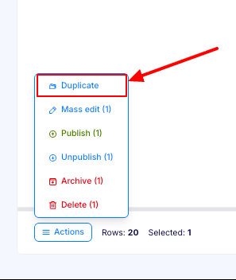
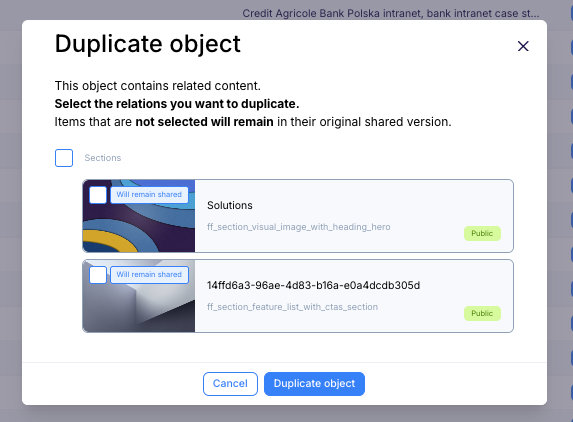

---
tags:
  - Developer
---

title: How to duplicate Content Objects | Flotiq docs
description: How to duplicate Content Objects in Flotiq

## Duplicating Content Objects

Flotiq makes duplicating Content Objects fast and effortless. Create a new object based on an existing one in seconds,
without re-entering data or rebuilding relations.

To use this feature, go to the Content Object list view select and click the duplicate icon next to the object you want
to
copy.

{: .border}

A modal window will open with available relations for duplication, so you can quickly duplicate the object and its
relations. or you can leave the relations out and duplicate only the object itself. After selecting the relations you
want to duplicate, click the `Duplicate` button.

{: .border}

### Limitations

Some relations are not available for duplication, such as images or tags. In these cases, Flotiq creates a new object
that keeps shared relations, so your content stays consistent and ready to use.

After duplication, Flotiq automatically updates unique and required fields by adding a hash suffix, so each new object
stays unique and ready to use right away.
You can edit these values at any time to match your content needs.