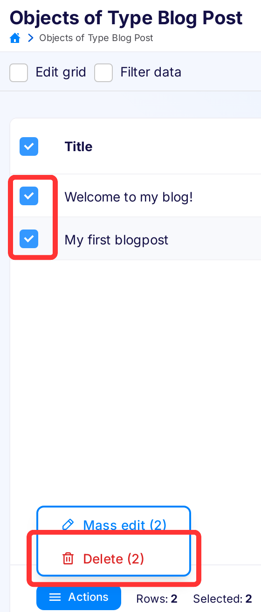
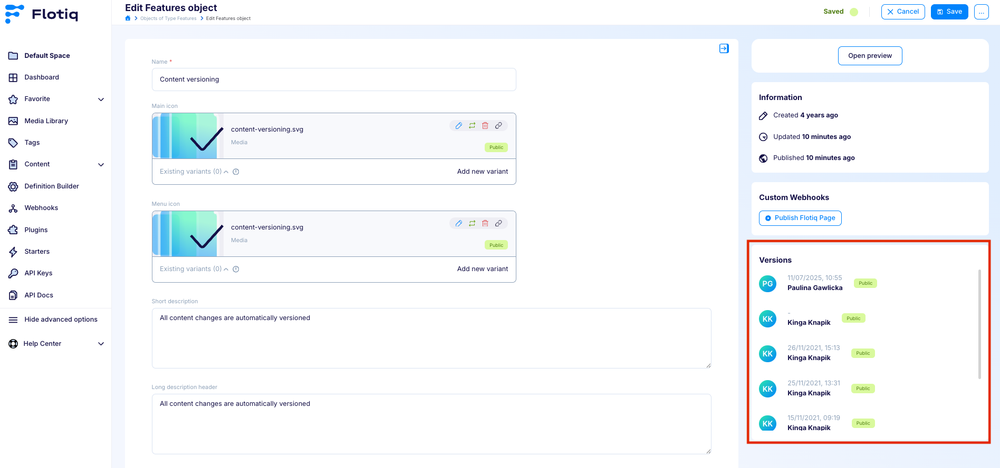
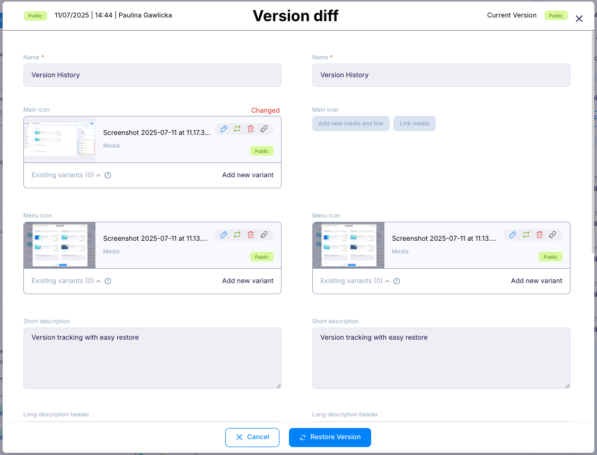
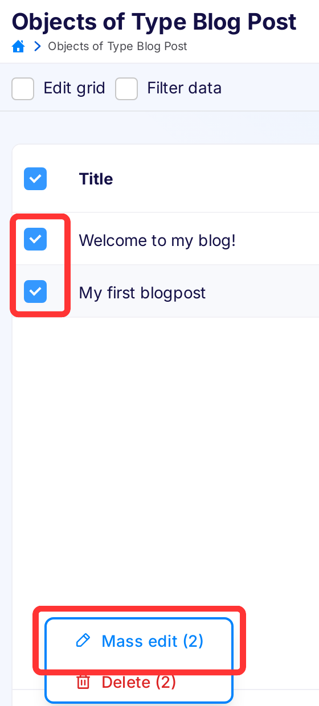
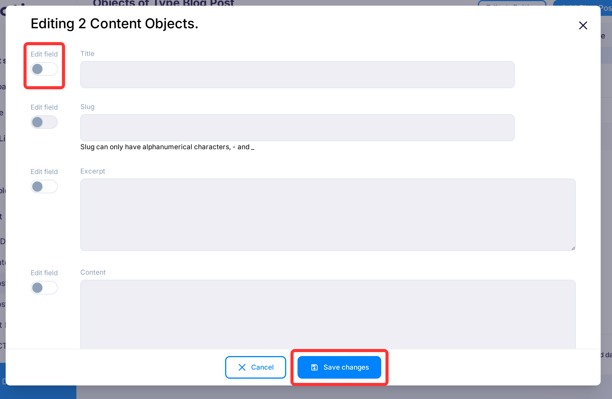

---
tags:
  - Content Creator
---

# Content objects

Once a Content Type has been defined in the system - the user can create Content Objects of that Content Type.
This is done either directly through the API or via the convenient Content Entry tools
provided within the [Flotiq Dashboard](https://editor.flotiq.com){:target="_blank"}.

## Authoring content :fontawesome-solid-triangle-exclamation:{ .pricing-info title="Limits apply" }[^1]

The Content Entry component consists of two elements - the content browser and the content editor.

Click tile on the Type Definitions to go to the content browser page:

{: .center .width75 .border}

or entry in the left menu:

{: .center .width25 .border}

The content browser provides a convenient grid interface to browse and search through large amounts of data quickly.
Users can customize the grid according to their preferences:

{: .center .width75 .border}

From the grid, the users can go to the form that allows them to edit particular Content Objects:

{: .center .width75 .border}

## Deleting content

You can delete the object either by clicking the `Delete` button on the edit object page (in the top right corner):

{: .center .width50 .border}

Or by selecting it on the content browser and clicking the `Action` then `Delete` button:

{: .center .width50 .border}

!!! warning
    You can only remove objects that are not linked to any other object in the system.

## Version History

Flotiq provides built-in version control for content objects, allowing users to view, compare, and restore previously saved versions.

Each time a content object is updated, a new version is automatically saved and listed in the Versions panel on the right-hand side of the editor. The version log includes the timestamp and the name of the user who made the change, which supports full transparency and encourages collaborative workflows within teams.

{: .center .border}

By clicking on a version entry, you can open a Version Diff window, where the current version and the selected historical version are displayed side by side. Any changed fields are clearly highlighted. This makes it easy to review differences and decide whether to revert.

{: .center .border}

## Mass edit

You can edit multiple object at the same time. To do that you need to select needed objects in grid and then click
`Mass edit selected` button that appears at `Actions` menu

{: .center .width50 .border}

You can change fields that are not read only and are not unique (unless you edit only one object using mass edit).

To edit particular field you need to turn on `Edit field` switch on the left of that field,
the field will become enabled. If you insert data in the field, but turn off the switch, the data will not be saved.

{: .center .width75 .border}

To accept the changes click `Save changes` button in the modal.
If all the data are correct the modal will disappear and toast with number of updated object will appear.
If something was wrong the errors will appear in modal nest to fields that are incorrect.

[^1]: The number of available Content Objects depends on the chosen subscription plan.
Check pricing and limits [here](https://flotiq.com/pricing){:target="_blank"}
