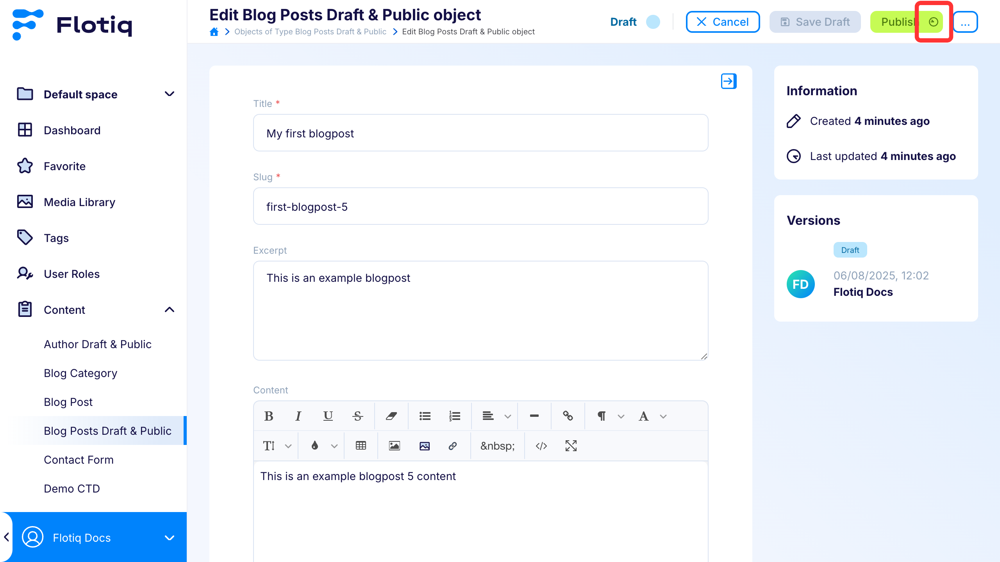

---
tags:
  - Content Creator
---

title: Publication scheduling
description: Publication scheduling is a feature that allows content editors to schedule the publication of a specified `ContentObject`.

## Publication scheduling

Publication scheduling allows content editors to define the exact date, time, and time zone when a specific
ContentObject should be published. Similar to features available in platforms like WordPress, where users can schedule
posts for future release, this functionality enables precise control over when content goes live. It supports long-term
planning, allowing publications to be scheduled days, weeks, or even months in advance. Moreover, scheduled publications
can be easily modified or canceled at any time before the content is published, providing flexibility and control over
the publishing workflow.

!!! Note
This feature is available only in `ContentObject` with
enabled  [Draft & Public Mode](/docs/panel/ContentObjects/draft-public)

## Usage

Click the clock icon next to the `Publish` button to schedule the publication of the current draft.

Once you click the button, a modal will appear where you can configure the `publication date` and `time zone`.

!!! Note
    **Please note that the publication must be scheduled more than 5 minutes in advance. Setting it to exactly 5 minutes
    ahead is not permitted.**

Clicking the `Set Schedule` button sets the object’s status to `scheduled`. When the scheduled date and time are
reached, the object is automatically published and its status is updated to `public`

### Managing scheduled object

The highlighted section of the UI provides information about the scheduled publication date, along with controls for
editing or canceling the schedule. The pencil icon opens the scheduling modal for editing, whereas the trash icon
removes the publication schedule and resets the object's state.

!!! Note
    **Modifying the content of the object in any way will automatically cancel the scheduled publication and change the
    object's status back to draft.**

Clicking the `Publish` button on a scheduled object opens a modal indicating that the object is scheduled for future publication,
with an option to override the schedule and publish it immediately.

