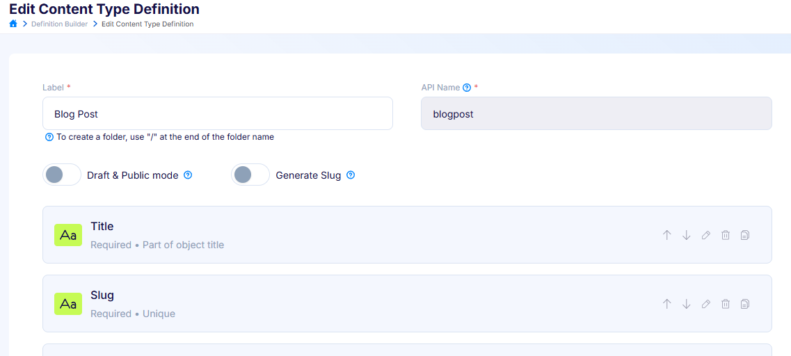
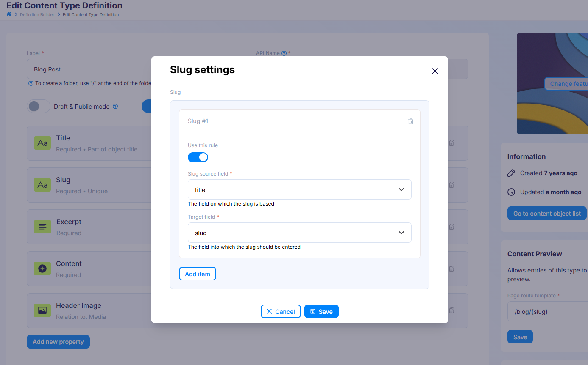
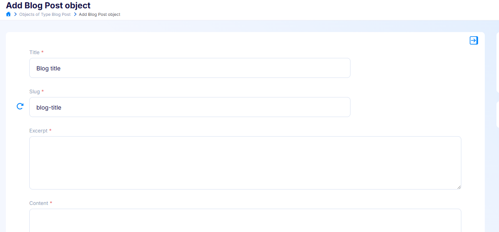

---
tags:
  - Developer
---

title: Generating slugs | Flotiq docs
description: How to automatically generate slugs for Content Objects in the Flotiq Dashboard

# Generating slugs

Flotiq can automatically generate URL-friendly slug values for your
<abbr title="Content Object - an instance of a Content Type.">Content Objects</abbr>
based on another field in the same object. For example, a blog post titled
*"Blog title"* can automatically receive a slug `blog-title`.

Slug generation is configured per
<abbr title="Content Type Definition - a JSON payload that defines the Content Type, it's validation rules, etc.">Content Type Definition</abbr>
by defining one or more **slug rules**. Each rule maps a source field (used as input)
to a target field (where the generated slug is written).

!!! hint
    If you previously used the [Slug plugin](../Plugins/Slug.md), this feature replaces it.
    Slug generation is now built into Flotiq core — no plugin installation is required.
    Existing plugin configurations are migrated automatically.

!!! hint
    This page describes configuring slug generation in the Dashboard. If you want to
    configure slug rules through the API, head to
    [the slugs property](../../API/content-type/creating-ctd.md#the-slugs-property).

## Enabling slug generation

In the Content Type Definition form, enable the **Generate Slug** switch, located next
to the **Draft & Public mode** switch.

{: .center .width75 .border}

Enabling the switch opens the **Slug settings** modal, where you configure the rules.

## Configuring slug rules

In the **Slug settings** modal, each rule is presented as a card (e.g. *Slug #1*) with
the following controls:

{: .center .width75 .border}

* **Use this rule** - toggles whether the rule is active. Inactive rules are kept on the
  definition but are ignored when objects are created or updated.
* **Slug source field** - the field whose value will be slugified (e.g. `title`).
  This is the field on which the slug is based.
* **Target field** - the field where the generated slug will be written (e.g. `slug`).
  This is the field into which the slug is entered.

Click **Add item** to define additional rules, or the trash icon to remove a rule.
When you are done, click **Save** to close the modal, then save the Content Type Definition
as usual.

!!! note
    Both the source and target fields must already exist in the Content Type Definition.
    For an active rule, if either field is missing, saving the definition will fail with a
    validation error. The source and target must also be two different fields.

## How slug generation works

Once a slug rule is active, the target field is auto-filled in the Content Object form.

{: .center .width75 .border}

A **refresh button** appears next to every field that is used as a target in an active
slug rule. Its behaviour is:

* When you create a new object and the target field is empty, the slug is generated
  automatically from the source field as you fill in the form.
* If the target field already contains a value (for example when editing an existing
  object), click the refresh button to regenerate the slug from the current source value.
* You can always edit the generated slug manually — typing into the field overrides the
  generated value.

!!! note
    The same behaviour applies when creating objects through the API. If the target field
    is omitted from the request, Flotiq generates it from the source field; if you send the
    target field explicitly, your value is preserved. See
    [auto-generated slug fields](../../API/content-type/creating-co.md#auto-generated-slug-fields)
    for details.
