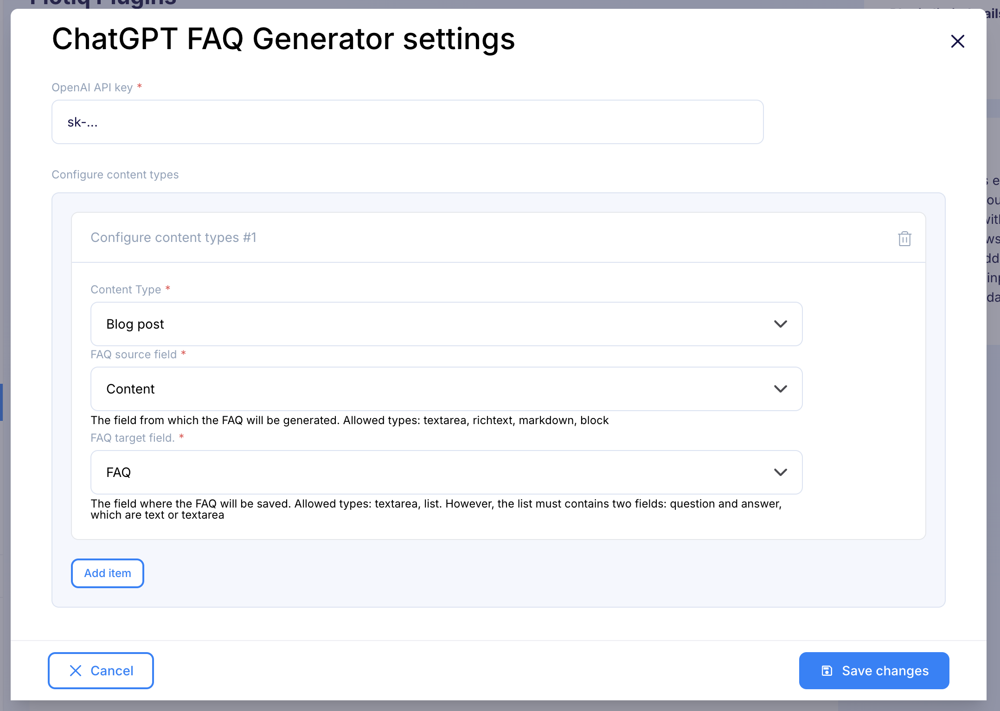

---
tags:
  - Developer
---

title: ChatGPT FAQ Generator plugin | Flotiq documentation
description: The ChatGPT FAQ Generator plugin automates the creation of FAQs from your content, streamlining the process of generating and saving FAQs to your desired field.

The ChatGPT FAQ Generator plugin automates the creation of FAQs from your content, streamlining the process of generating and saving FAQs to your desired field.

## Installing the ChatGPT FAQ Generator plugin

Find in the right sidebar panel `Plugins` and select.

{: .center .width25 .border}

On the next screen, click the plus icon next to `ChatGPT FAQ Generator` to install and enable the plugin.

{: .center .width75 .border}

Once the plugin is enabled, click `Manage` to open the modal with the form.

{: .center .width75 .border}

Next, fill in the details and click `Save changes` to complete your plugin setup.

{: .center .width75 .border}

* **OpenAI API Key** - Insert your OpenAI API key here. It should begin with `sk-`.
* **Content Types** - Select the type of content you want to generate FAQs from.
* **FAQ Source Field** - Choose the field from which the FAQ will be generated. Supported types include:
    - Textarea
    - Richtext
    - Markdown
    - Block
* **FAQ Target Field** - Specify the field where the FAQ will be saved. Supported types are:
    - Textarea
    - List - must contain two fields:
        - question (text or textarea)
        - answer (text or textarea)

## Usage

Go to object form in one of the selected content types. Next, Locate the target field and click the FAQ icon on the left.

{: .center .width75 .border}

Once new FAQ is generated, save the content object.

{: .center .width75 .border}
