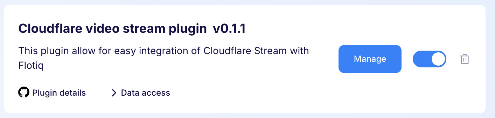
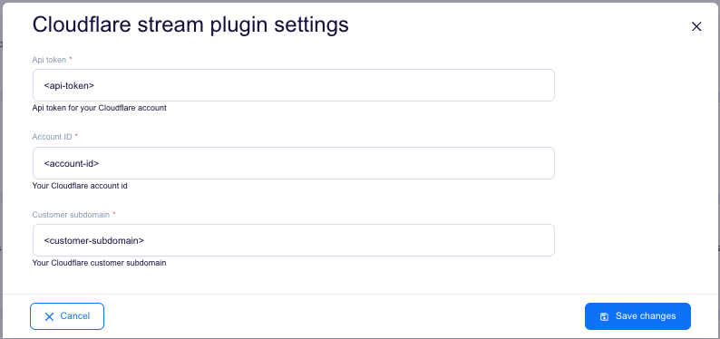
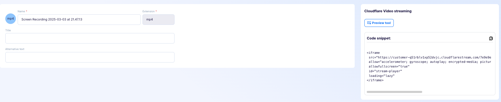
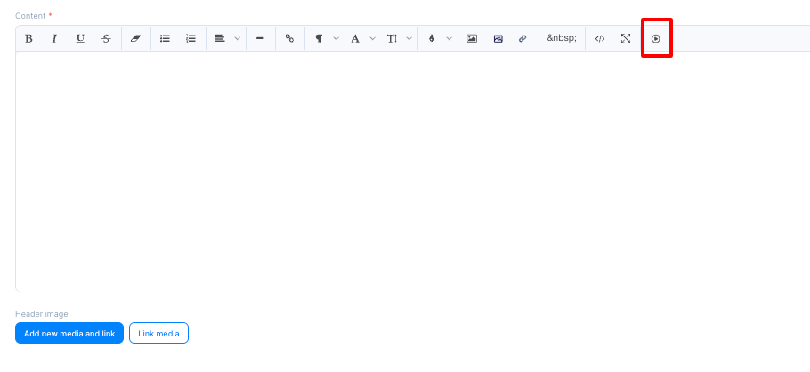
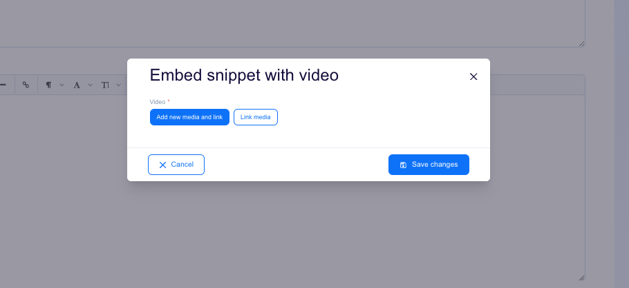
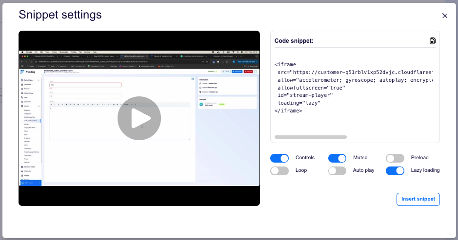

---
tags:
  - Developer
---

title: Cloudflare stream plugin | Flotiq documentation
description: This plugin offers seamless integration of Cloudflare Stream with Flotiq.

This plugin offers seamless integration of Cloudflare Stream with Flotiq, providing users with an intuitive way to embed video content directly from the rich text editor. With this solution, adding Cloudflare Stream videos becomes effortless, eliminating the need for manual embed code insertion. It's a perfect tool for those looking to enhance their content with multimedia elements while keeping the process simple and efficient.

## Installing the Cloudflare stream plugin

Find in the right sidebar panel `Plugins` and select.

{: .center .width25 .border}

On the next screen, click the plus icon next to `Cloudflare stream plugin` to install and enable the plugin.

{: .center .width75 .border}

Once the plugin is enabled, click `Manage` to open the modal with the form.

{: .center .width75 .border}

Next, fill in the details and click `Save changes` to complete your plugin setup.

{: .center .width75 .border}

* Api Token - Cloudflare account API token.
* Account ID - Cloudflare account ID.
* Customer subdomain - Cloudflare customer subdomain.

## Usage

To generate a snippet, go to the edit page of the selected video and click **Generate Snippet**. After the snippet is generated, the snippet code will apear in the right sidebar.

{: .center .width75 .border}

After clicking the **Snippet Preview** button, a modal will open where you can adjust the video settings and preview the changes in real time.

To inject a snippet directly from the rich text editor, click the player icon at the end of the options bar.

{: .center .width75 .border}

A modal will open, allowing you to select existing media or add new ones.

{: .center .width75 .border}

After selecting the media, another modal will open where you can adjust the video settings, see a live preview, and inject it into the editor.

{: .center .width75 .border}

After clicking the **Inject Snippet** button, the snippet will automatically be added to the rich text editor content.

{: .center .width75 .border}

