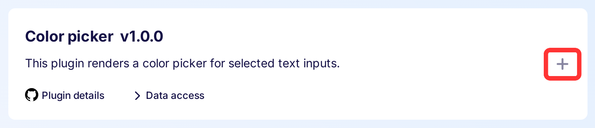
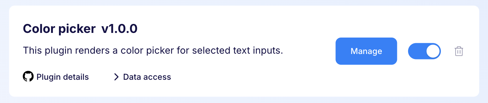
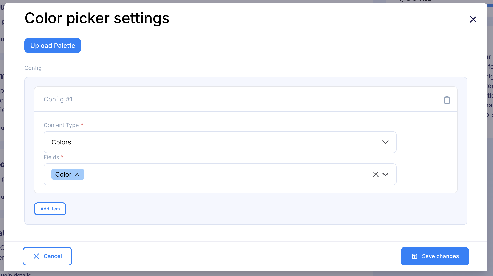
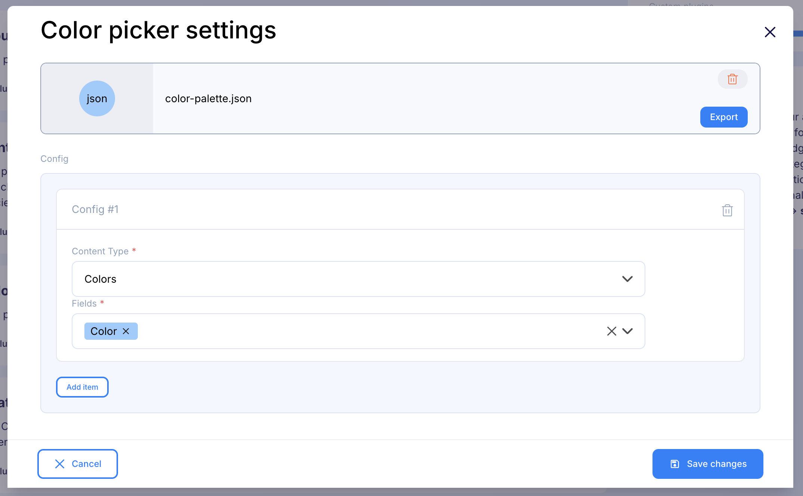
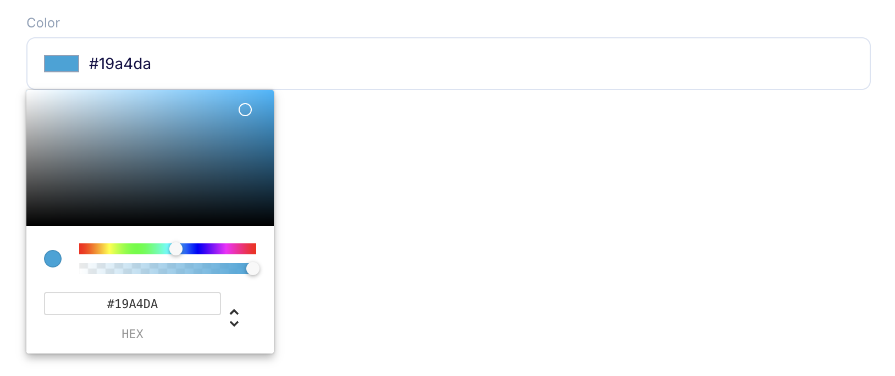
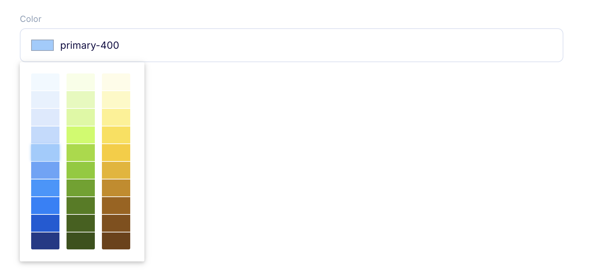

---
tags:
  - Developer
---

title: Color picker plugin | Flotiq documentation
description: This plugin renders a color picker for selected text inputs.

The Flotiq Color Picker plugin transforms standard text input fields into intuitive color selection interfaces. This plugin provides a visual way to select and manage colors for your content, eliminating the need to manually enter hex color codes.

## Installing the Color picker plugin

Find in the right sidebar panel `Plugins` and select.

{: .center .width25 .border}

On the next screen, click the plus icon next to `Color picker` to install and enable the plugin.

{: .center .width75 .border}

Once the plugin is enabled, click `Manage` to open the modal with the form.

{: .center .width75 .border}

Next, fill in the details and click `Save changes` to complete your plugin setup.

{: .center .width75 .border}

* Content Type - Defines the type of objects for which the color picker will be displayed.
* Fields - Choose at least one field to transform for provided Content Type.

!!! note "Color validation pattern"
    After saving the plugin, if custom palette was not uploaded, the selected fields in your content type definition will be automatically updated with a validation pattern (regex) to ensure proper hex color code format. To maintain color validation functionality, please keep this pattern intact and avoid manual removal.

### Custom Color Palette

To use a predefined palette:

1. Click "Upload Palette" in the plugin settings.
2. Choose a JSON file with the correct format (see examples below).

#### Palette Format

The color palette must be a JSON array containing arrays of colors. Each color can be either:
- A simple string (hex color code)
- An object with `name` (any string) and `value` (hex color code) properties

**Example 1: Simple hex colors**
```json
[
  [
    "#F0F9FF",
    "#E7F1FE"
  ],
  [
    "#F7FEE7",
    "#E4F9B9"
  ]
]
```

**Example 2: Named colors**
```json
[
  [
    {
      "name": "primary-50",
      "value": "#F0F9FF"
    },
    {
      "name": "primary-100",
      "value": "#E7F1FE"
    }
  ],
  [
    {
      "name": "secondary-50",
      "value": "#F7FEE7"
    },
    {
      "name": "secondary-100",
      "value": "#E4F9B9"
    }
  ]
]
```

If the format is correct, you should see the chosen file in the plugin settings:

{: .center .width75 .border}

## Usage

Transformed text field into color picker:

**Without predefined color palette**

{: .center .width75 .border}

**With predefined color palette**

{: .center .width75 .border}
