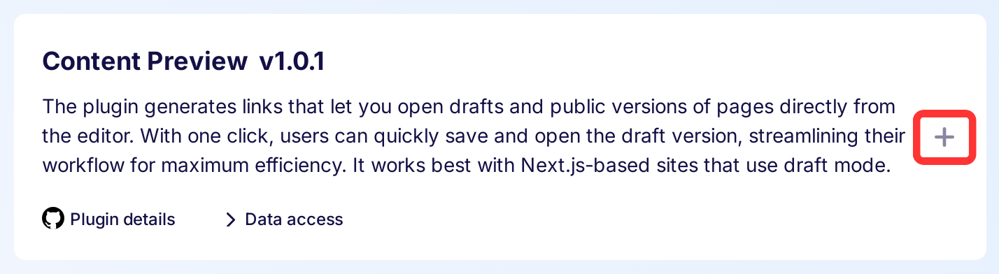
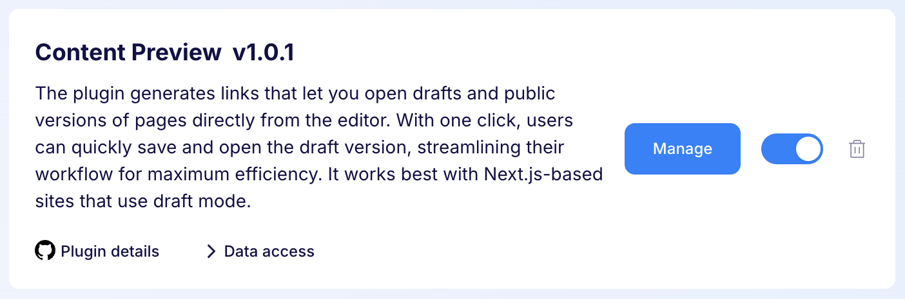
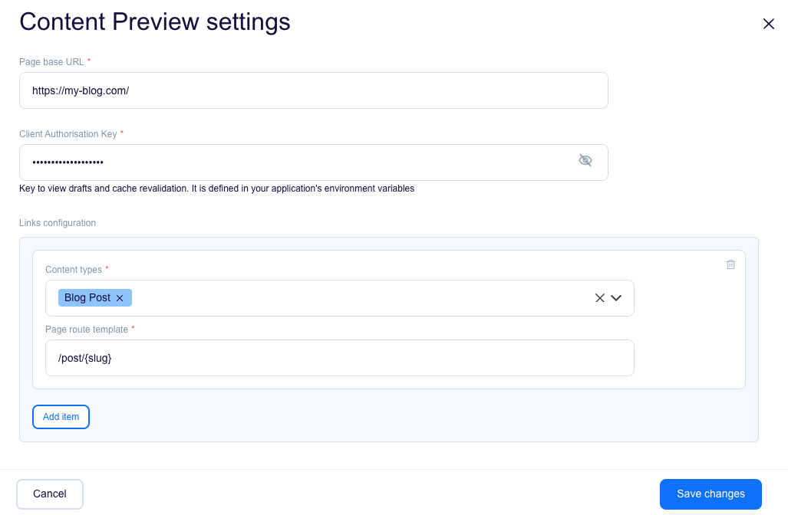
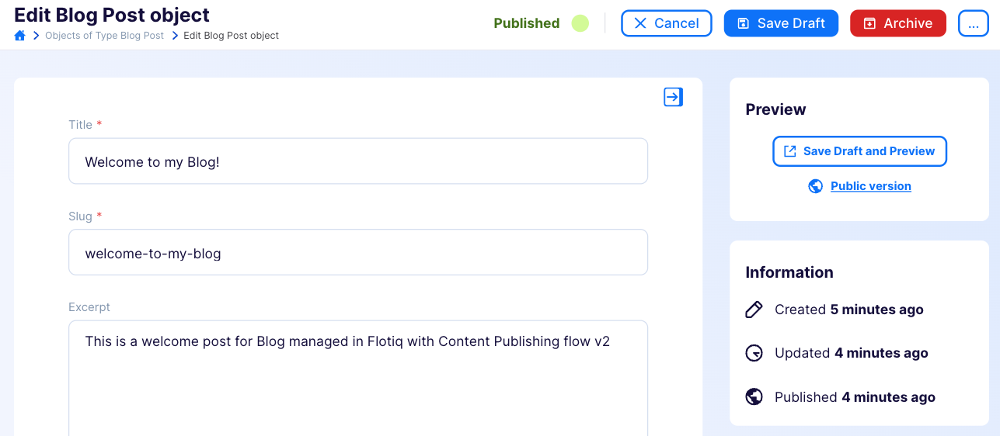
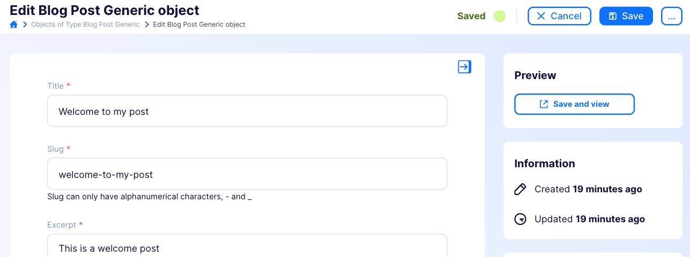

---
tags:
  - Developer
---

title: Content Preview plugin | Flotiq documentation
description: The plugin generates links that let you open drafts and public versions of pages directly from the editor. With one click, users can quickly save and open the draft version, streamlining their workflow for maximum efficiency. It works best with Next.js-based sites that use draft mode.

The plugin generates links that let you open drafts and public versions of pages directly from the editor. With one click, users can quickly save and open the draft version, streamlining their workflow for maximum efficiency. It works best with Next.js-based sites that use draft mode.

## Installing the Thumbnails plugin

Find in the right sidebar panel `Plugins` and select.

{: .center .width25 .border}

On the next screen, click the plus icon next to `Content Preview` to install and enable the plugin.

{: .center .width75 .border}

Once the plugin is enabled, click `Manage` to open the modal with the form.

{: .center .width75 .border}

Next, fill in the details and click `Save changes` to complete your plugin setup.

{: .center .width75 .border}

* **Page base URL** - To start, you may want to use http://localhost:3000 to easily navigate between Flotiq and your local development environment. This will be accessible to all developers working on the site locally. Once you have your page deployed and publicly visible, you should change this URL.
* **Client Authorisation Key** - This key grants access to view drafts and perform cache revalidation on your website. Make sure to define it in your application's environment variables. Without this key, the plugin won't be able to preview unpublished content or update the cache effectively.
* **Content types** - Specify the types of content for which you want the plugin to generate links.
* **Page route template** - Define the URL template for your content pages. For example, you might use /post/{slug}, where {slug} corresponds to a specific field in your content type, such as the post's title or ID. You can also use nested fields, like {internal.createdAt}, or list fields, such as {addresses[0].city}. This flexibility allows you to customize how your content URLs are structured.

## Usage

### Content publishing workflow

Imagine you've already published a blog post, but now you want to make some updates. Instead of publishing right away, you can use the Preview and Save Draft button. This lets you see your changes on the website before they go live. For example, it might take you to https://my-blog.com/post/welcome-to-my-post, where you'll see your unpublished edits. To compare your draft with the live version, click Public Version. This shows you the same page but with the content everyone else sees.

{: .center .width75 .border}

This feature uses draft mode in NextJS, allowing you to view changes before they are visible to your readers.

### Simple workflow

With the simple workflow, any changes you save are immediately visible on your website. Click the Save and View button to quickly save your work and see the updated page.

{: .center .width75 .border}