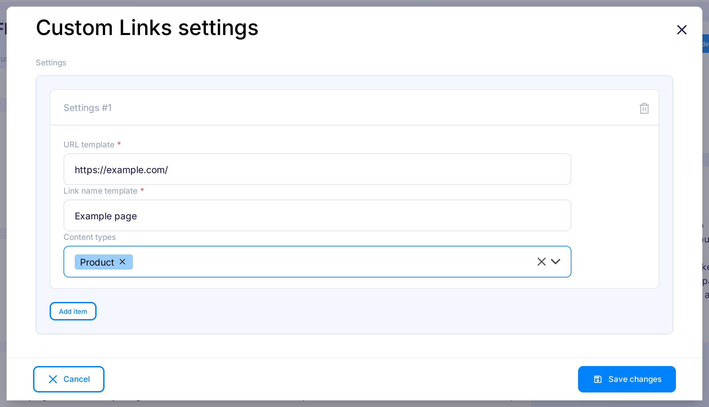
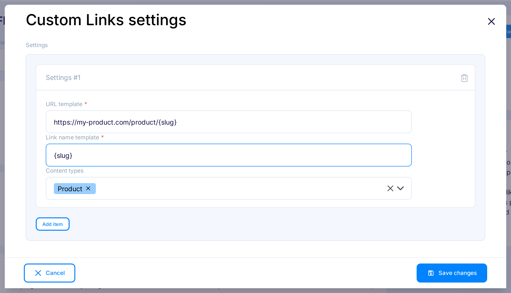
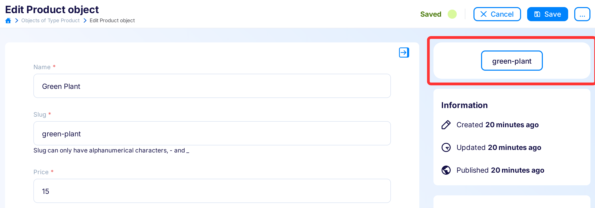
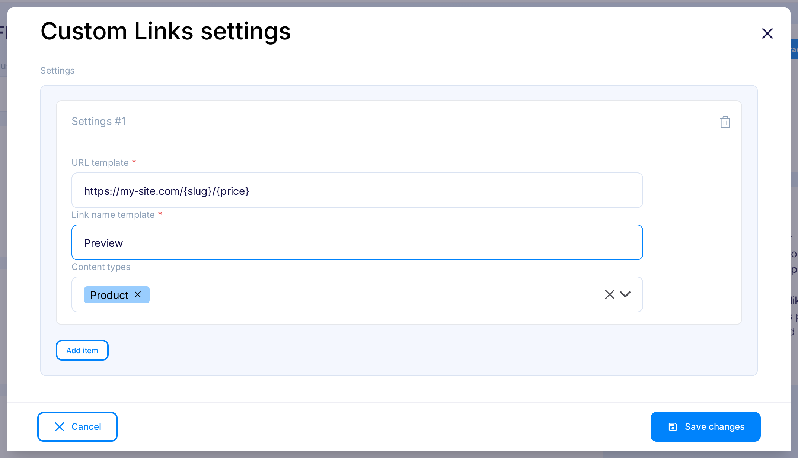

title: Custom Links | Flotiq documentation
description: This plugin allows to create custom links in each entity view.

This plugin will display a button with a link in the edit content object. The link will be supplemented with data from the currently edited object.
Thanks to this link, you will be able to get easy access to the preview of where the content is used.

## Installing the Custom Links plugin

Find in the right sidebar panel `Plugins` and select.

{: .center .width25 .border}

On the next screen, click on the switch next to `Custom Links` for enabling plugin.

{: .center .width75 .border}

Once plugin is enabled, click `Mange` to open modal with the form.

{: .center .width75 .border}

After the modal is opened, click `Add new`.

{: .center .width75 .border}

Next - fill in the details and click `Save changes` to finish your plugin setup.

{: .center .width75 .border}

* URL template - It's a place to enter the link template, e.g. `https://my-blog/post/{slug}`, where `slug` is the name of the content field of the type selected below. Instead of `{slug}`, you can use any field of a given content type, it is also possible to use nesting, e.g. `{internal.createdAt}`. However, the use of list type fields is not supported.

* Link name template - Any name that will be displayed on the link button.

* Content types - Select the content types to display the button only for the specified content types. If the content types are not selected, the button will be shown when editing each content object.

You're done. Now you will see `Example page` in Content Objects forms with `http://example.com/` link.

{: .center .width100 .border}

## Examples

### Using Custom Links plugin for preview links

One of the most common use cases for using this plugin is to add a direct link to a preview/staging environment  directly from the editor. Here's how you could set that up:

{: .center .width75}

if you use this configuration with an object similar to this

{: .center .width100 .border}

you will see the `first-page` link that will lead you to `https://my-blog/post/first-page`.

### Creating links to pages using complex routing

Here's a bit more complex example, where the page routing requires to provide a URL with the name of a category *and* a slug of the current page:

{: .center .width75}

if you use this configuration with an object similar to this

{: .center .width100 .border}

you will see a preview link that will lead you to `https://my-site.com/office/best-office-chair`.
