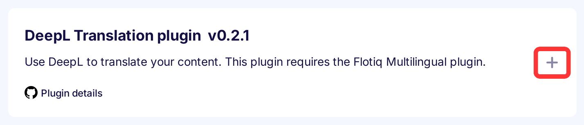
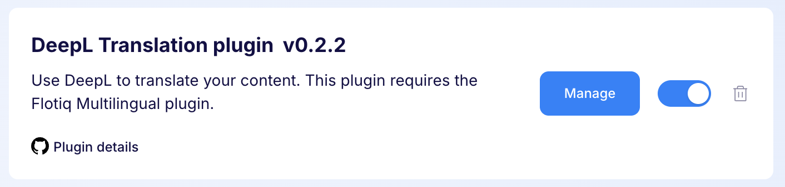
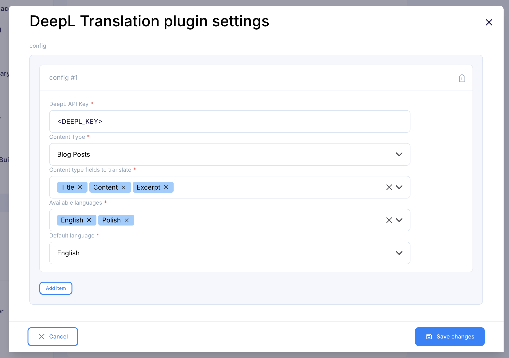

---
tags:
  - Developer
---

title: DeepL Translation plugin | Flotiq documentation
description: This plugin provides automated translation using the DeepL API. It requires that the Multilingual plugin.

This plugin provides automated translation using the DeepL API. It requires that the [Multilingual plugin](./Multilingual.md) is installed and configured. It supports multiple languages and enables users to define and manage their own language sets.

## Installing the DeepL Translation plugin

Find in the right sidebar panel `Plugins` and select.

{: .center .width25 .border}

On the next screen, click the plus icon next to `DeepL Translation plugin` to install and enable the plugin.

{: .center .width75 .border}

Once the plugin is enabled, click `Manage` to open the modal with the form.

{: .center .width75 .border}

Next, fill in the details and click `Save changes` to complete your plugin setup.

{: .center .width75 .border}

* DeepL - DeepL API Key.
* Content type - Select the content types with content to translate.
* Content type fields to translate - Select the fields for the content type for which you want to enable tranlsations. Only text and rich-text fields are supported for now.
* Available languages - Select the languages ​​that will be available in translations.
* Default language - Select default language from available languages

## Usage

1. Once the plugin is configured - go to the configured Content Type and edit one of the objects.
1. There will be a magic icon displayed next to the first field of the form - once you're done entering your content and you want to translate - click on it.
1. You can now browse to the other language tabs to see your translated content!

{: .center .width75 .border}
