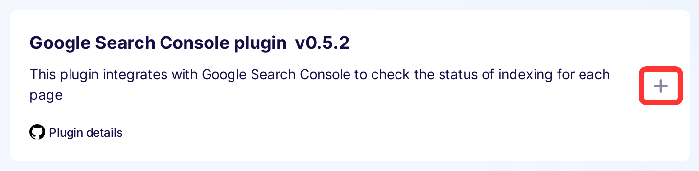
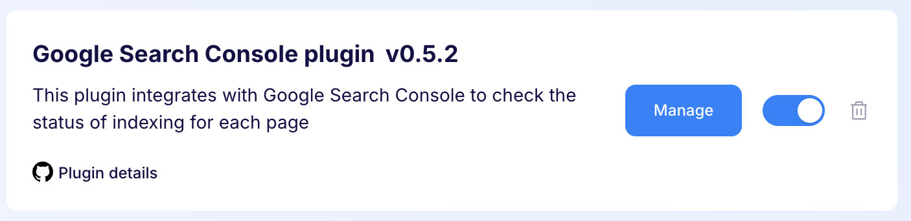
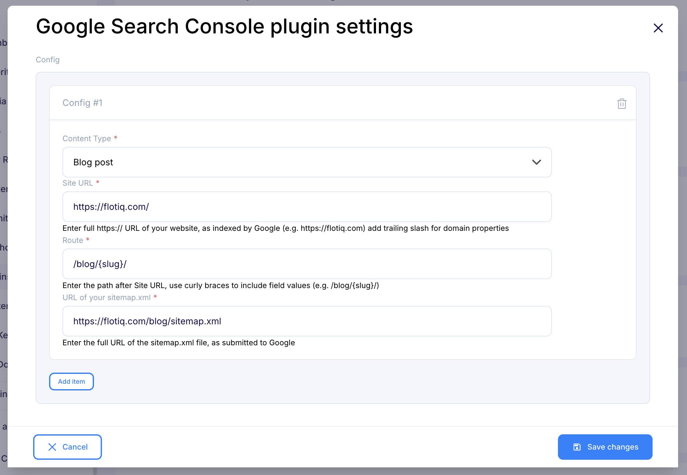
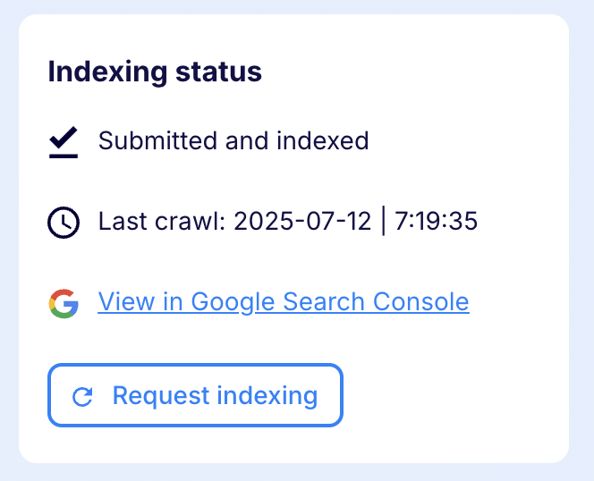

---
tags:
  - Developer
---

title: Google Search Console plugin | Flotiq documentation
description: This plugin integrates with the Google Search Console API to provide up-to-date information about indexing status of your pages.

This plugin integrates with the Google Search Console API to provide up-to-date information about indexing status of your pages.

## Installing the Thumbnails plugin

Find in the right sidebar panel `Plugins` and select.

{: .center .width25 .border}

On the next screen, click the plus icon next to `Google Search Console` to install and enable the plugin.

{: .center .width75 .border}

Once the plugin is enabled, click `Manage` to open the modal with the form.

{: .center .width75 .border}

Next, fill in the details and click `Save changes` to complete your plugin setup.

{: .center .width75 .border}

* Content types - Defines the Content Types for which you want to see information about indexing status.

* Site URL - Enter full https:// URL of your website, as indexed by Google (e.g. https://flotiq.com) add trailing slash for domain properties

* Route - Enter the path after Site URL, use curly braces to include field values (e.g. /blog/{slug}/)

* URL of your sitemap.xml - Enter the full URL of the sitemap.xml file, as submitted to Google

## Usage

Once the plugin is configured - go to the configured Content Type and edit one of the objects.

Google index status will display in the right sidebar after a moment.

{: .center .width50 .border}