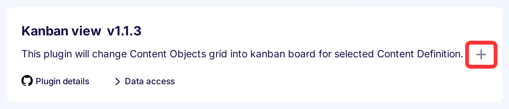
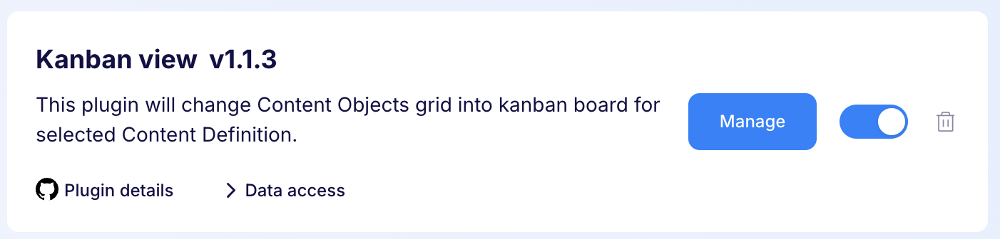
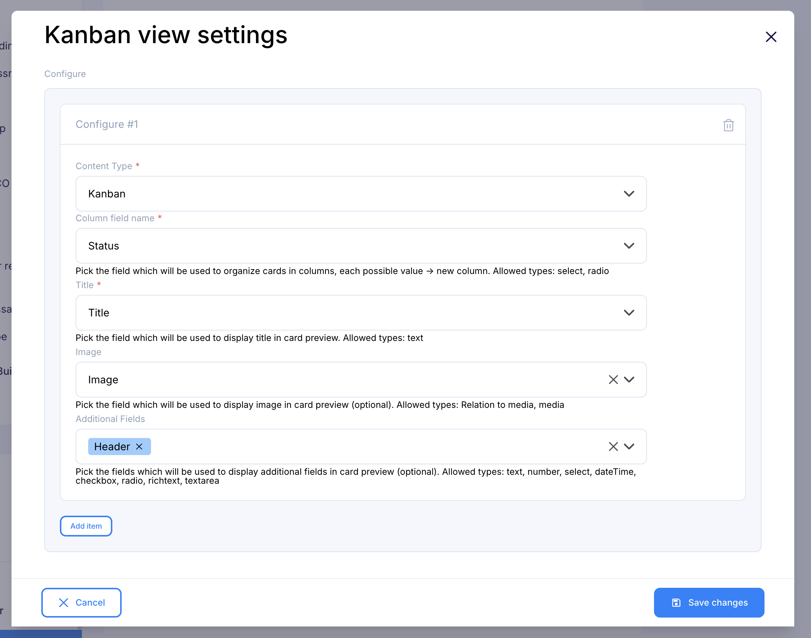
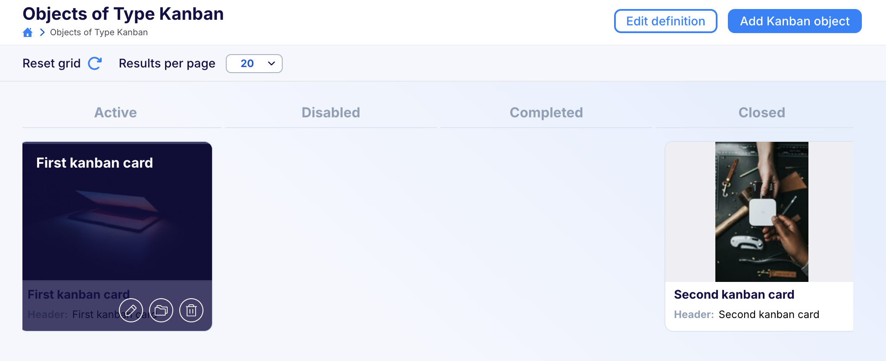

---
tags:
  - Developer
---

title: Kanban view plugin | Flotiq documentation
description: This plugin transforms the default Flotiq content-type-objects page into a Kanban board, where content objects are displayed as cards within their respective columns.

This plugin transforms the default Flotiq content-type-objects page into a Kanban board, where content objects are displayed as cards within their respective columns.

## Installing the Kanban view plugin

Find in the right sidebar panel `Plugins` and select.

{: .center .width25 .border}

On the next screen, click the plus icon next to `Kanban view` to install and enable the plugin.

{: .center .width75 .border}

Once the plugin is enabled, click `Manage` to open the modal with the form.

{: .center .width75 .border}

Next, fill in the details and click `Save changes` to complete your plugin setup.

{: .center .width75 .border}

* **Content Type** - Content type definition that will be converted into a Kanban board.
* **Column field name** - The field that will determine the Columns on the board. The field has to be of type Select or Radio.
* **Title** - The field which will be used to display the title in the card preview. Allowed types: text.
* **Image** - The field which will be used to display the image in the card preview (optional). Allowed types: relation to media.
* **Additional Fields** - The fields which will be used to display additional fields in the card preview (optional). Allowed types: text, number, select, dateTime, checkbox, radio, richtext, textarea

## Usage

Go to the configured Content Type list of objects.

Instead of the table view you will see the kanban view of the objects.

{: .center .width75 .border}
