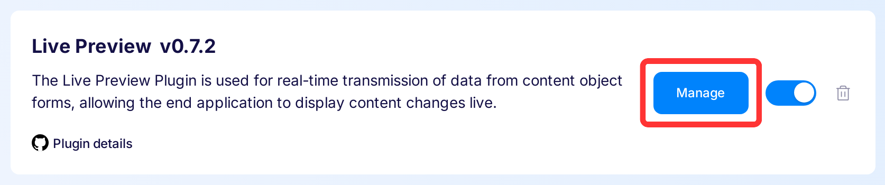
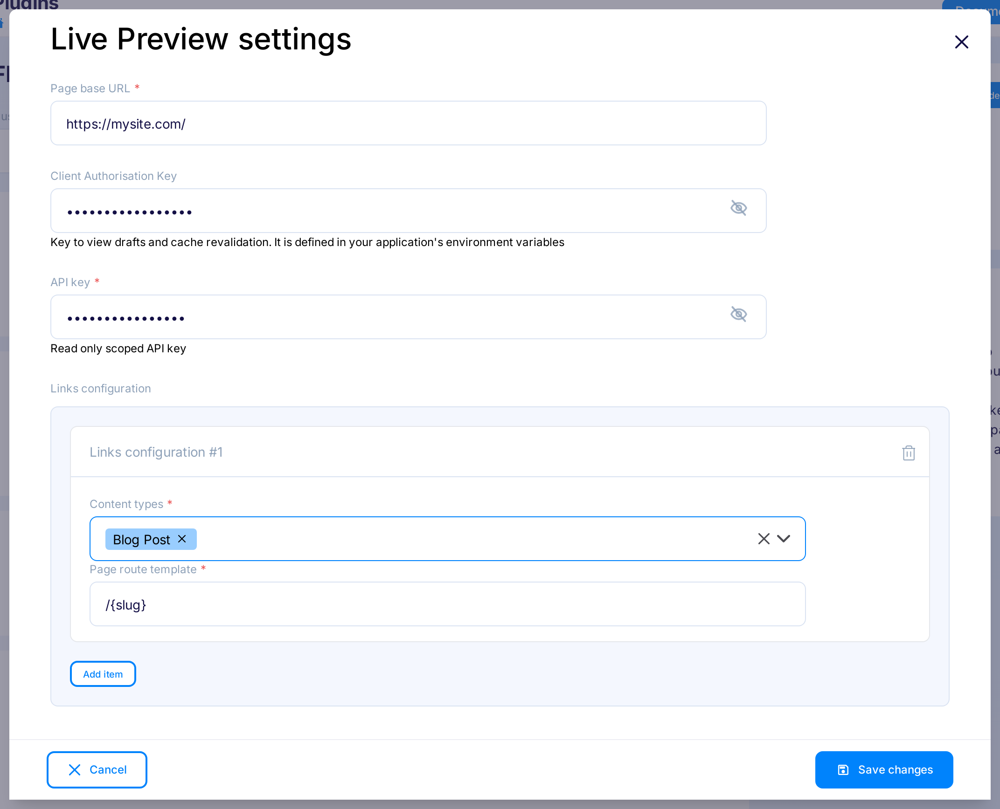

---
tags:
  - Developer
---

title: Live Preview Plugin | Flotiq documentation
description: Use live preview plugin for real-time transmission of data from content object forms to display content changes live.

# Live Preview Plugin

The Live Preview Plugin is used for real-time transmission of data from content object forms, allowing the end application to display content changes live. The plugin generates links that let you open drafts of your pages directly from the editor with a live streaming preview. It works best with Next.js-based sites.

## Installing Live Preview Plugin

Find in the right sidebar panel `Plugins` and select.

{: .center .width25 .border}

On the next screen, click the plus icon next to `Live Preview Plugin` to install and enable the plugin.

{: .center .width75 .border}

Once the plugin is enabled, click Manage to open the modal with the form.

{: .center .width75 .border}

Next, fill in the details and click `Save changes` to complete your plugin setup.

{: .center .width75 .border}

* **Page base URL** - To start, you may want to use `http://localhost:3000` to easily navigate between Flotiq and your local development environment. This will be accessible to all developers working on the site locally. Once you have your page deployed and publicly visible, you should change this URL.

* **Client Authorisation Key** - This key grants access to view live preview data on your website. Make sure to define it in your application's environment variables. Without validating this key, evenrybody can see your live preview data. This key is defined by you.

* **API Key** - Flotiq API key used to authorize websocket connection.

* **Content types** - Specify the types of content for which you want the plugin to generate links and show live preview.

* **Page route template** - Define the URL template for your content pages. For example, you might use /post/{slug}, where {slug} corresponds to a specific field in your content type, such as the post's title or ID. You can also use nested fields, like {internal.createdAt}, or list fields, such as {addresses[0].city}. This flexibility allows you to customize how your content URLs are structured.

Now it's time to integrate your application with live preview plugin.

## Next.js integration

You can integrate live preview functionality into any project by responding to events sent by the Live Preview plugin during content editing.

We've prepared a Next.js integration that allows you to add live preview support to your project in just a few steps.
Documentation and setup instructions for integrating it into your Next.js project can be found in the [@floiq/nextjs-live-preview](https://www.npmjs.com/package/@flotiq/nextjs-live-preview) package.

{: .center .width50 .border}

## Usage

> **Note**: You must integrate your application with the Live Preview plugin to work properly.

Go to edit content object form and click `Preview` button in right sidebar.

{: .center .width75 .border}

You will see the page is opened next to the form.

{: .border}

In this view you can:

- check the live preview status
- change the viewport of the application
- open application in the new tab
- close the preview
