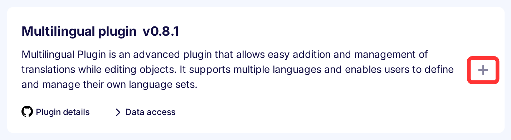
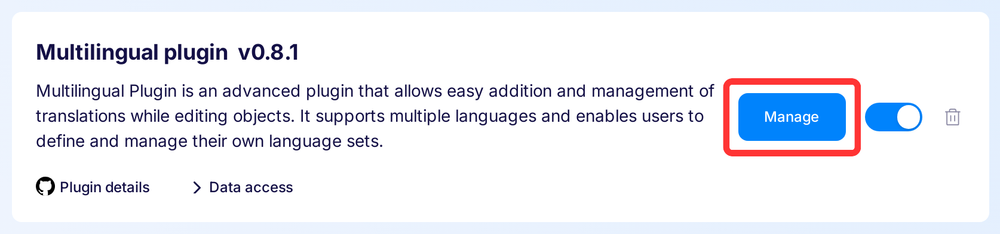
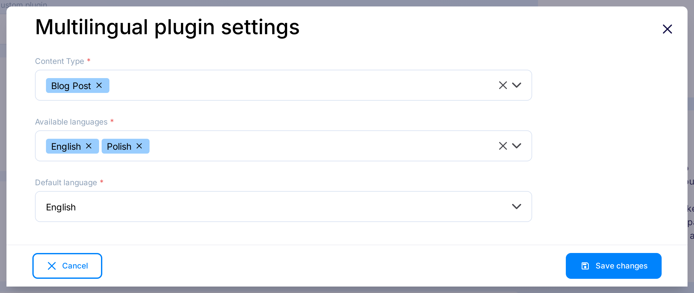
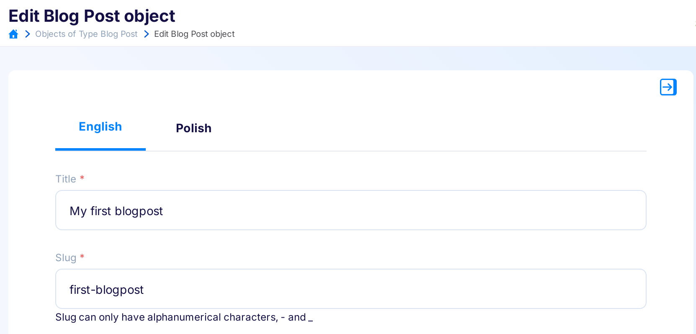
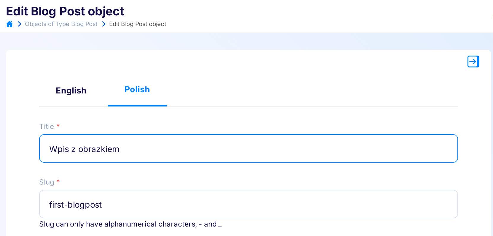

---
tags:
  - Developer
---

title: Multilingual | Flotiq documentation
description: This plugin allows you manage multilingual data in Flotiq.

Multilingual plugin is an advanced plugin that allows easy addition and management of translations while editing objects. It supports multiple languages and enables users to define and manage their own language sets.

## Installing the Multilingual plugin

Find in the right sidebar panel `Plugins` and select.

{: .center .width25 .border}

On the next screen, click the plus icon next to `Multilingual plugin` to install and enable the plugin.

{: .center .width75 .border}

Once the plugin is enabled, click `Manage` to open the modal with the form.

{: .center .width75 .border}

After the modal is opened, fill in the details and click `Save changes` to complete your plugin setup.

{: .center .width75 .border}

* Content type - Select the content types with content to translate.

* Available languages - Select the languages ​​that will be available in translations.

* Default language - Select default language from available languages

## Usage

### Managing Content Objects

When adding/editing an object, tabs with the previously selected languages will be available. The default language is always in the first tab.
Clicking on another language tab will add the translated fields, populated with the current fields in the default language.

<div markdown=1 class="grid-cols-2">
<div markdown=1>{:.border}</div>
<div markdown=1>{:.border}</div>
</div>

!!! warning
    If we return to the default language tab, make changes, and go back to another language tab, the previously filled fields will not be overwritten.

### Special Fields

After saving the settings, the Content Types are modified and a `__translations` field is added, containing an array of available translations. The translation language is available under the `__language` field in each `__translations` item.

* `__translations`: Contains an array of translations, excluding the default language, whose data is found in the object fields.
* `__language`: Specifies the translation language. Language is saved in ISO 639 language codes.

!!! warning
    The `__translations` field should not be manually modified. After each change in the content type for translated fields, go to the plugin settings and save them again to properly update the translation fields.


### Example object

Let's assume you have an object with `title` and `slug` fields. Before applying translations, your object will look like:

```json
{
   "title": "My first blog post",
   "slug": "my-first-blog-post"
}
```

Now, let's consider that you are adding two languages: `Polish` and `English`, and your default language is `English`. After applying translations, the object will be:

```json
{
   "title": "My first blog post",
   "slug": "my-first-blog-post",
   "__translations": [{
      "__language": "pl",
      "title": "Mój pierwszy post na blogu",
      "slug": "my-first-blog-post",
   }]
}
```

## Removing Content Type from plugin settings

When removing the content type from the settings, you will be asked whether to keep the translations or remove them:

* **Removing**: Modifies the content type, removes the `__translations` field, and deletes the collected data.
* **Keeping**: If you choose the "Keep translation fields" option, you can remove `__translations` field later manually by editing the content type.

{: .center .width75 .border}