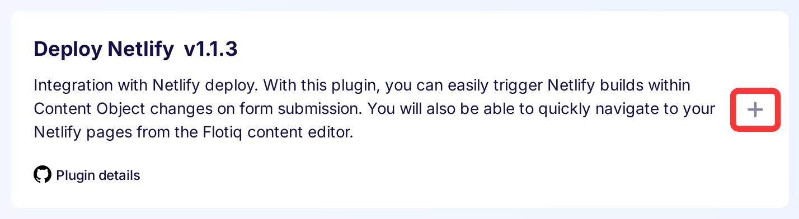
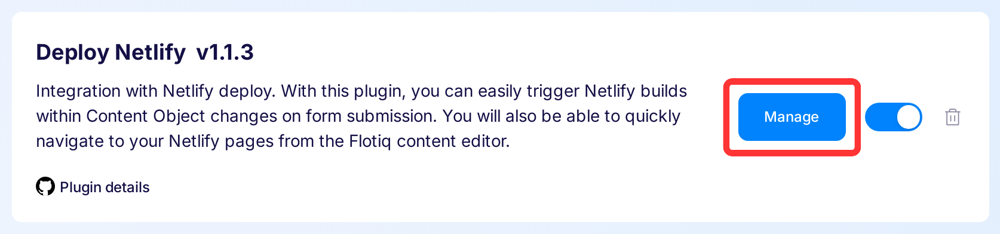
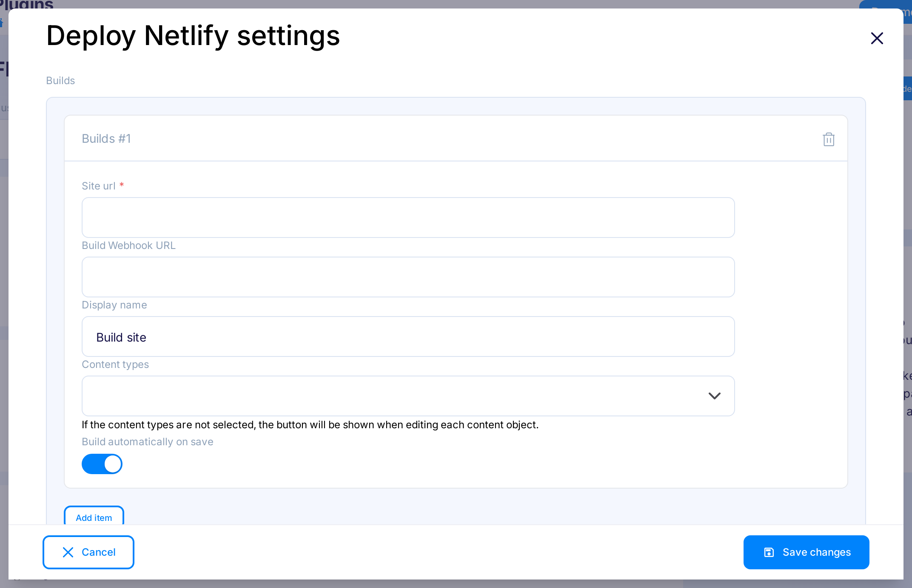
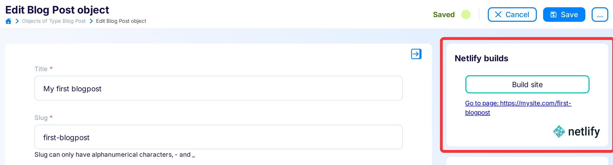

title: Integrate Netlify and Flotiq | Flotiq documentation
description: Enable content build using Flotiq Netlify plugin.

# Connecting your Flotiq account to Netlify

This article will walk you through the process of connecting your Flotiq account, and your Netlify account. 
By doing so, you will be able to trigger Netlify builds within Content Objects forms. 
You will also be able to quickly navigate to your Netlify pages from the Flotiq content editor.

## Prerequisites

1. Flotiq account
2. Netlify account
3. Website, sourcing content from Flotiq.

!!! note
    You might want to try one of our starters, which already come with predefined content:

    - [Recipe website Gatsby starter](https://github.com/flotiq/flotiq-gatsby-recipe-1){:target="_blank"}
    - [Event calendar Gatsby starter](https://github.com/flotiq/flotiq-gatsby-event-1){:target="_blank"}
    - [Project portfolio Gatsby starter](https://github.com/flotiq/flotiq-gatsby-portfolio-1){:target="_blank"}
    - [Simple blog Gatsby starter](https://github.com/flotiq/flotiq-gatsby-blog-1){:target="_blank"}
    - [Gatsby and Snipcart boilerplate, sourcing products from Flotiq](https://github.com/flotiq/flotiq-gatsby-shop-1){:target="_blank"}
    - [Snipcart and Next.js, sourcing products from Flotiq](https://github.com/flotiq/snipcart-nextjs){:target="_blank"}
    - [Snipcart and Angular with Scully, sourcing products from Flotiq](https://github.com/flotiq/scully-products-starter){:target="_blank"}
    - [Simple blog using Angular with Scully](https://github.com/flotiq/scully-blog-starter){:target="_blank"}
    
    These starters all come with detailed READMEs and a one-line content import command, be sure to check those!

## Signing in to Netlify
If you do not have the account, the easiest way to create the account and use with this tutorial will be using `GitHub` on Netlify sign up page. Netlify will ask you to authorize with your GitHub account. If you need to request access to one or more repositories, you can click "request access" here or later, when creating an instance.

Once signed in, configuring Netlify with Flotiq requires several steps. We will walk you through them below.

## Creating an instance

Once you've authenticated with Netlify and GitHub, you have two ways of creating the site in Netlify. The first and faster way is to use the `Deploy to netlify` button on the bottom of Readme in every starter repository provided by Flotiq team:

{: .center .width75 .border}

then click `Connect to GitHub` button:

{: .center .width75 .border}

insert environment variables (more [below](#setting-up-environment-variables)) and click `Save and Deploy`, after few minutes, your page should be live:

{: .center .width75 .border}

The second way is to click the `New site from Git` button in Netlify dashboard:

{: .center .width75 .border}

then choosing the source of code:

{: .center .width75 .border}

and the desired repository:

{: .center .width75 .border}

next step is to manually put environment variables required by project, first click `Show advanced` and then `New variable` for every variable (more [below](#setting-up-environment-variables)):

{: .center .width75 .border}
{: .center .width75 .border}

and last but not least click `Deploy site` button, after few minutes, your page should be live:

{: .center .width75 .border}

### Setting up Environment Variables

An environment variable references a value that can affect how running processes will behave on a computer, for example, in staging and production environments. You must save environment variables in Netlify to authorize your instance to pull source data from Flotiq.

The essential two environment variables needed for every Gatsby project are `GATSBY_FLOTIQ_API_KEY` and `GATSBY_FLOTIQ_BASE_URL`. In some cases, you will provide additional env variables for your application to work.

For example, if you're using the [Gatsby and Snipcart starter](https://github.com/flotiq/gatsby-starter-products){:target="_blank"} you will also provide the Snipcart API key. The project Readme always described the needed variables.

To obtain the Flotiq API key - in your Flotiq account, Find in the right sidebar panel `Api keys` and select:

{: .center .width25 .border}

You can either select the application-wide read-only key:

{: .center .width75 .border}

Or as a safer option, create a scoped read-only API key that will only be used for the purpose of Netlify build, read more about [Flotiq API access](https://flotiq.com/docs/API/).

Copy the Read-Only key and paste it in Netlify settings as `GATSBY_FLOTIQ_API_KEY`. For the `GATSBY_FLOTIQ_BASE_URL` put `https://api.flotiq.com`.

!!! Note
    Flotiq doesn't enforce any particular way of selecting drafts or non-public versions of your pages. The Read-Only key you copied will give you access to all your content. If you'd like to setup draft and public versions of your pages - you can do so by adding an extra field to your content types and querying for it in you GraphQL queries.

## Installing the Netlify plugin

Find in the right sidebar panel `Plugins` and select

{: .center .width25 .border}

On the next screen, click on the plus next to `Netlify Build` for adding plugin.

{: .center .width75 .border}

Once plugin is enabled, click `Mange` to open modal with the form.

{: .center .width75 .border}

After the modal is opened, click `Add new`. Next - fill in the details from your Netlify account and click `Save changes` to finish your Netlify Build setup.

{: .center .width75 .border}

### Configuring Netlify Build plugin

The two elements you will need to copy from Netlify is the Build instance URL:

{: .center .width75 .border}

and the Builds Webhook URL from Settings:

First, navigate to Settings -> Build & deploy

{: .center .width75 .border}

Then scroll to `Build hooks` section, and click `Add build hook` button:

{: .center .width75 .border}

Put the name of your webhook (`Flotiq build` on this screen), choose branch (`master` here) and click the `Save` button:

{: .center .width75 .border}

Copy webhook URL:

{: .center .width75 .border}

You will paste both of them in Flotiq Netlify Build plugin settings, don't forget to click the `Save changes` button.

## That's it!

You're done. Now you will see `Build site` in Content Objects forms, and you will be able to build site after you made changes to the content.

{: .center .width75 .border}
