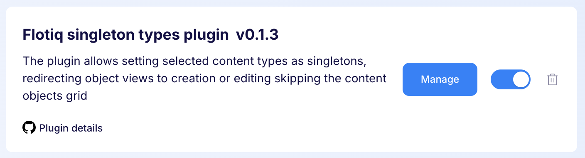
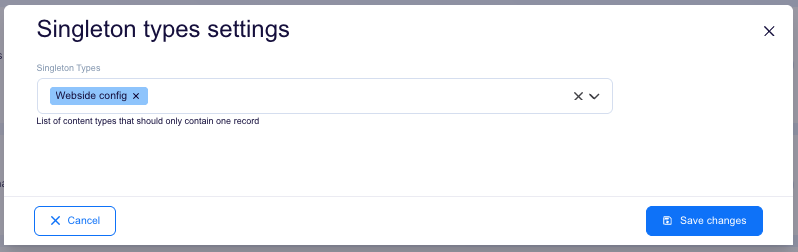
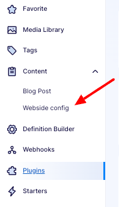

---
tags:
  - Developer
---

title: Thumbnails plugin | Flotiq documentation
description: The plugin allows setting selected content types as singletons, redirecting object views to creation or editing skipping the content objects grid.

The plugin allows setting selected content types as singletons, redirecting object views to creation or editing skipping the content objects grid.

## Installing the Singleton Types plugin

Find in the right sidebar panel `Plugins` and select.

{: .center .width25 .border}

On the next screen, click the plus icon next to `Flotiq singleton types plugin` to install and enable the plugin.

{: .center .width75 .border}

Once the plugin is enabled, click `Manage` to open the modal with the form.

{: .center .width75 .border}

Next, fill in the details and click `Save changes` to complete your plugin setup.

{: .center .width75 .border}

* Singleton types - Defines the type of objects that should only contain one record.

## Usage

Now when you click on the types selected in the plugin configuration you will be taken directly to the edit or add page of Content object

{: .center .width5 .border}

