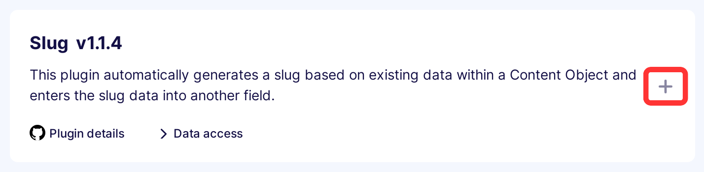
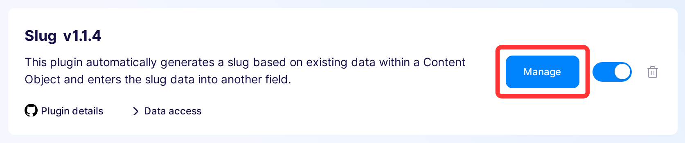
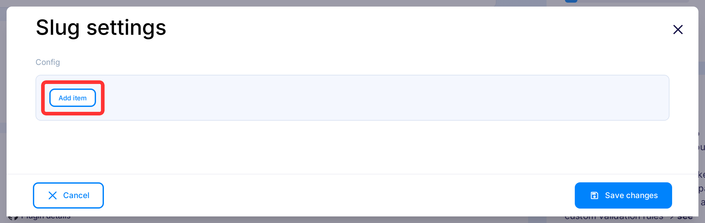
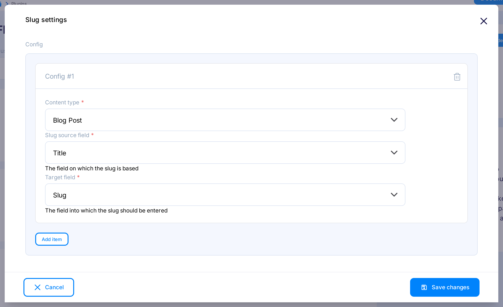

---
tags:
  - Developer
---

title: Slug | Flotiq documentation
description: This plugin simplifies the process of creating slugs for your Content Object.

# Slug generation plugin

This plugin simplifies the process of creating slugs for your Content Object. It’s particularly useful when you want to generate slugs automatically based on existing data within a Content Object (e.g. the title of a blog post).

## Installing the Slug plugin

Find in the right sidebar panel `Plugins` and select.

{: .center .width25 .border}

On the next screen, click the plus icon next to `Slug` to install and enable the plugin.

{: .center .width75 .border}

Once the plugin is enabled, click `Manage` to open the modal with the form.

{: .center .width75 .border}

After the modal is opened, click `Add`.

{: .center .width75 .border}

Next, fill in the details and click `Save changes` to complete your plugin setup.

{: .center .width75 .border}

* Content Type - Defines the type of objects for which the slug will be generated.

* Slug source field - Determines the field on which the slug will be based.

* Target field - Specifies the field to which the slug will be entered.

You're done. Now you will see the refresh icon next to the slug field in the Content Object form. If you’re creating a new object and the field is currently empty, it will be auto-filled. If you’re editing an existing object or the field contains data, click the refresh icon to regenerate the slug.

{: .center .width75 .border}
