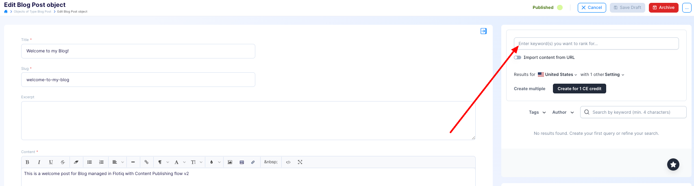

---
tags:
  - Developer
---

title: SurferSEO Content Optimization Plugin | Flotiq documentation
description: Use leading content optimization platform directly in Flotiq and never miss a chance to increase your visibility in search engines!

# SurferSEO Content Optimization Plugin

This plugin integrates Surfer SEO into your application, enabling advanced text analysis for selected input fields. It
provides real-time SEO insights and recommendations, helping you optimize your content directly within your workflow.

## Installing SurferSEO Content Optimization Plugin
Find in the right sidebar panel `Plugins` and select.

{: .center .width25 .border}

On the next screen, click the plus icon next to `Installing SurferSEO Content Optimization Plugin` to install and enable the plugin.

{: .center .width75 .border}

Once the plugin is enabled, click Manage to open the modal with the form.

{: .center .width75 .border}

After the modal is opened, click `Add item`.

{: .center .width75 .border}


## Configuration

The plugin requires you to select a Content Type Definition (CTD) and a rich text field for which the SEO analysis will
be performed. The analysis window will be displayed in the sidebar during content creation and editing, providing
real-time SEO analysis of the content from the selected rich text field. This seamless integration ensures that users
can optimize their content as they work, without needing to switch between tools

> **Note**: The plugin also supports optional fields such as title, whose content will be processed as an `<h1>`.
> lead, whose content will be analyzed as a `<p>` and FAQ, whose content will also be included in the analysis.

{: .center .width75 .border}

**The fields selected in the plugin configuration will be passed for analysis in the following format.**

```html

<body>
   <h1>{{Title}}</h1>
   <p>{{Lead}}</p>
   {{source}}
   
   <h2>Frequently Asked Questions</h2>
   <div>
       <h3>{{question.1}}</h3>
       <div>{{question.1}}</div>
   </div>
   <div>
       <h3>{{question.2}}</h3>
       <div>{{question.2}}</div>
   </div>
   {{...}}
</body>
``` 
{ data-search-exclude }

It's worth noting that if an optional field is not selected, it will not be included in the analysis. For example, if
the title field is left empty, the `<h1>` tag **will not be sent for analysis.**

## Usage

> **Note**: You must be logged into your Surfer SEO account and enable third-party cookies in your browser for this
> integration to function properly.


First, select the keywords you want to target for analyzing your content. These keywords will guide the SEO
recommendations and help optimize your text effectively. Choosing relevant keywords is essential to ensure the analysis
aligns with your goals.

{: .center .width80 .border}

Next, select the tag of interest from the list of available tags.

{: .center .width75 .border}

Now, the content of the selected field will be analyzed based on the tags you have chosen.

{: .center .width75 .border}

You can read more about SurferSeo
plugin [here](https://surferseo.notion.site/Surfer-Guidelines-in-your-CMS-ba2ea6b1a3234850bc1b49caa1a7acda)
