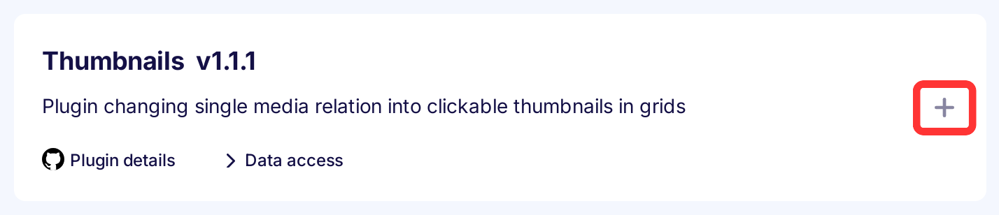
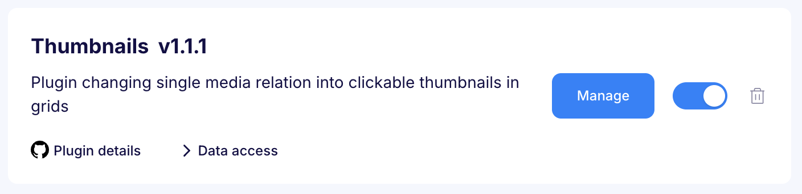

---
tags:
  - Developer
---

title: Thumbnails plugin | Flotiq documentation
description: This plugin generates thumbnails instead of simple link icons on object grids. Thumbnails are clickable and after clicking, a modal with a bigger version is shown.

This plugin generates thumbnails instead of simple link icons on object grids. Thumbnails are clickable and after clicking, a modal with a bigger version is shown.

## Installing the Thumbnails plugin

Find in the right sidebar panel `Plugins` and select.

{: .center .width25 .border}

On the next screen, click the plus icon next to `Thumbnails` to install and enable the plugin.

{: .center .width75 .border}

Once the plugin is enabled, click `Manage` to open the modal with the form.

{: .center .width75 .border}

Next, fill in the details and click `Save changes` to complete your plugin setup.

{: .center .width75 .border}

* Content types - Defines the type of objects for which the thumbnails will be displayed.

## Usage

Now you will see single media images for the selected types in objects gird.

{: .center .width75 .border}

And after clicking on it the modal is visible.

{: .center .width75 .border}
