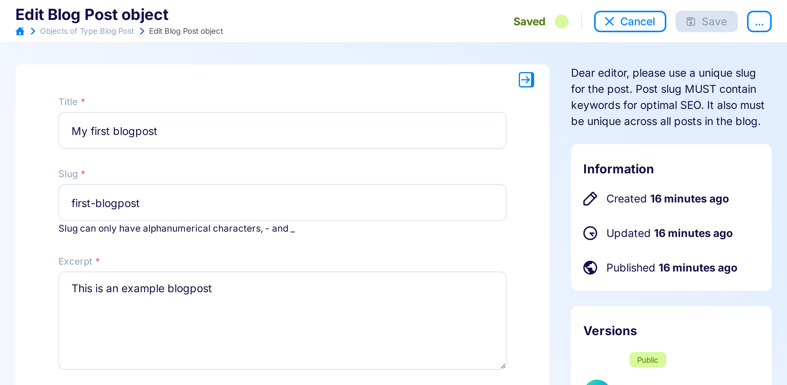
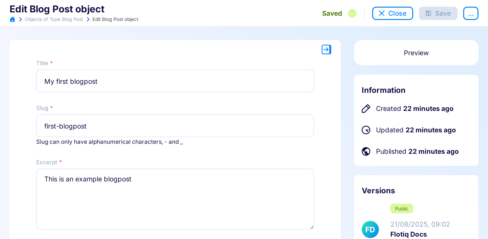
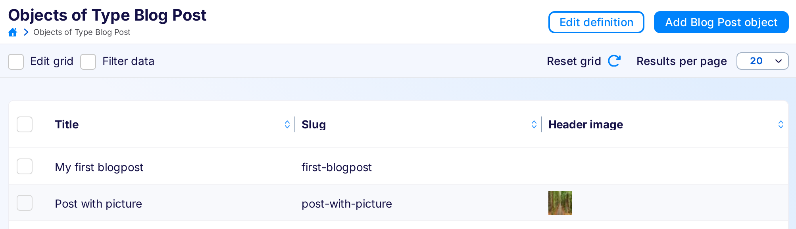
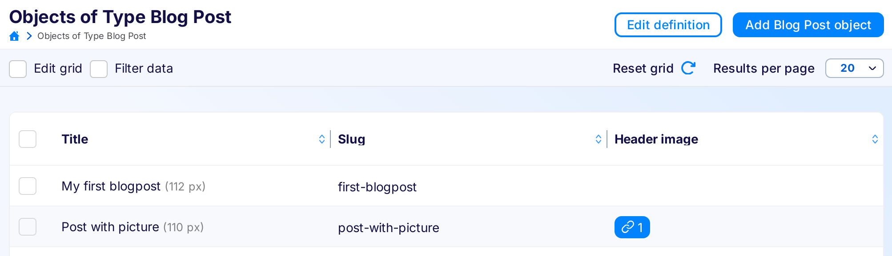

---
tags:
  - Developer
---

# Flotiq UI Example Plugins

## Add instructions for your editors

```javascript
// Register plugin
FlotiqPlugins.add(
  {
    id: 'mycompany.post-edit-info',
    name: `Blog Post instructions`,
    version: `1.0.0`,
  },
  function (handler) {
    // Listen for sidebar-panel::add events to intercept sidebar rendering
    handler.on('flotiq.form.sidebar-panel::add', ({ contentType }) => {
      // Make sure we're adding the info only for Blog Posts
      if (contentType?.name !== 'blogpost') return null;

      // Return string message
      return `Dear editor, please use a unique slug for the post. 
        Post slug MUST contain keywords for optimal SEO. 
        It also must be unique across all posts in the blog.`;
    });
  },
);
```
{ data-search-exclude }

Result:

{: .border}

## Add preview link to edit form

This plugin adds new right-hand sidebar elements for content object forms.

```javascript
FlotiqPlugins.add(
  {
    id: 'mycompany.link-to-preview',
    name: `Preview link for posts`,
    version: `1.0.0`,
  },
  function (handler) {
    handler.on(
      'flotiq.form.sidebar-panel::add',
      ({ contentType, contentObject }) => {
        if (contentType?.name !== 'blogpost') return null;
        if (!contentObject) return null; // Skip link creation on Add Blog Post object page

        // Create div HTML element
        const div = document.createElement('div');

        // Add link inside
        div.innerHTML = `
            <a target="_blank" href="https://my.page.com/${contentObject.slug}">Preview</a>
        `;

        // Style panel to look a bit better.
        div.style.background = `white`;
        div.style.padding = `1rem`;
        div.style.borderRadius = '1rem';
        div.style.textAlign = 'center';

        return div;
      },
    );
  },
);
```
{ data-search-exclude }

Result:

{: .border}

## Preview image in the grid

```javascript
FlotiqPlugins.add(
  {
    id: 'mycompany.preview-media',
    name: `Media preview`,
    version: `1.0.0`,
    permissions: [ // Our plugin needs to be able to access media api
      {
        ctdName: '_media',
        type: 'CO',
        canRead: true,
      },
    ],
  },
  function (handler, client) {
    handler.on(
      'flotiq.grid.cell::render',
      ({ contentType, accessor, data }) => {
        // Don't do anything if we're not rendering blogpost -> media field
        if (contentType?.name !== 'blogpost') return null;
        if (accessor != 'headerImage') return null;

        const imageRelation = data[0];
        if (!imageRelation)  return null;

        // Create HTML image element
        const img = document.createElement('img');

        // Load media object using api client
        // Important - *::render and *::add event handlers 
        //     may not be async/await functions, so we need to use
        //     .then callback to add src attribute
        client._media
          .get(imageRelation.dataUrl.match(/[^/]+$/)[0])
          .then(({ body }) => {
            // Once media info is loaded, set image url
            const imgUrl = client.getMediaUrl(body, 30, 30);
            img.setAttribute('src', imgUrl);
          });

        return img;
      },
    );
  },
);
```
{ data-search-exclude }

Result:

{: .border}


## Modify input config

Change styles for selected inputs in object forms.

```javascript
FlotiqPlugins.add(
  {
    id: 'mycompany.input-styles',
    name: `Form input styles`,
    version: `1.0.0`,
  },
  function (handler) {
    handler.on(`flotiq.form.field::config`, ({ config, contentType, name }) => {
      if (contentType.name !== 'blogpost') return;
      
      if (name === 'title') {
        config.style = {
          ...config.style,
          color: 'blue',
          backgroundColor: 'lightgreen',
        };
      } else if (name === 'slug') {
        config.style = {
          ...config.style,
          fontFamily: 'monospace',
        };
      }

      return config;
    });
  },
);
```
{ data-search-exclude }

Result:

{: .border}

## Access parent HTML element

In some cases, you may need to access the DOM tree. However, when a result element is created, it isn't attached yet. To be able to act on the DOM tree immediately after the element is attached, you can use `flotiq.attached` html event. 

Here we are adding a width of the title based on a parent element width:

```javascript
FlotiqPlugins.add(
  {
    id: 'mycompany.title-width',
    name: `Add title width to the Blog Posts table`,
    version: `1.0.0`,
  },
  function (handler) {
    handler.on(
      `flotiq.grid.cell::render`,
      ({ data, contentType, accessor }) => {
        if (contentType.name !== 'blogpost' || accessor !== 'title') return;

        const titleSpan = document.createElement('span');
        titleSpan.textContent = data;

        titleSpan.addEventListener('flotiq.attached', () => {
          const parentWidth = Math.round(
            titleSpan.parentElement.getBoundingClientRect().width,
          );

          titleSpan.innerHTML = `${data} <span style="font-size: 0.9em; color: gray;">(${parentWidth} px)</span>`;
        });
        return titleSpan;
      },
    );
  },
);
```
{ data-search-exclude }

Result:

{: .border}

## Clear global counter after element is detached

In some cases, you may need to know when element is detached from the DOM tree. To be able to act immediately after the element is detached, you can use `flotiq.detached` html event. 

Here we clear the global counter after element is detached:

```javascript
let counter = 0;

FlotiqPlugins.add(
  {
    id: 'mycompany.click-counter',
    name: `Count clicks on the blog post titles`,
    version: `1.0.0`,
  },
  function (handler) {
    handler.on(
      `flotiq.grid.cell::render`,
      ({ data, contentType, accessor }) => {
        if (contentType.name !== 'blogpost' || accessor !== 'title') return;

        const button = document.createElement('button');
        button.textContent = `${data} (${counter})`;

        button.addEventListener('click', () => {
          counter++;
          button.textContent = `${data} (${counter})`;
        });

        button.addEventListener('flotiq.detached', () => {
          counter = 0;
        });

        return button;
      },
    );
  },
);
```
{ data-search-exclude }

## Open custom modal 
 
Open the modal by clicking on the grid ID cell.

```javascript
FlotiqPlugins.add(
  {
    id: 'mycompany.open-modal',
    name: 'Open the modal by clicking on the grid ID cell',
    version: '1.0.0',
  },
  function (handler, _, { openModal }) {
    handler.on(
      `flotiq.grid.cell::render`,
      ({ data, contentType, accessor }) => {
        if (accessor !== 'id') return;

        const contentElement = document.createElement('div');
        contentElement.textContent = `I'm the modal content!`;

        const idButton = document.createElement('button');
        idButton.textContent = data;
        idButton.style.color = 'green';

        idButton.addEventListener('click', async () => {
          const result = await openModal({
            title: 'Some modal title',
            size: 'md',
            content: contentElement,
            hideClose: true,
            buttons: [
              {
                key: 'result',
                label: 'I have the true result',
                result: true,
              },
              {
                key: 'callback',
                label: `I have the callback`,
                color: 'blueBordered',
                onClick: () => {
                  console.log('There is my callback');
                  return false;
                }
              }
            ]
          });

          console.log('result', result);
        });
        return idButton;
      },
    );
  },
);
```
{ data-search-exclude }

Result:

<video class="border" src="../img/custom-modal-html.mp4" controls=""><a href="../img/custom-modal-html.mp4">Open custom modal</a></video>

## Open modal with form 

In the examples, we are opening a modal from the grid ID cell.

### Form defined with a schema that returns data

After the form submission, we log the form values in the console.

```javascript
FlotiqPlugins.add(
  {
    id: 'mycompany.open-form-modal',
    name: 'Open modal with custom form from id cell',
    version: '1.0.0',
  },
  function (handler, _, { openSchemaModal }) {
    handler.on(
      `flotiq.grid.cell::render`,
      ({ data, contentType, accessor }) => {
        if (accessor !== 'id') return;

        const idButton = document.createElement('button');
        idButton.textContent = data;
        idButton.style.color = 'green';

        idButton.addEventListener('click', async () => {
          const result = await openSchemaModal({
            title: 'Some modal title',
            size: 'lg',
            form: {
              schema: {
                id: 'mycompany.open-modal',
                schemaDefinition: {
                  type: 'object',
                  allOf: [
                    {
                      $ref: '#/components/schemas/AbstractContentTypeSchemaDefinition',
                    },
                    {
                      type: 'object',
                      properties: {
                        text: {
                          type: 'string',
                          minLength: 1,
                        },
                      },
                    },
                  ],
                  required: ['text'],
                  additionalProperties: false,
                },
                metaDefinition: {
                  order: ['text', ],
                  propertiesConfig: {
                    text: {
                      label: 'Text',
                      unique: false,
                      helpText: '',
                      inputType: 'text',
                    },
                  },
                },
              },
            },
          });
          console.log('result', result);
        });

        return idButton;
      },
    );
  },
);
```
{ data-search-exclude }

Result:
<video class="border" src="../img/custom-modal-ctd-schema.mp4" controls=""><a href="../img/custom-modal-ctd-schema.mp4">Form defined with a schema that
returns data</a></video>

### Form with custom submit and button labels

After the form submission, we copy values from one field to another and after 1s we close the modal and log new values in the console. The button labels are customized.

```javascript
FlotiqPlugins.add(
  {
    id: 'mycompany.open-form-modal',
    name: 'Open modal with custom form from id cell',
    version: '1.0.0',
  },
  function (handler, _, { openSchemaModal }) {
    handler.on(
      `flotiq.grid.cell::render`,
      ({ data, contentType, accessor }) => {
        if (accessor !== 'id') return;

        const idButton = document.createElement('button');
        idButton.textContent = data;
        idButton.style.color = 'green';

        idButton.addEventListener('click', async () => {
          const result = await openSchemaModal({
            title: 'Some modal title',
            size: 'lg',
            form: {
              labels: { ok: 'Test', cancel: 'Close' },
              options: {
                onSubmit: async (values, modalInstance) => {
                  const newValues = { text: values.text, 'text-copy': values.text };
                  setTimeout(() => {
                    modalInstance.resolve(newValues);
                  }, [1000]);
                  return [newValues, null];
                },
              },
              schema: {
                id: 'mycompany.open-modal',
                schemaDefinition: {
                  type: 'object',
                  allOf: [
                    {
                      $ref: '#/components/schemas/AbstractContentTypeSchemaDefinition',
                    },
                    {
                      type: 'object',
                      properties: {
                        text: {
                          type: 'string',
                          minLength: 1,
                        },
                        'text-copy': { type: 'string' },
                      },
                    },
                  ],
                  required: ['text'],
                  additionalProperties: false,
                },
                metaDefinition: {
                  order: ['text', 'text-copy'],
                  propertiesConfig: {
                    text: {
                      label: 'Text',
                      unique: false,
                      helpText: 'This content will be copy to text-copy input',
                      inputType: 'text',
                    },
                    'text-copy': {
                      label: 'Text Copy',
                      helpText: '',
                      inputType: 'text',
                      readonly: true,
                    },
                  },
                },
              },
            },
          });
          console.log('result', result);
        });

        return idButton;
      },
    );
  },
);
```
{ data-search-exclude }

Result:

<video class="border" src="../img/custom-modal-ctd-schema-async-return.mp4" controls=""><a href="../img/custom-modal-ctd-schema-async-return.mp4">Form
with custom submit and button labels</a></video>
