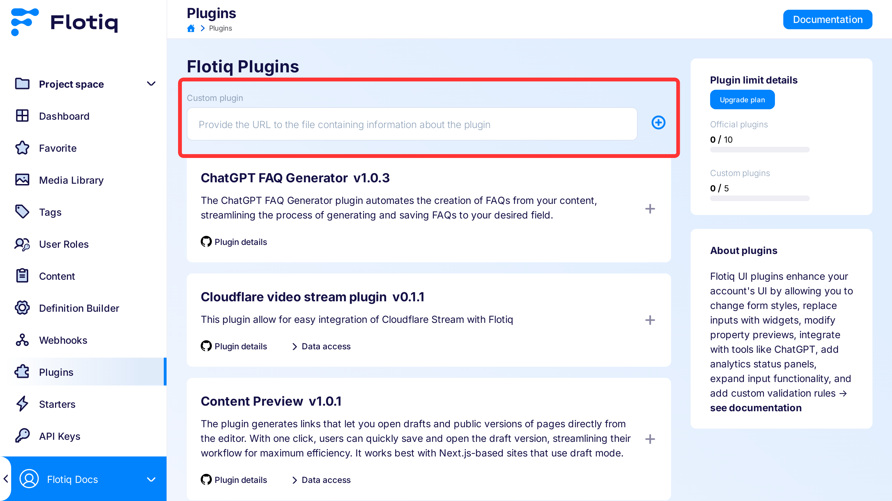

---
tags:
  - Developer
---

# Flotiq UI Plugins development

If you find Flotiq UI not enough, you can write your own extensions, that will suit your specific needs.

Flotiq UI plugins can be used to enhance our UI experience within your account, including (but not limited to):

* Changing styles of the form
* Replacing existing inputs in forms with dedicated widgets (e.g. star rating radio instead of radio buttons, a tool to visually place items on 2d canvas with coordinates saved to a list)
* Modifying preview of certain properties in table-view
* Integrating with tools like ChatGPT to generate text descriptions
* Adding status panels that integrate with your analytics tool
* Expanding the functionality of existing inputs by adding a visual preview of the results
* Introducing custom validation rules before objects can be saved

## Basics

The Flotiq extensions system is based on the idea of events. The plugin first registers itself, and after that, it registers event handlers for the actions it wants to intercept.


Once event handlers are registered, the plugin is ready to help us. For example by rendering it as a React component via `<ElementFromPlugin>`:


## Writing the code

Here's a general structure of the plugin code:

```javascript
FlotiqPlugins.add({                                     // 1. Registration
    id: '<unique plugin id>',
    name: '<human readable name for the plugin>',
    version: '<semver version>',
    permissions: [/* list of permissions, see below */],
}, function (handler, apiClient, globals) {             // 2. Initialization
    handler.on('flotiq::event1', (eventParams) => {     // 3. Event handling
        /* event handling code */
    })
})
```
{ data-search-exclude }

What happens here?

1. **Registration** - First, the plugin needs to introduce itself to Flotiq. Most of the information here is for end-users, so that they can review what kind of plugins they are running. There are several pieces of info that are more important to the plugin API:
    - `id` - this must be a unique string for all plugins. Only one plugin with a given `id` can be registered. If subsequent registration is executed with the same `id`, the previous plugin instance will be removed.
      We recommend prefixing each plugin `id` with your company name to avoid `id` conflicts.
    - `name`* - A user friendly name of the plugin. It will be shown in plugin management page
    - `url`* - Full URL to the js file that contains the plugin.
    - `version`* - Current version of the plugin. It is required for Flotiq to determine if the version used by the user is still up to date.
    - `permissions` - if the plugin requires access to user data via Flotiq API, it must present a set of required permissions. This is the only way, to get an `apiClient` object that will allow you to access user content or schema.
   
    *\* These fields are not required during plugin development, but must be present in plugin manifest when plugin is published and loaded via manifest entry*

2. **Initialization** - After registration, your plugin will be initialized with a provided callback. This callback receives two arguments:
    - `handler` - an event handler for your plugin. It will allow you to attach to multiple UI events.
    - `apiClient` - an API client with a set of properties that allow you to access user data.
  
    This is the best place to perform initialization work. E.g. inject `<style>` elements with your CSS classes.

3. **Event handling** - After all initialization code is executed, your plugin will wait for events from Flotiq UI. Each time the event occurs in Flotiq, your event callback will be executed. Each event has a different set of parameters and expects different results. For example `::render` events will expect HTML content as a result, while `::config` events will not take any result and expect you to modify existing config. For details, please refer to [[Events.md|Flotiq Event Types]].

### API permissions

Often plugins require access to user data. E.g. to display options stored in another content type, or to display images from a relation field. 

Flotiq UI plugins are allowed to access API only with pre-prepared API client, after declaring the scope of access. 

**Important**: plugins are not using own API Keys, nor there are direct `fetch` calls from plugin code to API. Instead, plugins **must** use the provided API client. All of the write actions will be registered as if a user made the change.

To be able to do it, a plugin needs to request API access with [[PluginInfo.md#class-pluginpermission|`permissions`]] field during registration:

```javascript
FlotiqPlugins.add({
    id: '<unique plugin id>',
    name: '<human readable name for the plugin>',
    version: '<semver version>',
    permissions: [
      {type: 'CO', canRead: true, ctdName: '*'},
      {type: 'CO', canWrite: true, canCreate: true, canDelete: true, canRead: true, ctdName: 'blogpost'},
      {type: 'CTD', canRead: true, ctdName: '_media'},
      {type: 'CTD', canRead: true, ctdName: '_tag'},
    ]
}, /*...*/)
```
{ data-search-exclude }

In the example above, we are requesting the following access:

- an ability to read all content objects
- an ability to read, modify, delete and create objects of type `blogpost`
- an ability to read the schema of `_media` (we can read `_media` objects already due to the first access rule. )
- an ability to read the schema of `_tags`

Now, we can utilize this info in our event handlers:

```javascript
FlotiqPlugins.add(
  {
    /* ... */
    permissions: [
      /*...*/
    ],
  },
  function (handler, apiClient) {
    handler.on('flotiq::event1', () => {
      // Load Content Type Definition for _media objects
      apiClient._media.getContentType().then(({ body, ok }) => {
        if (ok) 
          console.log('media get schema:', body);
        else 
          console.error('media get schema error:', body);
      });

      // Load _media objects
      apiClient._media.get('<media id>').then(({ body, ok }) => {
        if (ok) 
          console.log('media get response:', body);
        else 
          console.error('media get error:', body);
      });

      // Save new blogpost object
      apiClient.blogpost.post({title: 'title', content: 'content'}).then(({ body, ok }) => {
        if (ok) 
          console.log('blogpost create response:', body);
        else 
          console.error('blogpost create error:', body);
      });
    });
  },
);
```
{ data-search-exclude }

### Examples

See [Plugin examples page](./plugin-examples.md)

### Available classes and events

See [Flotiq UI API reference](PluginDocs/index.md).

### Caching

As a plugin author, you are responsible for caching relevant results on your end. There are two areas that will require caching in most scenarios.

#### `::render` and `::add` result caching

Flotiq UI updates whenever your plugin returns something new. Consider the following code:

```javascript
//...
handler.on('flotiq.grid.cell::render', ({ contentType, accessor, data }) => {
  //...
  // Create HTML image element
  const div = document.createElement('div');
  div.textContent = data.toString().toUpperCase();
  return div;
});
//...
```
{ data-search-exclude }

In this example, each time the grid cell is rendered we are creating a new HTML element and populating it with data. While this operation does not take long, we are doing it for all grid cells, which may sum up to lower performance and many unnecessary UI re-renders.

To avoid this, it's a good practice to set up an element cache:

```javascript
const elementCache = {};
//...
handler.on(
  'flotiq.grid.cell::render',
  ({ contentType, accessor, data, contentObject }) => {
    //...
    const elementCacheKey = `${contentType.name}-${contentObject.id}-${accessor}`;

    // Check if the element for this cell exists already.
    let div = elementCache[elementCacheKey];

    if (!div) {
      // If not, create HTML image element and ut it into cache
      div = elementCache[elementCacheKey] = document.createElement('div');
    }

    // Update content
    div.textContent = data.toString().toUpperCase();
    return div;
  },
);
//...
```
{ data-search-exclude }

Here we added an in-memory cache for created div elements. Each element in the cache is indexed by content type, id of the object and the name of the property. If the div element for the particular cell already exists, it will be returned instead of creating a new one. This will not only save us some memory and CPU but also avoid unnecessary re-renders of the UI!

This can be easily so that elements are removed from the cache, once they are removed from the DOM. We can also cache more data alongside the element (for example React app root object)

#### API call results

Often you'll be calling Flotiq API to query some data. There are views in which the data will not change often though. One such view is a content grid table where we're just displaying some data and no updates are done.

Let's consider the example below:

```javascript
const elementCache = {};

handler.on('flotiq.grid.cell::render', ({ contentType, accessor, data, contentObject }) => {
  // Don't do anything if we're not rendering blogpost -> media field
  if (contentType?.name !== 'blogpost') return null;
  if (accessor != 'headerImage') return null;
  const elementCacheKey = `${contentType.name}-${contentObject.id}-${accessor}`;

  const imageRelation = data[0];

  let img = elementCache[elementCacheKey];
  if (!img) img = elementCache[elementCacheKey] = document.createElement('img');

  // Load media object using api client
  // Important - *::render and *::add event handlers
  //     may not be async/await functions, so we need to use
  //     .then callback to add src attribute
  const imageId = imageRelation.dataUrl.match(/[^/]+$/)[0];
  client._media.get(imageId).then(({ body }) => {
    // Once media info is loaded, set image url
    const imgUrl = client.getMediaUrl(body, 30, 30);
    img.setAttribute('src', imgUrl);
  });

  return img;
});
```
{ data-search-exclude }

Here, our code creates an `img` element. Then we extract `mediaId` from `dataUrl` and download info about the media file. Finally, we populate the `src` attribute with an image URL based on the `_media` content object.

This will display correct data, however, we'll download `_media` object for each row of the grid, even in some cases the same image may occur more than once. To improve user experience, we should keep some of this info in a local cache and reuse it when we can.

Now let's take a look at an improved example:

```javascript
const elementCache = {};
const mediaPromiseCache = {};

handler.on('flotiq.grid.cell::render', ({ contentType, accessor, data, contentObject }) => {
  // Don't do anything if we're not rendering blogpost -> media field
  if (contentType?.name !== 'blogpost') return null;
  if (accessor != 'headerImage') return null;
  const elementCacheKey = `${contentType.name}-${contentObject.id}-${accessor}`;

  const imageRelation = data[0];

  let img = elementCache[elementCacheKey];
  if (!img) img = elementCache[elementCacheKey] = document.createElement('img');

  // Load media object using api client
  // Important - *::render and *::add event handlers
  //     may not be async/await functions, so we need to use
  //     .then callback to add src attribute
  const imageId = imageRelation.dataUrl.match(/[^/]+$/)[0];

  let mediaPromise = mediaPromiseCache[imageid];
  if (!mediaPromise) {
    mediaPromise = mediaPromiseCache[imageid] = client._media.get(imageId);
  }

  mediaPromise.then(({ body }) => {
    // Once media info is loaded, set image url
    const imgUrl = client.getMediaUrl(body, 30, 30);
    img.setAttribute('src', imgUrl);
  });

  return img;
});
```
{ data-search-exclude }

We added a similar cache object to the element cache. Each cache element is a promise that is returned from the API client. We create this promise only once for each media `id`. Not only we will avoid pulling the same image data in parallel, but we will also re-use this data if such an image is used on other grid pages.

### Acting when an element is attached to the DOM tree

If you need to make any changes to the element after it was attached to the DOM tree, you can use `flotiq.attached` DOM event.

**Important**: This event is only fired on the root element returned by the plugin. Elements inside will not receive this event.

```javascript
const element = document.createElement('span');
console.log(element.parentElement); // will return null
element.addEventListener('flotiq.attached', () => { 
  console.log(element.parentElement); // will return parent <div>
});
return element;
```
{ data-search-exclude }

### Acting when an element is detached from the DOM tree

If you want to do something after detaching an element from the DOM tree (e.g. clear the element cache), you can use `flotiq.detached` DOM event.

**Important**: This event is only fired on the root element returned by the plugin. Elements inside will not receive this event.

```javascript
const element = document.createElement('span');
element.addEventListener('flotiq.detached', () => { 
  console.log('element removed'); // will be fired after element is detached
});
return element;
```
{ data-search-exclude }

!!! note "Multiple attaches/detaches"
    Your HTML element may be attached and detached multiple times, depending on the view and place being rendered. Be prepared to handle those situations accordingly. E.g. if you keep your elements in a cache across multiple renders, consider waiting at least 50ms before the element is removed from the cache.

## Plugin Installation

Once you have your plugin written, you have several options to install it into Flotiq UI. Multiple instances of the plugin with the same `id` will override each other, so you can easily update your plugin as needed.

### Temporary installation using js

**Important** This way, you'll register a plugin until you log out or refresh a browser tab.

1. Go to the Flotiq page and log in to your account
2. Open the developer console for the browser
3. Paste your plugin code into the console
4. (optional) work on the code
5. (optional) paste the code again

### Temporary installation using URL to js file

**Important** This way, you'll register a plugin until you log out or refresh a browser tab.

**Prerequisites**: Your plugin script needs to be accessible via http(s) URL from your browser.

1. Go to the Flotiq page and log in to your account
2. Open the developer console for the browser
3. Execute the following command:
   ```javascript
   FlotiqPlugins.loadPlugin('<unique script id>', '<url to file>');
   ```
   { data-search-exclude }
   For example:
   ```javascript
   FlotiqPlugins.loadPlugin(
     'mycompany.my-local-plugin',
     'http://localhost:3000/index.js',
   );
   ```
{ data-search-exclude }

### Permanent installation for the organization

**Prerequisites**: Your plugin script needs to be accessible via the http(s) URL from the browser of any user in your organization. In this case, `localhost` serving may not be enough unless you know for sure you are the only user of the plugin! 

Your plugin also must contain all required information in the `plugin-manifest.json` file. Manifest file has the same structure as the object provided when plugin registers its event handlers, however, some fields are no longer optional when manifest is provided. 

<details>
<summary>See an example of `plugin-maniest.json` that can be used to register new plugin</summary>

```json
{
  "id": "my-organization.example-plugin",
  "name": "An Example plugin",
  "description": "This is plugin created by My Organization to handle an example workflow for all data types",
  "version": "1.0.0",
  "repository": "https://github.com/my-organization/flotiq-example-plugin",
  "url": "https://example.com/index.js",
  "permissions": [
    {
      "ctdName": "*",
      "canRead": true,
      "type": "CO"
    }
  ]
}
```
{ data-search-exclude }

</details>

For more details on the required fields, see [[PluginInfo.md]].

If your plugin is ready for wider use within your organization:

1. Go to the Flotiq page and log in to your account
2. On the left-hand side select Plugins
3. Paste the URL to your `plugin-manifest.json` file in the **Custom plugin** field
4. Press the Add button (blue "+" icon) next to the field. Your plugin should now be visible in the list of available plugins
5. Add your plugin to the organization (gray "+" to the right of the plugin name) and enable it. 


