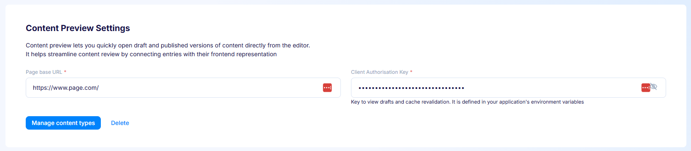
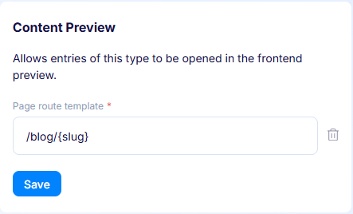
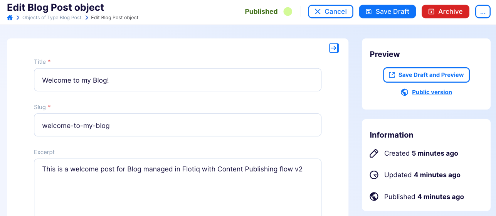
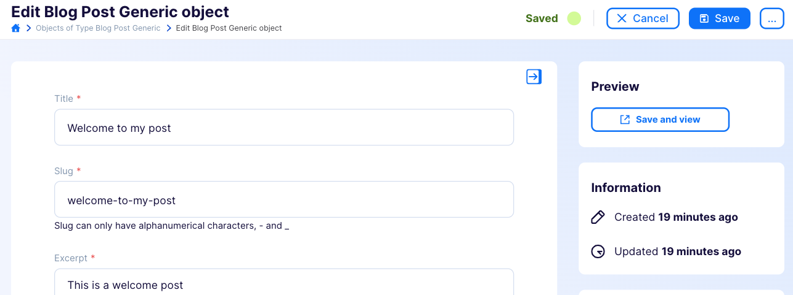

---
tags:
  - Developer
---

# Content Preview

Content Preview lets you quickly open draft and published versions of content
directly from the editor. It helps streamline content review by connecting
entries with their frontend representation. It works best with Next.js-based
sites that use draft mode.

!!! note
    Content Preview was previously available as a plugin. It is now part of
    [Space Settings](index.md) and no longer requires installing a plugin.

## Content Preview vs Live Preview

Flotiq offers two ways to preview content, for different use cases:

| Feature              | Content Preview                            | Live Preview                        |
| -------------------- | ------------------------------------------ | ----------------------------------- |
| **Preview type**     | Static link to draft page                  | Real-time websocket stream          |
| **Updates**          | Manual - refresh to see changes            | Automatic - updates as you type     |
| **Technology**       | Static HTTP link                           | WebSocket connection                |
| **Setup complexity** | Simple - just configure a URL template     | Requires npm package integration    |
| **Use case**         | Quick draft verification, simple workflows | Real-time editing with live preview |
| **Performance**      | Lower bandwidth, no ongoing connection     | Continuous connection required      |

Choose **Content Preview** if you need a simple way to preview your draft
content. Choose [Live Preview](../Plugins/Live-preview.md) if you want real-time
synchronization between your editor and website.

## Configuration

{: .border}

- **Page base URL** *(required)* - The base address of the site that renders
  your content, for example `http://localhost:3000` during local development.
  Once your site is deployed and publicly available, change this URL to the
  production address.
- **Client Authorisation Key** *(required)* - The key used to view drafts and
  perform cache revalidation on your site. Define the same key in your
  application's environment variables. Without it, your site can't preview
  unpublished content or update its cache.

Use **Manage content types** to go to the content type list, where you set a
route template on each type you want to preview (see below). Use **Delete** to
remove the Content Preview configuration from the space.

## Content types and route templates

The **Page route template** is configured per content type, in the Content
Preview panel shown when you edit a Content Type Definition. Set it for each
content type you want to preview.

{: .border}

- **Page route template** *(required)* - The URL path of your content pages,
  for example `/blog/{slug}`, where `{slug}` is a field of the content type.
  You can also use nested fields, like `{internal.createdAt}`, or list fields,
  such as `{addresses[0].city}`.

Only content types with a route template show preview links in the editor.
Use the trash icon to remove a content type from Content Preview.

## Usage

How the preview links behave depends on whether the content type uses the
draft/public publishing workflow.

### Content publishing workflow

When a content type uses the draft/public workflow, the editor shows two
actions:

- **Preview and Save Draft** - saves the current changes as a draft and opens
  the draft version of the page, so you can review edits before they go live.
- **Public Version** - opens the currently published version of the same page,
  letting you compare your draft against what readers see.

{: .border}

This uses draft mode in Next.js, so you can view changes before they are
visible to your readers.

### Simple workflow

When a content type doesn't use the draft/public workflow, any saved change is
immediately visible on your site. The editor shows a single **Save and View**
action that saves your work and opens the updated page.

{: .border}
