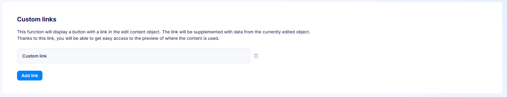
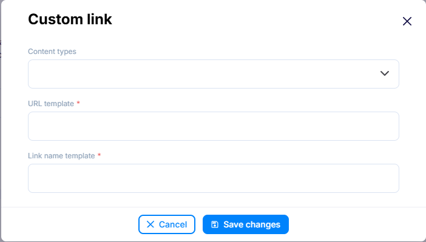
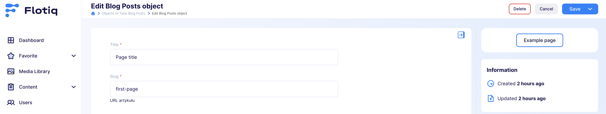
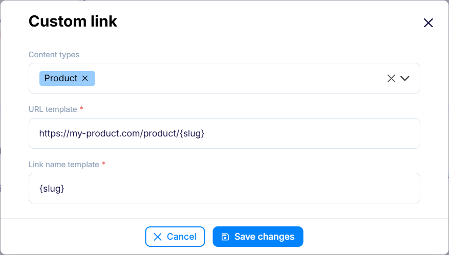
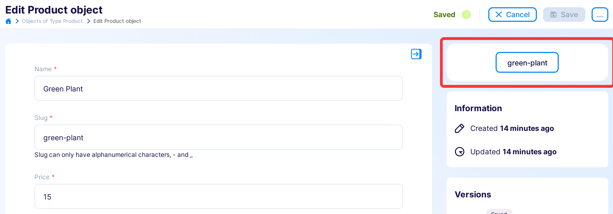
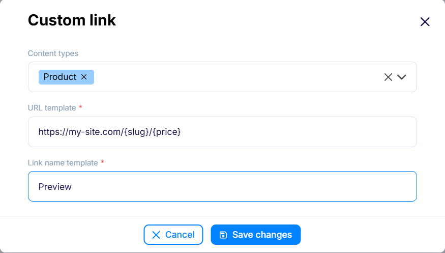
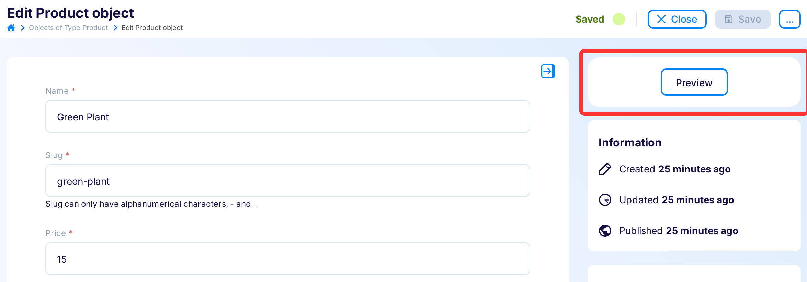

---
tags:
  - Developer
---

# Custom Links

Custom Links add a button with a dynamic link to the content object form. The
link is filled in with data from the object currently being edited, giving you
quick access to wherever that content is used.

!!! note
    Custom Links were previously available as a plugin. They are now part of
    [Space Settings](index.md) and no longer require installing a plugin.

## Configuration

{: .border}

Use **Add link** to create a new custom link, and the trash icon to remove one.
Select a link to open its configuration.

{: .border}

- **Content types** - The content types this link appears for. Leave empty to
  show the link for all content types.
- **URL template** *(required)* - The link address, filled in with fields of
  the edited object, for example `https://example.com/post/{slug}`. Nested and
  list fields work the same way as in route templates,
  e.g. `{internal.createdAt}` or `{addresses[0].city}`.
- **Link name template** *(required)* - The label shown on the button. It can
  also include object fields, for example `Open {title}`.

## Usage

Once configured, the custom link shows up as a button on the content object
form. Its address and label are filled in with data from the object you are
editing, so it always points to the right place for the current entry.

{: .border}

The link appears for the selected content types and is hidden while creating or
duplicating an object.

## Examples

### Linking to a preview environment

A common use case is a direct link to a preview or staging environment from the
editor. Configure a URL template that points to your preview site:

{: .border}

With an object like this:

{: .border}

you get a `green-plant` link leading to
`https://my-product.com/product/green-plant`.

### Complex routing

When a page URL needs several fields — for example a category *and* a slug —
combine them in the URL template:

{: .border}

With an object like this:

{: .border}

you get a link leading to `https://my-site.com/green-plant/15`.
