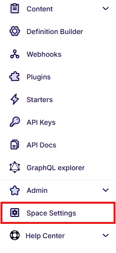

---
tags:
  - Developer
---

# Space Settings

Space Settings is the place to configure features that apply across a whole space.

- [Content Preview](content-preview.md) - open draft and published versions of
  your content directly from the editor.
- [Custom Links](custom-links.md) - add buttons with dynamic links to the
  content object form.

To open Settings, go to your space and select **Space Settings**:

{: .border}
