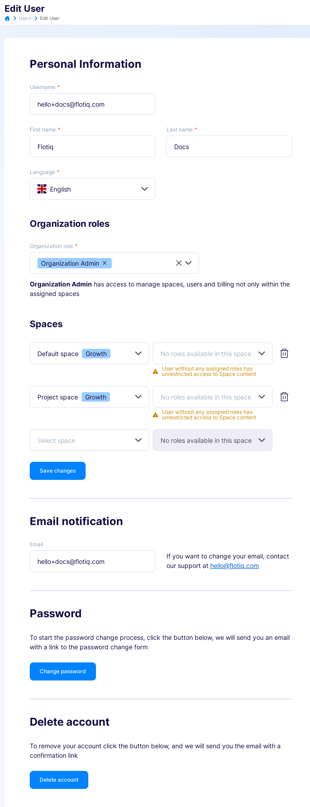
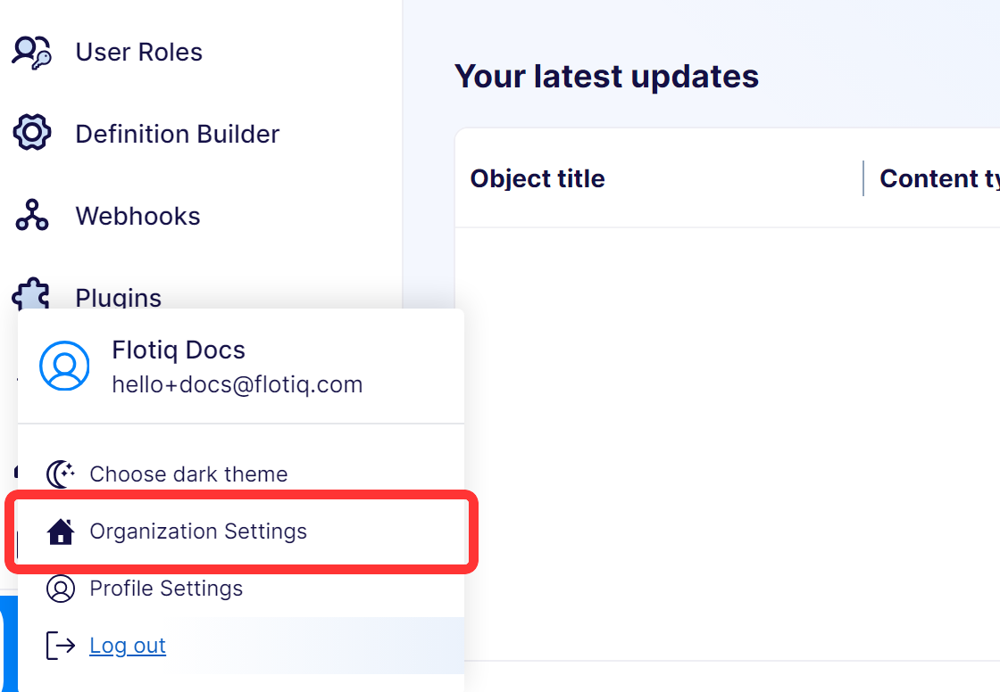

---
tags:
  - Content Creator
  - Administrator
---

title: Account Settings
description: How to manage account and organization settings in Flotiq.

# Account Settings

This page explains where account-related settings are managed in the Flotiq Panel and which role is required.

## Settings scope

Flotiq has two settings scopes:

- **User account settings** for your profile data and password.
- **Organization settings** for users, Spaces, and billing.

## User account settings

To update your profile data, open the `Users` section and edit your user record.

{: .center .width75 .border}

Typical updates include:

- Display name
- Password
- Email preferences

## Organization settings

Use `Organization Settings` to manage account-wide configuration.

{: .width25 .border .center}

From there, you can:

- Manage users in the Organization
- Manage Spaces and usage
- Access billing and invoices

## Role requirements

- **Organization Admin** can manage organization-wide settings.
- Users without organization admin permissions can only manage their own account-level details.

## Related docs

- [Users](./users.md)
- [User Roles](./user-roles.md)
- [Spaces and Organization](./spaces.md)
- [Plans and Billing](./billing.md)
- [Authentication](./authentication.md)

