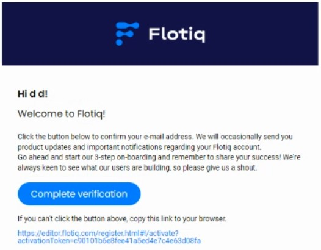
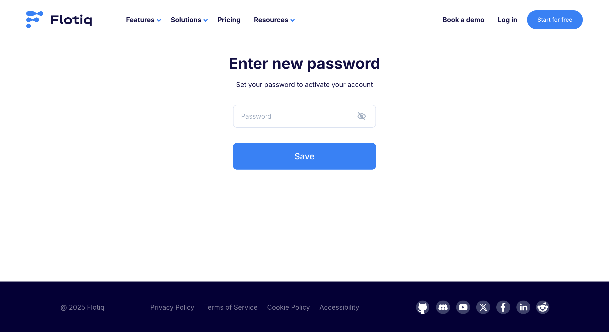
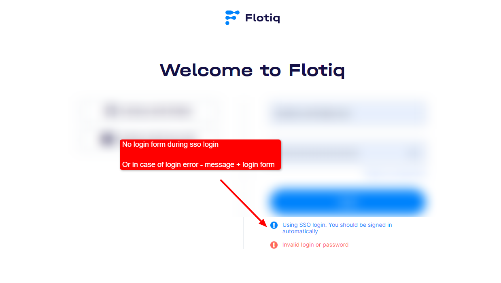

---
tags:
  - Content Creator
  - Developer
  - Administrator
---

title: Authentication
description: Authentication methods and access flow in Flotiq.

# Authentication

Flotiq supports standard login and enterprise single sign-on. Access after login depends on your assigned role and Space.

## Standard account flow

Typical user access flow:

1. A user is invited by an `Organization Admin`.
2. The user receives an invitation email.
3. The user sets a password and activates the account.
4. The user signs in to the Flotiq Panel.

{:.width50 .center .border}

{: .center .border}

## Enterprise SSO flow

Organizations on Enterprise plans can use Active Directory SSO.

SSO is typically configured by an `Organization Admin` together with an IT identity administrator.

{: .border}

With SSO enabled:

- users are automatically authenticated by the company login system (identity provider),
- the login form is skipped when authentication succeeds,
- standard login remains available as a fallback when SSO cannot authenticate the user.

For setup prerequisites and rollout steps, see [SSO](./sso.md).

## Authentication and authorization

Authentication confirms who the user is.
Authorization controls what the user can access.

In Flotiq, authorization is defined by:

- Organization role (for organization-wide management),
- Space role (for content access within a selected Space).

See [User Roles](./user-roles.md) for role details.

## API access note

Panel login credentials and API keys are separate authentication methods.
For API keys and scoped access, see [API access & scoped keys](../API/index.md).

## Related docs

- [SSO](./sso.md)
- [Users](./users.md)
- [User Roles](./user-roles.md)
- [Access control](./access-control.md)
- [Account Settings](./account-settings.md)

