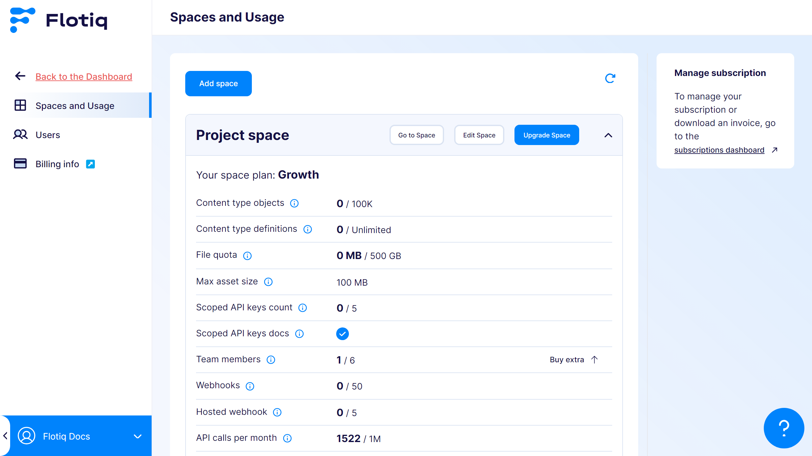
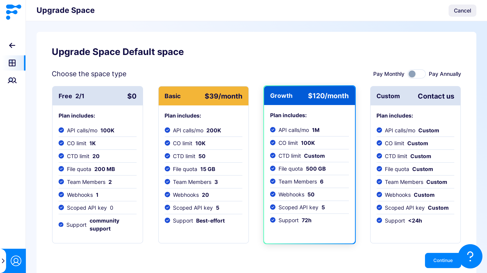
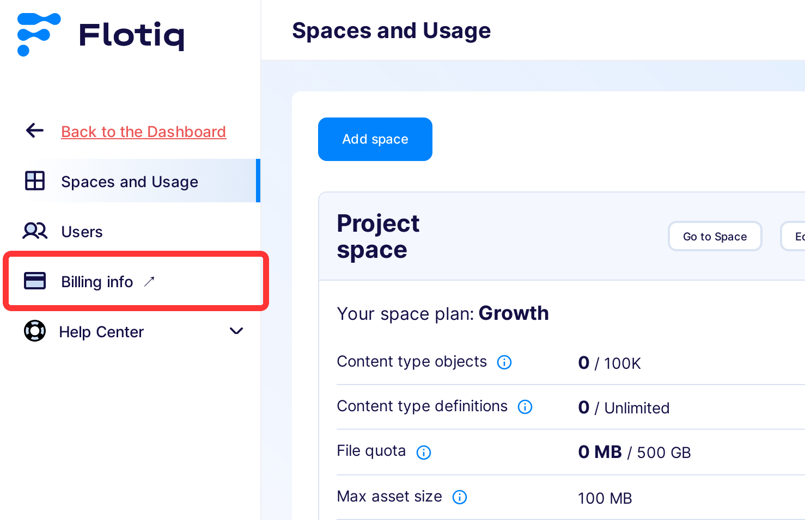

---
tags:
  - Administrator
---

title: Plans and Billing
description: How plans, subscriptions, and billing work in Flotiq.

# Plans and Billing

In Flotiq, billing and usage are managed per Space. Each Space has its own plan and usage limits.

Usage limits can include metrics such as API requests, content volume, and media storage, depending on your plan.

## Billing scope

- Plans are assigned to individual Spaces.
- Usage limits are calculated separately for each Space.
- A single Organization can contain Spaces with different plans.

## Who can manage plans and billing

Only users with the `Organization Admin` role can change plans, manage subscriptions, and review billing documents.

## Where to manage plans

1. Open `Organization Settings`.
2. Go to `Spaces and Usage`.
3. Use available actions for a selected Space.

{: .border}

## Changing a Space plan

From `Spaces and Usage`, choose the Space and select `Upgrade Space`.

{: .border}

When plan changes take effect:

- **Free to paid**: redirect to payment flow.
- **Paid to another paid plan**: change is confirmed, and billing adjustment is applied at the end of the billing period.
- **Paid to free**: cancellation is scheduled for the end of the current billing period.

## Managing subscription and invoices

To manage subscription details or download invoices:

1. Open `Organization Settings`.
2. Open `Billing info`.

{: .border}

## Related docs

- [Spaces and Organization](./spaces.md)
- [User Roles](./user-roles.md#role-scope-organization-vs-space)
- [Users](./users.md)
- [Pricing](https://flotiq.com/pricing){:target="_blank"}

