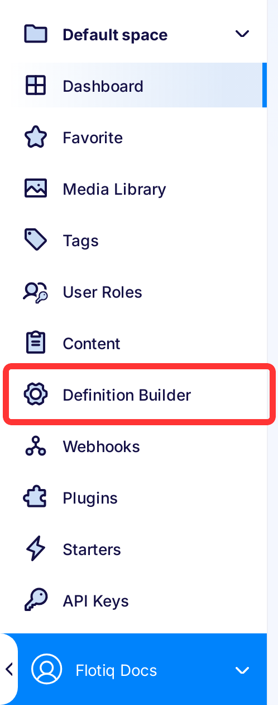
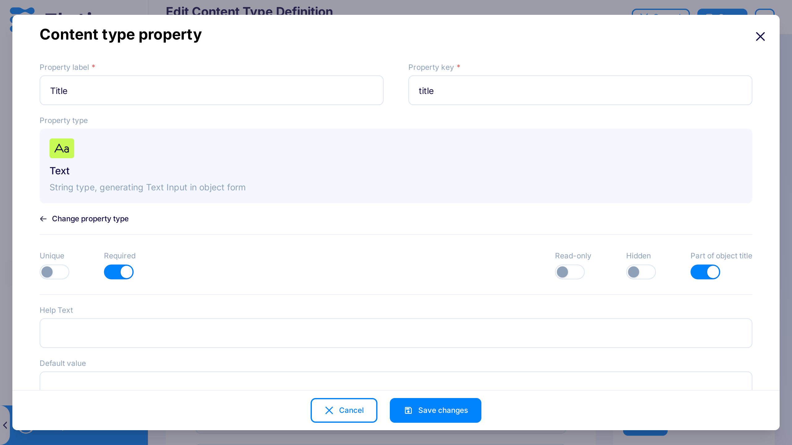
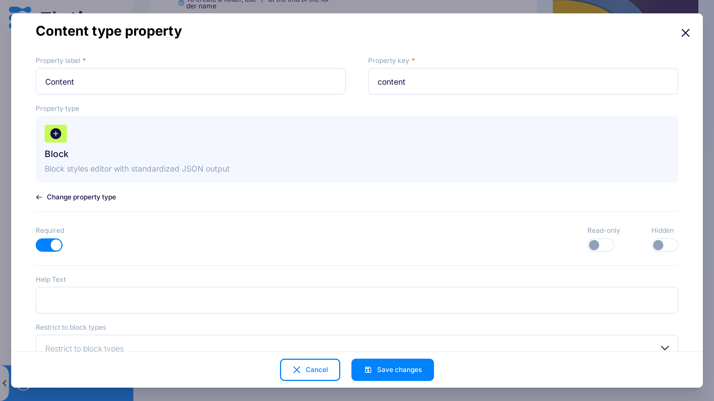

# Content Types

On this page, we describe how to create **Content Type Definition** (**CTD**) using Flotiq Dashboard. 

We use simple Blog Post CTD as an example:

Example: 
!!! note "Example: Content Type Definition for Blog Post"
    * id – string, unique, required, Flotiq Dashboard adds this automatically
    * title – string, required, part of the object title
    * slug – string, unique, required 
    * content – string, required
    * thumbnail - relation to Media type
    * headerImage - relation to Media type

You need an activated account to see the CDT page in the Dashboard. This documentation page does not describe how to create CTDs using API if you want to learn about it head to the [Working with Content Types API](../API/content-types.md)

## Creating Content Type Definitions

The Content Modeler is a convenient tool for modelling CTDs, which can you can access through the ``Type definitions`` menu entry.
The Modeler interacts with the ``/api/v1/internal/contenttype`` endpoint on behalf of the user and seamlessly integrate into the Content Management Platform.

Click Type definitions in the menu on the left to get to CTDs list:

{: .center .border}

If you don't have any CTDs yet, you see tiles with predefined CTDs from which you can choose your first one by clicking on the tile representing your chosen CTD. You can also create one from scratch by clicking `Custom` tile or by clicking `Add definition` button in the top right corner of the page.

{: .center .width75 .border}

In this example, you should click `Blog Post` predefined type.

{: .center .width75 .border}

As you can see, it has five properties:

1. title

2. slug

3. content

4. thumbnail

5. headerImage
    

Click pencil icon to edit title property, as you see title is required property of Text type, it will render Text Input in Blog Post Content Object form:

{: .center .width75 .border}

Also, because `Part of object title` is checked, objects listing; to use them in the relation of other objects; use this property value to describe the object. Learn more about connecting object via relations in [managing Content Objects](content-objects.md#Relations). You can find more about [property settings below](#property-settings).

The slug property is also required, but also must be unique across all your blogpost objects in the system, of course, if someone else would make blogpost CTD with unique slug value of the slug could repeat across one of the objects of their type and one of the objects of your type.

{: .center .width75 .border}

The content property is set to generate Rich Text input (CKEditor in Dashboard case):

{: .center .width75 .border}

The thumbnail property is the relation to Media CTD. It can only have one element added. Media CTD is system CTD that anyone can use, but everyone sees only their entries.

{: .center .width75 .border}

The headerImage is set up exactly like the thumbnail; the only difference is the property name.

{: .center .width75 .border}

You can add more fields by clicking the `Add property` button, which opens the modal window, where you can define the property name, data type, and it's basic validation. It opens the same modal as for editing of the property.

After saving your CTD Dashboard redirects you on the CTDs list, where you can click on the tile to add Content Objects or click on the cog to edit CTD.

{: .center .width75 .border}

As you see, you can no longer click predefined CTDs tile, but you can use the dropdown menu on the top right corner to add more predefined CTDs.

{: .center .border}

## Updating Content Type Definitions

You can always edit your CTDs. Click the cog icon on the CTD tile to do that, but you should be aware that **previously added objects would not be consistent with the schema**. Flotiq automatically updates the search index after the CTD update. If you would change the types of properties it can lead to data loss in the search index, as the property data have to be wipe out to keep the index working correctly, it can especially occur when you change the type from Text to Relation or vice versa. The save type change is between string types (Text, Textarea, RichText, Email) and between Number and string types (but changing string to number leads to data loss).

## Property settings

Here you can find the explanation of property settings:

| Setting | Description |
| ------- | ----------- |
| Property key | Name of the property have to be unique throughout the definition. |
| Property type | Type of the property, its options are described in the table below |
| Unique |
| Required |
| Part of object title |
| Regex pattern |
| Read-only |
| Hidden | 
| Default value |
| Help text |
| Multiple |
| Restrict to type |

Property types

| Type | Description |
| ---- | ----------- |
| Text | String type, generating Text Input in object form |
| Textarea | Long string type accepting new line characters, generating Textarea in object form |
| RichText | Long string type accepting HTML, generating CKEditor in object form |
| Email | String type, generating Email Input in object form |
| Number | Number type accepting only integers, generating Number Input |
| Radio |
| Checkbox |
| Select |
| Relation |
| List |
