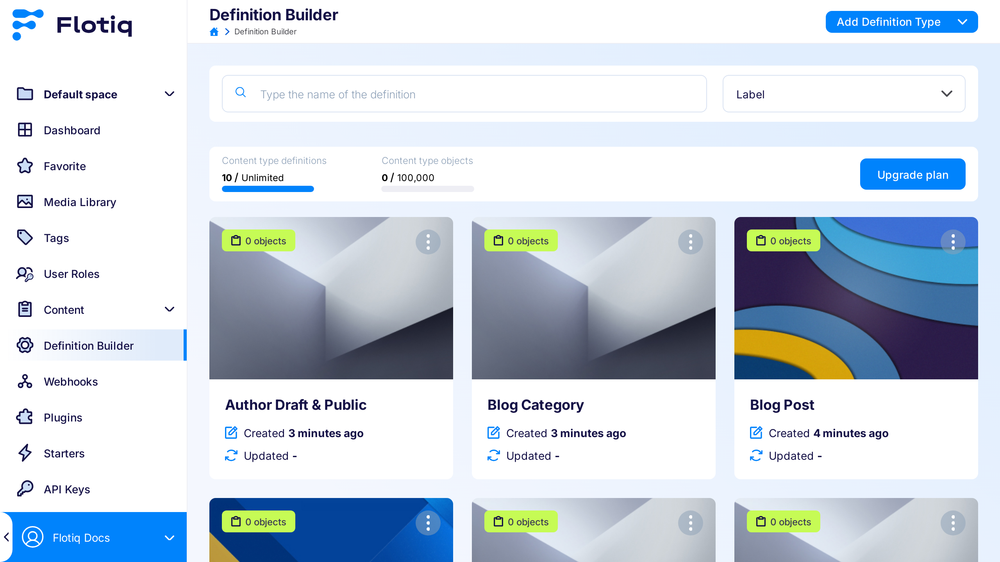

# Content Types

This page describes how to create a **Content Type Definition** (**CTD**) using [Flotiq Dashboard](https://editor.flotiq.com){:target="_blank"}. 

We will use a simple Blog Post CTD as an example:

Example: 
!!! note "Example: Content Type Definition for Blog Post"
    A blog post typically can be described with the following set of properties:

    * id – string, unique, required, Flotiq Dashboard adds this automatically
    * title – string, required, part of the object title
    * slug – string, unique, required 
    * content – string, required
    * thumbnail - relation to Media type
    * headerImage - relation to Media type

You need an activated account to see the CTD page in the Dashboard. 

!!! hint 
    This documentation page does not describe how to create CTDs using API if you want to learn about it head to the [Working with Content Types API](../API/content-types.md)

## Creating Content Type Definitions :fontawesome-solid-triangle-exclamation:{ .pricing-info title="Limits apply" }[^1]

The Content Modeler is a convenient tool for modelling CTDs, which you can access through the ``Type definitions`` menu entry.
The Modeler interacts with the ``/api/v1/internal/contenttype`` endpoint on behalf of the user and seamlessly integrates into Flotiq's UI.

Click `Type definitions` in the menu on the left to get to CTDs list:

{: .center .border}

If you don't have any Content Types defined yet, you will see a list of tiles which will help you to quickly create . Select your first one or create such from scratch by choosing `Custom`. It is also possible to create additional CTD by clicking `Add definition` button in the top right corner of the page. 

!!! hint 
    To learn more about our predefined CTDs and how to use them in your projects - head to [the next article](./predefined-content-types.md)

{: .center .width75 .border}

In this example, click `Blog Post` predefined type.

{: .center .width75 .border}

It has five properties:

1. title
2. slug
3. content
4. thumbnail
5. headerImage
    

Click the pencil icon to edit the `title` property. As you can see - `title` is a required property of Text type. Once you create the the CTD - this property will render as a Text Input in Blog Post Content Object form:

{: .center .width75 .border}

Also, because the `Part of object title` checkbox is checked, the value of this field will be used to describe objects in different places of Flotiq's UI - object listings or when linking objects through relations.

!!! hint 
    Learn more about connecting objects via relations in [managing Content Objects](content-objects.md#relations). 
    You can find more about other property settings [below](#property-settings).

The `slug` property is also required, but also must be unique across all your blogpost objects in the system.

{: .center .width75 .border}

The `content` property is set to generate Rich Text input (we use CKEditor in Flotiq):

{: .center .width75 .border}

The `thumbnail` property is defined as a relation to Media CTD - a system type definition that anyone can use but sees only their entries. It can only have one element added.

{: .center .width75 .border}

The `headerImage` is set up exactly like the thumbnail; the only difference is the property name.

{: .center .width75 .border}

You can add more fields by clicking the `Add property` button, which opens the modal window, where you can define the property name, data type, and it's basic validation. It opens the same modal as for editing of the property.

After saving your CTD you will be redirected to the CTDs list, where you can click on the tile to list Content Objects or click on the cog to further edit CTD.

{: .center .width75 .border}

Predefined CTD tiles are no longer visible. You can use the dropdown menu on the top right corner to add more of such types.

{: .center .border}

## Updating Content Type Definitions

You can always edit your CTDs. Click the cog icon on the CTD tile to do that, but you should be aware that **previously added objects would not be consistent with the schema**. Flotiq automatically updates the search index after the CTD update. If you change the types of properties it can lead to data loss in the search index, as the property data have to be wiped out to keep the index working correctly. It can especially occur when you change the type from Text to Relation or vice versa. The safe type change is between string types (Text, Textarea, RichText, Email) and between Number and string types (but changing string to number leads to data loss).

## Property settings

Here you can find the explanation of property settings and for what types of properties they apply:

| Setting                 | Possible for types                                         | Required                                  | Unique | Description                                                                                                                                                                                                                                                                                                                                                                                                                                                                                                                                                                                                                                                                                                                                                                                                                                                                                                |     |
| ----------------------- | ---------------------------------------------------------- | ----------------------------------------- | ------ | ---------------------------------------------------------------------------------------------------------------------------------------------------------------------------------------------------------------------------------------------------------------------------------------------------------------------------------------------------------------------------------------------------------------------------------------------------------------------------------------------------------------------------------------------------------------------------------------------------------------------------------------------------------------------------------------------------------------------------------------------------------------------------------------------------------------------------------------------------------------------------------------------------------- | --- |
| Property key            | all                                                        | yes                                       | yes    | Name of the property have to be unique throughout the definition.                                                                                                                                                                                                                                                                                                                                                                                                                                                                                                                                                                                                                                                                                                                                                                                                                                          |     |
| Property type           | all                                                        | yes                                       | no     | Type of the property, its options are described in the table below.                                                                                                                                                                                                                                                                                                                                                                                                                                                                                                                                                                                                                                                                                                                                                                                                                                        |     |
| Unique                  | Text, Textarea, Rich Text, Email, Number, Select, Relation | no                                        | no     | Information if the value of the property should be unique across all objects of this type                                                                                                                                                                                                                                                                                                                                                                                                                                                                                                                                                                                                                                                                                                                                                                                                                  |     |
| Required                | all                                                        | no                                        | no     | Information if the value should exist in the object, for strings it has to non-empty string                                                                                                                                                                                                                                                                                                                                                                                                                                                                                                                                                                                                                                                                                                                                                                                                                |     |
| Part of object title    | Text, Textarea, Email, Number, Select                      | no                                        | no     | Information if the value of this property should be used when displaying a list of objects in the relation creation, in the Flotiq Dashboard Object edit form                                                                                                                                                                                                                                                                                                                                                                                                                                                                                                                                                                                                                                                                                                                                              |     |
| Regex pattern           | Text                                                       | no                                        | no     | Validation information, the pattern that every string should follow to be the correct value for the property (it follows [ECMA 262](https://www.ecma-international.org/ecma-262/5.1/#sec-7.8.5){:target="_blank"} specification, but [here](https://json-schema.org/understanding-json-schema/reference/regular_expressions.html#example){:target="_blank"} you can find more user-friendly description). E.g.` ^\d{3}-\d{2}-\d{4}$` for ensuring that string is Social Security Number (SSN) in the 123-45-6789 format - Note that the regular expression is enclosed in the ^…$ tokens, where ^ means the beginning of the string, and $ means the end of the string. Without ^…$, the pattern works as a partial match, that is, matches any string that contains the specified regular expression. For example, pattern: pet matches pet, petstore and carpet. The ^…$ token forces an exact match. |     |
| Read-only               | Text, Textarea, Email, Number, Radio, Checkbox, Select     | no                                        | no     | Information if the Dashboard user can edit the value. In the edit object view, the input is visible but disabled. In the add object view, the input is not visible unless the input is marked as `required`. API user can edit value without restrictions.                                                                                                                                                                                                                                                                                                                                                                                                                                                                                                                                                                                                                                             |     |
| Hidden                  | Text, Textarea, Email, Number, Radio, Checkbox, Select     | no                                        | no     | If checked property can be changed only through API, the form input will not be rendered in object form in Dashboard                                                                                                                                                                                                                                                                                                                                                                                                                                                                                                                                                                                                                                                                                                                                                                                       |     |
| Default value           | Text, Textarea, Number, Select                             | no                                        | no     | Sets default value in object forms it is not respected when sending incomplete object through API                                                                                                                                                                                                                                                                                                                                                                                                                                                                                                                                                                                                                                                                                                                                                                                                          |     |
| Help text               | all                                                        | no                                        | no     | Additional description shown under generated input, it is also displayed in API documentation                                                                                                                                                                                                                                                                                                                                                                                                                                                                                                                                                                                                                                                                                                                                                                                                              |     |
| Options                 | Radio, Select                                              | no                                        | no     | Options to choose from in generated object form                                                                                                                                                                                                                                                                                                                                                                                                                                                                                                                                                                                                                                                                                                                                                                                                                                                            |     |
| Multiple                | Relation                                                   | no                                        | no     | Information if the list of objects in relation should be bigger than one                                                                                                                                                                                                                                                                                                                                                                                                                                                                                                                                                                                                                                                                                                                                                                                                                                   |     |
| Restrict to type        | Relation                                                   | yes (only when Property type == Relation) | no     | Information on which types can be attached as the relation                                                                                                                                                                                                                                                                                                                                                                                                                                                                                                                                                                                                                                                                                                                                                                                                                                                 |     |
| Show Time               | Date time                                                  | no                                        | no     | Enables the time picker next to the date picker                                                                                                                                                                                                                                                                                                                                                                                                                                                                                                                                                                                                                                                                                                                                                                                                                                                            |     |
| Restrict to block types | Block                                                      | yes (only when Property type == Block)    | no     | Names of plugins used in editor, possible plugins: `header`, `list`, `image`, `youtubeEmbed`, `quote`, `warning`, `delimiter`. `Paragraph` is available always as it is default text block.                                                                                                                                                                                                                                                                                                                                                                                                                                                                                                                                                                                                                                                                                                                |     |

Property types:

| Type      | Description                                                                                                                                                                                      |
| --------- |--------------------------------------------------------------------------------------------------------------------------------------------------------------------------------------------------|
| Text      | String type, generating Text Input in object form                                                                                                                                                |
| Textarea  | Long string type accepting new line characters, generating Textarea in object form                                                                                                               |
| Rich Text | Long string type accepting HTML, generating CKEditor in object form                                                                                                                              |
| Email     | String type, generating Email Input in object form                                                                                                                                               |
| Number    | Number type accepting any number, integer, float and doubles, generating Number Input                                                                                                            |
| Radio     | String type, generating Radio Input in object form                                                                                                                                               |
| Checkbox  | Boolean type, generating single Checkbox in object form                                                                                                                                          |
| Select    | String type, generating Select Dropdown in object form                                                                                                                                           |
| Relation  | Array type accepts only objects specified in `Restrict to type`, items in relation array cannot be duplicated                                                                                    |
| List      | Object type generates subforms in object form; the inside object can have all types of properties. If you choose the `list` type property inside the list, then the nested list will be created. |
| Date time | String type, the correct format is: YYYY-MM-DD or YYYY-MM-DDTHH-mm. Example: 2021-06-17T13:10 or 2021-06-17.                                                                                     |
| Block     | Object type, generates editor.js in object form                                                                                                                                                  |

[^1]: Number of available Content Type Definitions depends on the chosen subscription plan. Check pricing and limits on the [Flotiq Pricing page](https://flotiq.com/pricing){:target="_blank"}
