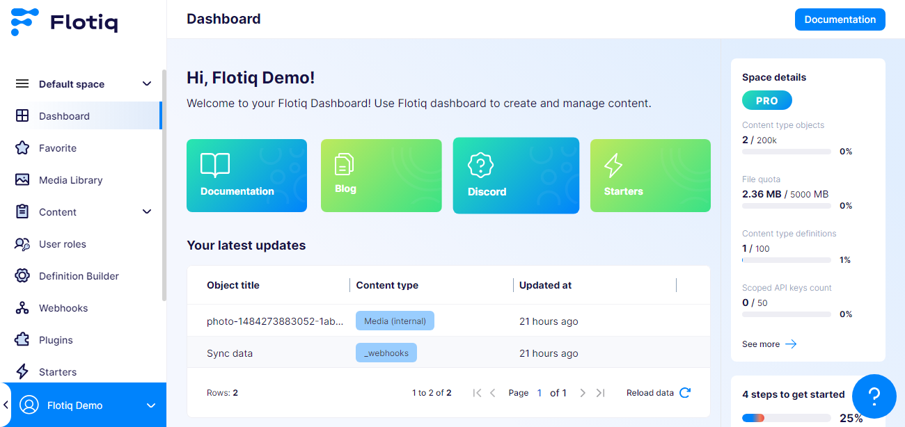
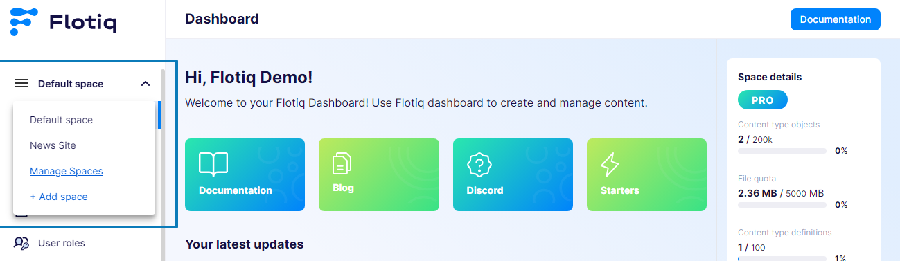

---
tags:
  - Content Creator
  - Developer
  - Administrator
---

title: Dashboard
description: How to use the Dashboard in Flotiq.

# Dashboard

The Dashboard is the first screen after you log in to the Flotiq Panel. It gives you a quick view of your current Space and shortcuts to common tasks.

A Space is an isolated workspace for one project. It has its own content, users, limits, and settings.

{: .border}

## What you can do on the Dashboard

- Review onboarding tasks for a new project.
- Open links to SDK resources.
- Verify which Space context is currently active.
- Move to content, media, users, and settings sections from the main menu.

## Space context on Dashboard

Dashboard data is always shown in the context of the selected Space.
If you work in multiple Spaces, switch the Space from the selector above the menu.

{: .border}

!!! note
    The selected Space changes what content and limits you see across the whole application.

## Common checks

### Dashboard does not show expected data

- Confirm that you selected the correct Space.
- Confirm that your user has access to that Space.
- Confirm that your role allows access to the section you are trying to open.

### Dashboard sections differ between users

Dashboard sections can differ by role and plan. Organization Admin users usually see more management options than content-focused roles.

### New account view looks different

The first login view can include onboarding tasks and starter links. This can differ by role and account state.

### Dashboard is mostly empty

An empty Dashboard is common in a new Space. Add your first Content Type Definition and content objects to populate workspace activity.

## Related docs

- [Spaces and Organization](./spaces.md)
- [User Roles](./user-roles.md)
- [Users](./users.md)
- [Plans and Billing](./billing.md)

