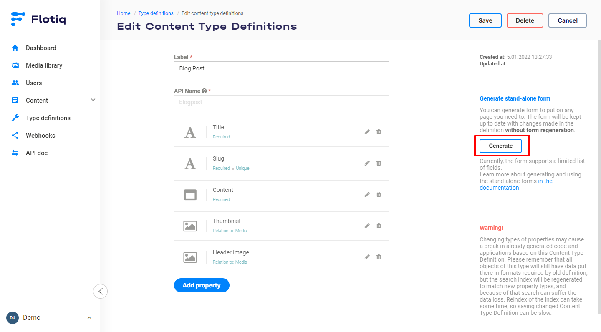
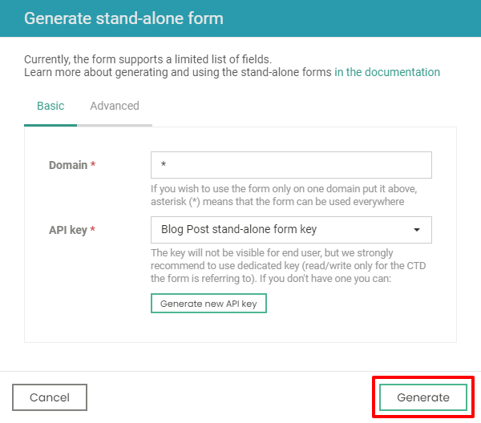
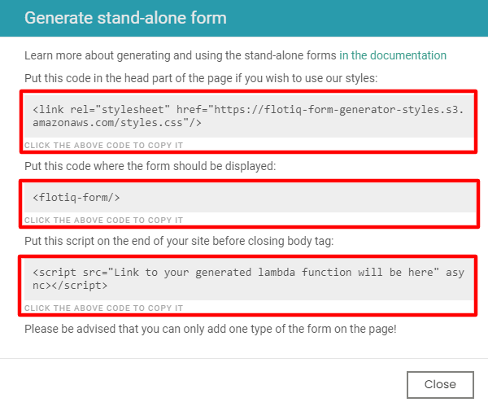

title: Flotiq Forms - the easiest way to add forms to static websites | Flotiq documentation
description: Use Flotiq Forms for an easy way to add forms to static websites and collect feedback from your users. Flotiq Forms is always up to date with your content model and keeps your forms spam-free and secure.

# Flotiq Forms

Headless content management systems work best if you actually have, ehm, content that you can keep in them. Flotiq Forms makes it dead-simple to put a form on any website to start accepting user data and make it automatically adapt to your data model in Flotiq. Like everything else in Flotiq - the forms will automatically update with any changes you make in your content type definitions, so you're always covered! Forms also support anti-spam and security features, so you don't have to worry about that, either.

## Features

Here are the most important features of Flotiq Forms:

- one-click HTML form
- copy and paste to your webpage
- works with serverless and static websites
- no coding required
- automatically updated to match your Flotiq Content Types
- provides anti-spam and security features out of the box.

## How to generate HTML forms

You can generate an HTML form that you can put on any webpage you like. 
The form will be automatically kept up to date with changes made to the Content Type Definition that this form is linked to. 

Form generation is available in the Content Type Definition edit form. You can generate forms for all of your Content Types, without restrictions.

To generate a new stand-alone form click `Generate` button:

{: .center .width75 .border}

It will display a modal where you need to provide some details.

!!! hint
    There are only two required details you have to provide:

    - `Domain` - Forms will only accept data from this domain, put `*` if you want to allow access from anywhere,
    - `API key` - select the API key you want to use for incoming form submissions.

    As best practice - we advise to enter your domain (without `http://` or `https://`) and create a dedicated, scoped API key that only allows `CREATE` access for the purpose of handling form submissions.

Don't worry - your API key is secure. It's not displayed anywhere in the form and is only used internally, for a set of serverless functions, which work under the hood to deliver your Forms. You can always revoke or regenerate the key, in case you have any suspicions it might have been compromised.

If you use the `Generate new API key` button - a fresh, scoped API key will be created automatically for you, along with the recommended permissions.

{: .center .border}

When domain and API key are in place, you can click on the `Generate` button. Please be patient; it may take up to a minute to generate the required code.

!!! note
        Flotiq uses Amazon Web Services (AWS Lambda in particular) to deliver Flotiq Forms to our users. AWS provides a global network of secure data centres, which allow us to easily expand our services and provide the best value to our customers. 

## How to use Forms

Once your Flotiq Forms are generated, you will see a window with two lines of HTML code. You need to put them inside your HTML page to start immediately collecting data to your Flotiq account.

1. Put the first code - `<flotiq-form/>` in your page, wherever you want the form to be displayed. 
2. Paste the second line - `` at the end of your HTML, just before the  `</body>` tag.

{: .center .border}

!!! note
    Please be advised that as for now you can add only one type of the form on a page. 
    If you wish to use more than one form, you have to put them on different sub-pages.

## Working example

You can see a working example below, it's just a `<flotiq-form/>` tag, that we pasted in our HTML:

<flotiq-form></flotiq-form>

You can use the form to tell us what you think about Flotiq Forms :)
