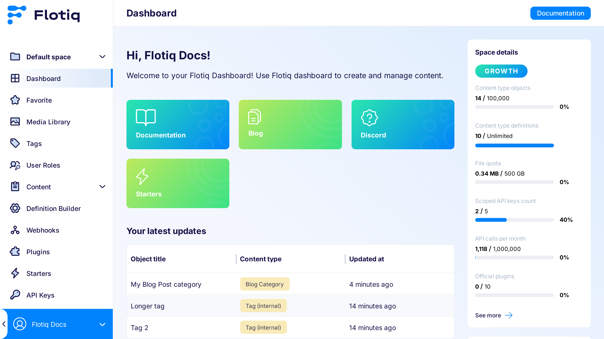
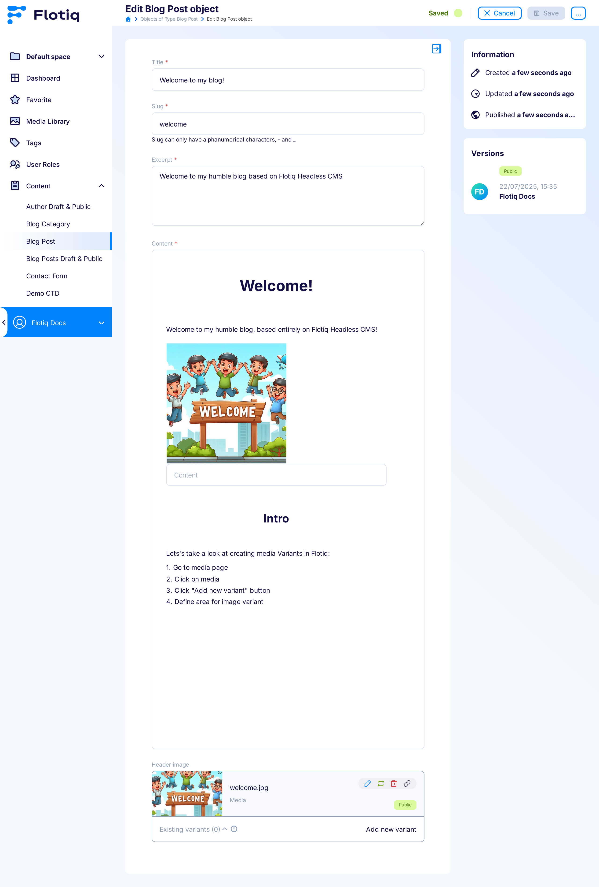

# Flotiq Panel

Here you will find the documentation about Flotiq Panel, which is the graphical interface that you will be using to work with your Content Type Definitions and Content Objects.

## Dashboard

After logging in you will see Flotiq's dashboard, by default it will show a welcome screen, the onboarding checklist and links to SDK packages that you can download in order to use the content provided by Flotiq in your project.

## Content Type Definitions

This part of Flotiq's interface will be your starting point whenever you begin working with new kind of data. In here you will find your existing Content Type Definitions, presented in a tile grid

## Content Type editor

From the main screen showing all Content Type Definitions you can either create a new CTD or edit an existing one. Both actions will take you to the Content Type editor, which is a convenient UI to define your data model.

## Content Object grid

Once you create a Content Type you can go to the Content menu in the left pane and select the name of the Content Type that you created. You will be taken to a grid view showing all your Content Objects. This view is particularly useful once you have many objects stored in your Flotiq account.

## Content Object editor

From the grid view you can easily access individual objects by clicking the pencil icon in the right-most column. You can also create new objects by clicking the `Add Object` button in the top right corner. The Content Object editor itself offers a convenient form, which is automatically generated based on the Content Type Definintion that you previously created. Since Content Objects are automatically versioned - this view also allows to switch to different versions of a particular object.

## Media Library

Flotiq provides storage for images and other media within our Media Library. The main screen of the Media Library shows all images and files that are currently present in your account:

when you switch to the `Stock photos` view - you will have access to the entire [Unsplash](https://unsplash.com) library of images, which you can use in your projects.

## Read more

Follow these resources to learn more about Flotiq:

- [how to create Content Type Definitions](./content-types/)
- [how to retrieve your API keys](../API/)
- [how to use Unsplash in Flotiq](./media-library/)