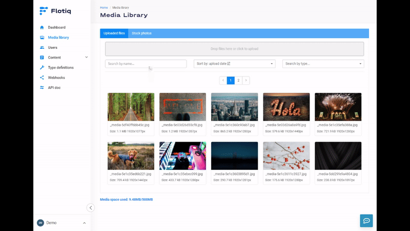

title: Media Library & Unsplash
description: How to use Flotiq Media Library and Unsplash integration.

# Media Library

The Media Library has 2 sections:

* Uploaded files - shows files currently uploaded by the user, as well as those downloaded from Unsplash
* Stock photos - allows to browse through and download images from Unsplash.

## Uploaded files :fontawesome-solid-triangle-exclamation:{ .pricing-info title="Limits apply" }[^1]

This section of the Media Library gives you access to all of your files that you're storing in Flotiq. You can upload, search, sort, and remove files from the library in this screen.

## Stock photos

This section gives you access to the Unsplash library of images. 
All Unsplash images are available to use for free and Flotiq takes care of the necessary attributions.
In order to use images from Unsplash - you need to download them to your library first. This is a very simple operation - once you select an image you like, simply click the download icon on that image and it will momentarily appear in you `Uploaded files`.

## API Endpoints

Media library is accessible via `/api/v1/media/` endpoints. Visit your API docs to learn more.

!!! note
    See also: [Working with media using API](/docs/API/media-library/)

[^1]: Number of available Content Objects and available disk space depends on the chosen subscription plan. [Check pricing and limits](https://flotiq.com/pricing){:target="_blank"}
