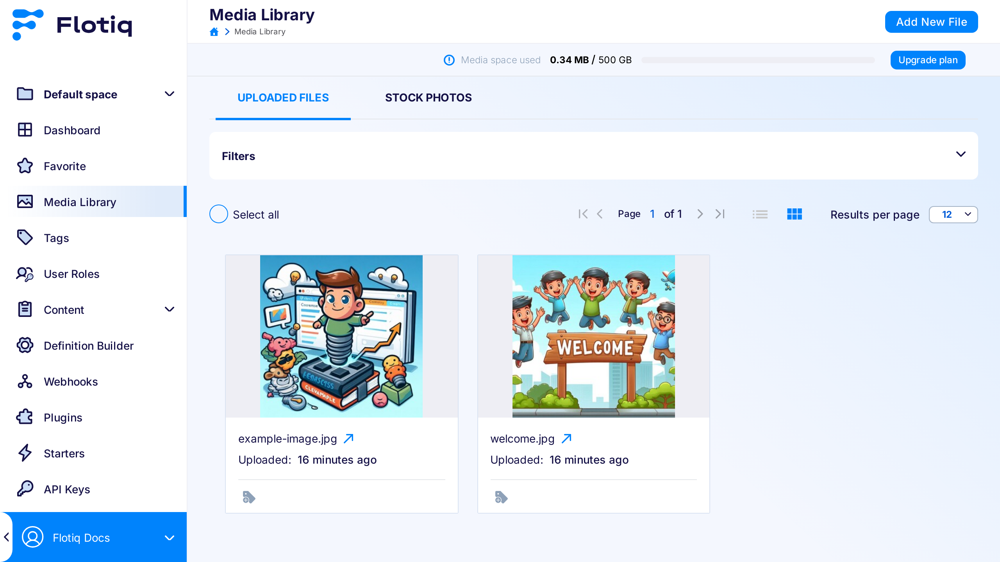
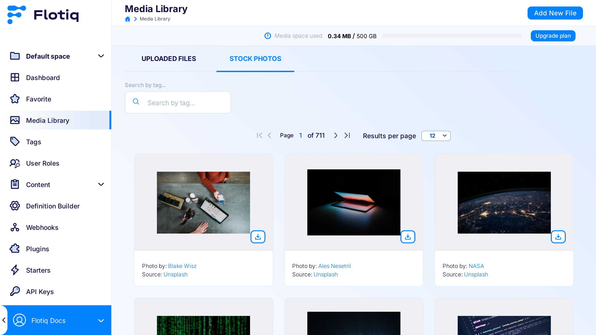
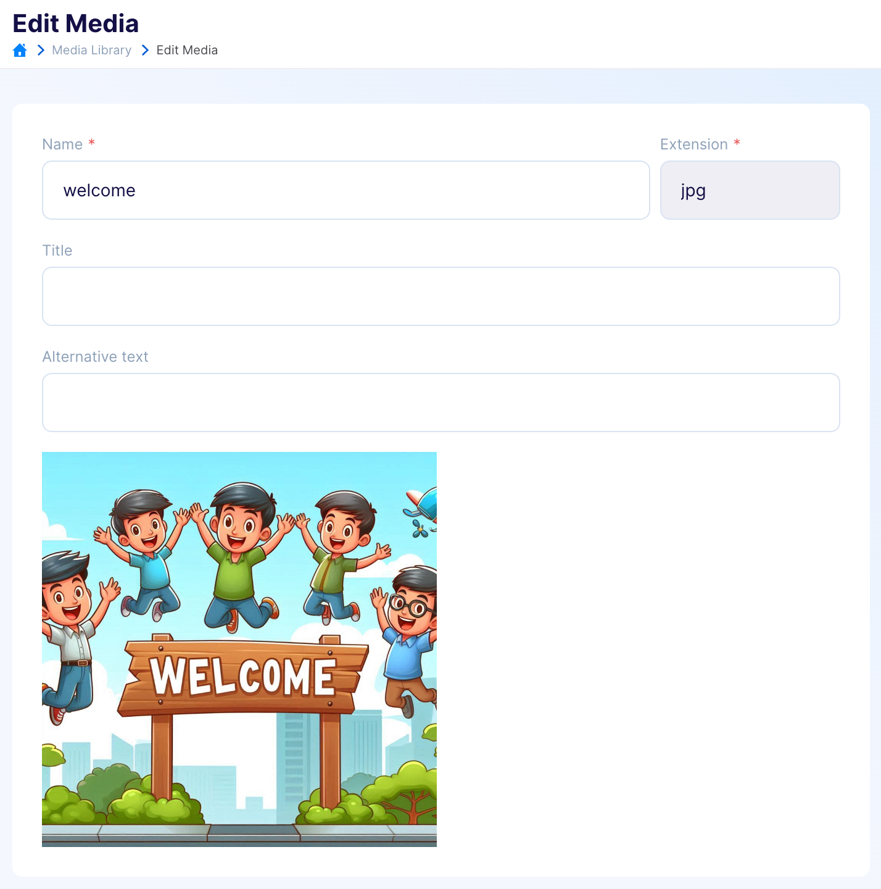
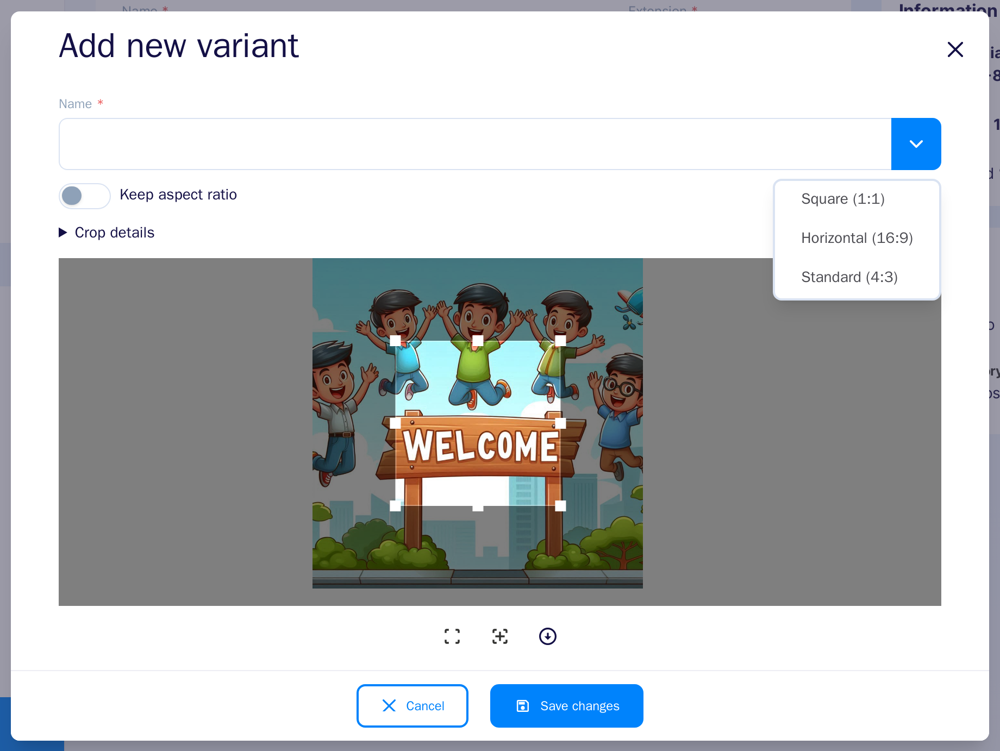
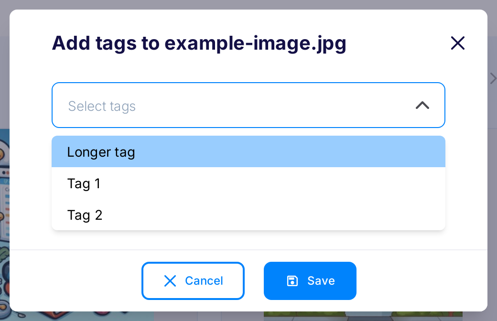

---
tags:
  - Content Creator
  - Developer
---

title: Media Library & Unsplash
description: How to use Flotiq Media Library and Unsplash integration.

# Media Library

The Media Library has 2 sections:

* Uploaded files - shows files currently uploaded by the user, as well as those downloaded from Unsplash
* Stock photos - allows to browse through and download images from Unsplash.

## Uploaded files :fontawesome-solid-triangle-exclamation:{ .pricing-info title="Limits apply" }[^1]

This section of the Media Library gives you access to all of your files that you're storing in Flotiq. You can upload, search, sort, and remove files from the library in this screen.

{: .border}

### ALT property for images

When editing an image, you can now add an optional `alt` text field, which you can later use to provide the value for `alt` tags for images in your project. You can modify the `alt` text in the media editing screen for each uploaded image.

## Stock photos

This section gives you access to the Unsplash library of images.
All Unsplash images are available to use for free and Flotiq takes care of the necessary attributions.

In order to use images from Unsplash - you need to download them to your library first. This is a very simple operation - once you select an image you like, simply click the download icon on that image and it will momentarily appear in you `Uploaded files`.

{: .border}

## Variants

Variants allow you to create transformed versions of images. A variant consists of a name and a number of modifications offered by Flotiq.

In order to create a variant through dashboard, simply press the edit button on any of your images in media library, and select `Add new variant` option.

{: .border .width50 .center}

A window will pop up with a WYSIWYG editor, that will allow you to easily modify the image according to your needs.

{.center .width75 .border}

After you are done with modifying the image, press `Save changes` button and a variant with this set of transformations will be added to your media data.

!!! Note
    After adding variants, remember that you also have to save the media edit for saving variants in the media object data.

!!! Note
    Flotiq variants currently do not support creating transformations for animated GIF files.

## Media tags

You can add tags to your media files to help categorize and find them.

To add tag to the file, use the `add tags` button on the media listing:

{: .border .width50 .center}

It will open a modal where you can choose existing tags or create new ones.

{: .border .width50 .center}

When you finish editing, click the `Save` button.

You can manage your tags on the Tags page:

{: .border .width50 .center}

The tag contains only name field.

Tag editing is compatible with standard content object editing. See more in the [editing content object description](/docs/panel/content-objects/).

Mass edit is not enabled for tags, as it has only unique fields.

## API Endpoints

Media library is accessible via `/api/v1/media/` endpoints. Visit your API docs to learn more.

!!! note
    See also: [Working with media using API](/docs/API/media-library/)

[^1]: Number of available Content Objects and available disk space depends on the chosen subscription plan. Check pricing and limits on the [Flotiq Pricing page](https://flotiq.com/pricing){:target="_blank"}
