---
tags:
  - Developer
---

# Predefined Content Types

Looking for starter projects and setup paths? See [Templates and Starters](./templates.md).

If you don't have any Content Type Definitions (CTD) yet, you see tiles with predefined CTDs from which you can choose your first one by clicking on the tile representing your chosen CTD.

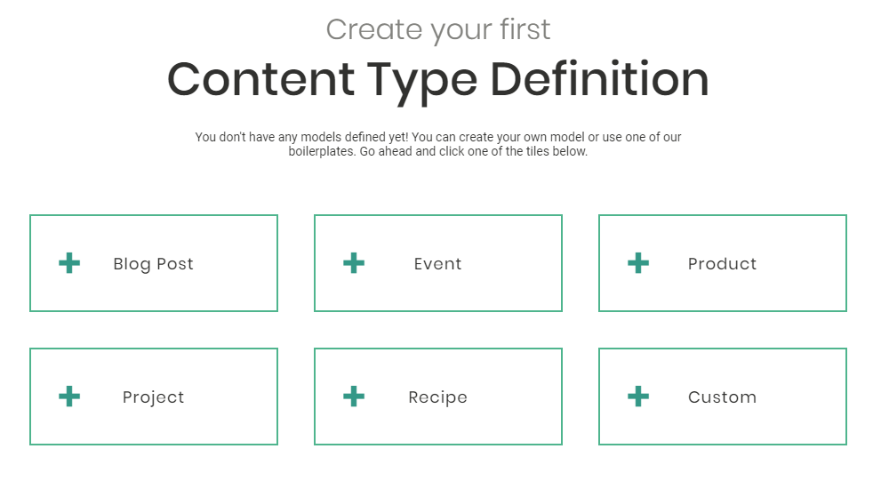{: .center .width75 .border}

Custom tile opens empty CTD.

If you already have at least one CTD, you can use the dropdown menu in the top right corner to add more predefined CTDs.

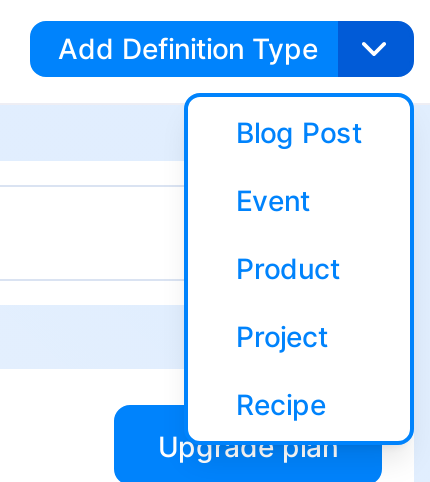{: .center .width25 .border}

## Blog Post

Type for storing simple blog posts. It contains properties storing title, slug, excerpt, content and images for the post:

| Field name  | Field type | Additional attributes          | Comments                                                    |
|-------------|------------|--------------------------------|-------------------------------------------------------------|
| title       | Text       | Required, Part of object title | Title of your post                                          |
| slug        | Text       | Required, Unique               | URL of the post (alphanumeric characters, `-` and `_` only) |
| excerpt     | Textarea   | Required                       | Short description of the post                               |
| content     | Block      | Required                       | The post itself, in block editor format                     |
| headerImage | Relation   | Restrict to type: Media        | Main image of the post                                      |

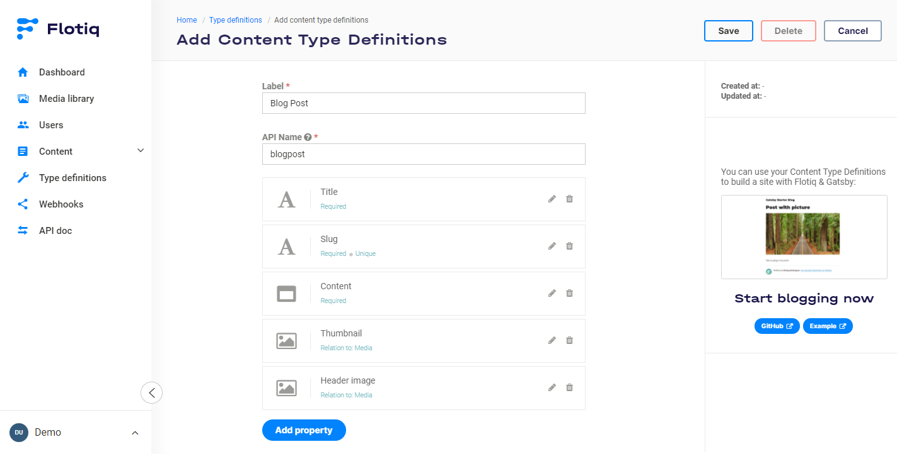{: .border}

Full schema for the Blog Post type:

??? "Blog Post JSON schema"
    ```json
    {
        "name": "blogpost",
        "label": "Blog Post",
        "schemaDefinition": {
            "type": "object",
            "allOf": [
                {
                    "$ref": "#/components/schemas/AbstractContentTypeSchemaDefinition"
                },
                {
                    "type": "object",
                    "properties": {
                        "slug": {
                            "type": "string",
                            "pattern": "^[a-zA-Z0-9-_]*$",
                            "minLength": 1
                        },
                        "title": {
                            "type": "string",
                            "minLength": 1
                        },
                        "content": {
                            "type": "object",
                            "minLength": 1,
                            "properties": {
                                "time": {
                                    "type": "number"
                                },
                                "blocks": {
                                    "type": "array",
                                    "items": {
                                        "type": "object",
                                        "properties": {
                                            "id": {
                                                "type": "string"
                                            },
                                            "data": {
                                                "type": "object",
                                                "properties": {
                                                    "text": {
                                                        "type": "string"
                                                    }
                                                },
                                                "additionalProperties": true
                                            },
                                            "type": {
                                                "type": "string"
                                            }
                                        }
                                    }
                                },
                                "version": {
                                    "type": "string"
                                }
                            },
                            "additionalProperties": false
                        },
                        "excerpt": {
                            "type": "string",
                            "minLength": 1
                        },
                        "headerImage": {
                            "type": "array",
                            "items": {
                                "$ref": "#/components/schemas/DataSource"
                            },
                            "minItems": 0
                        }
                    }
                }
            ],
            "required": [
                "title",
                "slug",
                "excerpt",
                "content"
            ],
            "additionalProperties": false
        },
        "metaDefinition": {
            "order": [
                "title",
                "slug",
                "excerpt",
                "content",
                "headerImage"
            ],
            "propertiesConfig": {
                "slug": {
                    "label": "Slug",
                    "unique": true,
                    "helpText": "Slug can only have alphanumerical characters, - and _",
                    "inputType": "text"
                },
                "title": {
                    "label": "Title",
                    "unique": false,
                    "helpText": "",
                    "inputType": "text",
                    "isTitlePart": true
                },
                "content": {
                    "label": "Content",
                    "unique": false,
                    "helpText": "",
                    "inputType": "block"
                },
                "excerpt": {
                    "label": "Excerpt",
                    "unique": false,
                    "helpText": "",
                    "inputType": "textarea"
                },
                "headerImage": {
                    "label": "Header image",
                    "unique": false,
                    "helpText": "",
                    "inputType": "datasource",
                    "validation": {
                        "relationContenttype": "_media"
                    }
                }
            }
        }
    }
    ```
    { data-search-exclude }

Form generated for Blog Post:

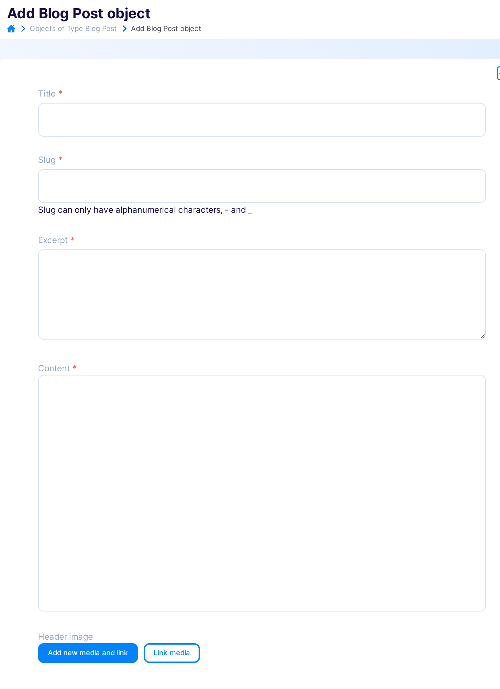{: .center .width75 .border}

Next.js starter for blog post:

[GitHub](https://github.com/flotiq/flotiq-nextjs-blog-1){:target="_blank"}

[Working example](https://flotiq-nextjs-blog-1.netlify.app){:target="_blank"}


Documentation examples:

[Our API documentation](https://flotiq-apidoc-prod-data.s3.us-east-1.amazonaws.com/organization-codewave-29d93d743f1edb08bdbde2f429a7c3a8){:target="_blank"}

[](https://god.postman.co/run-collection/a5c3102f2b2bfb71783e#?env%5BFlotiq%20API%5D=W3sia2V5IjoiYmFzZVVybCIsInZhbHVlIjoiaHR0cHM6Ly9hcGkuZmxvdGlxLmNvbSIsImVuYWJsZWQiOnRydWV9XQ==){:target="_blank"}

[Postman documentation](https://documenter.getpostman.com/view/10599962/TVzYfZUQ){:target="_blank"}

## Event

Type for storing simple events. It contains name, slug, image, address, date, price, description, excerpt and gallery for the event:

| Field name  | Field type | Additional attributes             | Comments                                     |
|-------------|------------|-----------------------------------|----------------------------------------------|
| name        | Text       | Required, Part of object title    | Name of your event                           |
| slug        | Text       | Required, Unique                  | URL of the event                             |
| image       | Relation   | Restrict to type: Media           | Featured image of the event                  |
| address     | Textarea   | Required                          | Address of the event                         |
| date        | DateTime   | Required, Show time               | Date and time of the event (ISO 8601 format) |
| price       | Textarea   | -                                 | Ticket price                                 |
| description | Rich Text  | -                                 | Description of the event, with HTML content  |
| excerpt     | Textarea   | -                                 | Short description excerpt                    |
| gallery     | Relation   | Restrict to type: Media, Multiple | Gallery for the event                        |

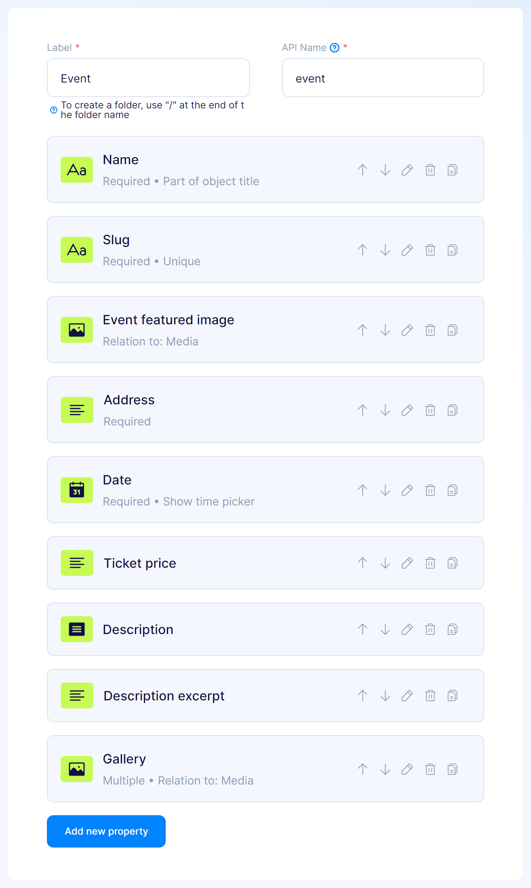{: .center .width75 .border}

Full schema for the Event type:

??? "Event JSON schema"
    ```json
    {
        "name": "event",
        "label": "Event",
        "schemaDefinition": {
            "type": "object",
            "allOf": [
                {
                    "$ref": "#/components/schemas/AbstractContentTypeSchemaDefinition"
                },
                {
                    "type": "object",
                    "properties": {
                        "date": {
                            "type": "string",
                            "pattern": "^$|^([12]\\d{3}-(0[1-9]|1[0-2])-(0[1-9]|[12]\\d|3[01]))T?(([0-1]?[0-9]|2[0-3]):[0-5][0-9])?(:[0-5][0-9])?(\\.[0-9]{3})?(Z|([\\+-]\\d{2}(:\\d{2})?))?$",
                            "minLength": 1
                        },
                        "name": {
                            "type": "string",
                            "minLength": 1
                        },
                        "slug": {
                            "type": "string",
                            "minLength": 1
                        },
                        "image": {
                            "type": "array",
                            "items": {
                                "$ref": "#/components/schemas/DataSource"
                            },
                            "minItems": 0
                        },
                        "price": {
                            "type": "string"
                        },
                        "address": {
                            "type": "string",
                            "minLength": 1
                        },
                        "excerpt": {
                            "type": "string"
                        },
                        "gallery": {
                            "type": "array",
                            "items": {
                                "$ref": "#/components/schemas/DataSource"
                            },
                            "minItems": 0
                        },
                        "description": {
                            "type": "string"
                        }
                    }
                }
            ],
            "required": [
                "name",
                "slug",
                "address",
                "date"
            ],
            "additionalProperties": false
        },
        "metaDefinition": {
            "propertiesConfig": {
                "date": {
                    "label": "Date",
                    "inputType": "dateTime",
                    "unique": false,
                    "helpText": "",
                    "showTime": true
                },
                "name": {
                    "label": "Name",
                    "inputType": "text",
                    "unique": false,
                    "helpText": "",
                    "isTitlePart": true
                },
                "slug": {
                    "label": "Slug",
                    "inputType": "text",
                    "unique": true,
                    "helpText": ""
                },
                "image": {
                    "label": "Event featured image",
                    "inputType": "datasource",
                    "unique": false,
                    "helpText": "",
                    "validation": {
                        "relationContenttype": "_media"
                    }
                },
                "price": {
                    "label": "Ticket price",
                    "inputType": "textarea",
                    "unique": false,
                    "helpText": ""
                },
                "address": {
                    "label": "Address",
                    "inputType": "textarea",
                    "unique": false,
                    "helpText": ""
                },
                "excerpt": {
                    "label": "Description excerpt",
                    "inputType": "textarea",
                    "unique": false,
                    "helpText": ""
                },
                "gallery": {
                    "label": "Gallery",
                    "inputType": "datasource",
                    "unique": false,
                    "helpText": "",
                    "validation": {
                        "relationMultiple": true,
                        "relationContenttype": "_media"
                    }
                },
                "description": {
                    "label": "Description",
                    "inputType": "richtext",
                    "unique": false,
                    "helpText": ""
                }
            },
            "order": [
                "name",
                "slug",
                "image",
                "address",
                "date",
                "price",
                "description",
                "excerpt",
                "gallery"
            ]
        }
    }
    ```
    { data-search-exclude }

Form generated for Event:

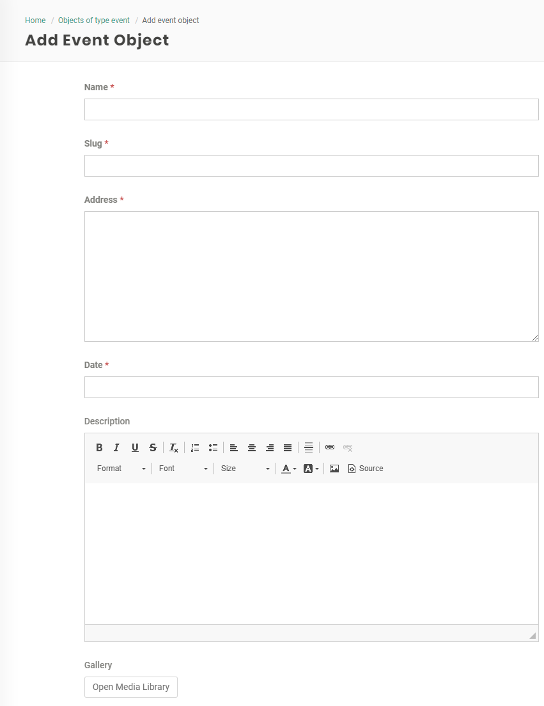{: .center .width75 .border}


Next.js starter for event calendar:

[GitHub](https://github.com/flotiq/flotiq-nextjs-event-2){:target="_blank"}

[Working example](https://flotiq-nextjs-event-2.netlify.app){:target="_blank"}

Documentation examples:

[Our API documentation](https://flotiq-apidoc-prod-data.s3.us-east-1.amazonaws.com/organization-codewave-059050e2bca123e0cff08ebf3f421d69){:target="_blank"}

[](https://god.postman.co/run-collection/0591d738333d41ce50e7#?env%5BFlotiq%20API%5D=W3sia2V5IjoiYmFzZVVybCIsInZhbHVlIjoiaHR0cHM6Ly9hcGkuZmxvdGlxLmNvbSIsImVuYWJsZWQiOnRydWV9XQ==){:target="_blank"}

[Postman documentation](https://documenter.getpostman.com/view/10599962/TVzYfZYr){:target="_blank"}

## Product

Type for storing simple products. It contains properties storing name, slug, price, description and images for the product:

| Field name     | Field type | Additional attributes                  | Comments                                          |
|----------------|------------|----------------------------------------|---------------------------------------------------|
| name           | Text       | Required, Unique, Part of object title | Name of your product                              |
| slug           | Text       | Required, Unique                       | URL of the product                                |
| price          | Number     | Required                               | Price of the product                              |
| description    | Rich Text  | -                                      | The description of the product, with HTML content |
| productImage   | Relation   | Restrict to type: Media                | Main image                                        |
| productGallery | Relation   | Restrict to type: Media, Multiple      | Gallery for the product                           |

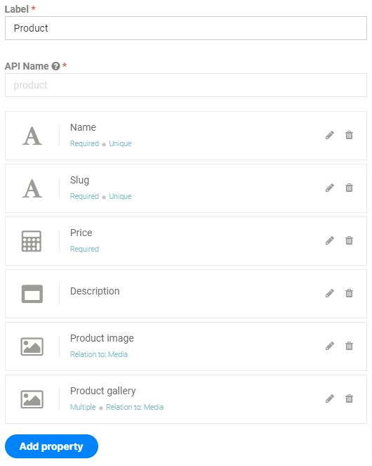{: .center .width75 .border}

Full schema for the Product type:

??? "Product JSON schema"
    ```json
    {
        "name": "product",
        "label": "Product",
        "schemaDefinition": {
            "type": "object",
            "allOf": [
                {
                    "$ref": "#/components/schemas/AbstractContentTypeSchemaDefinition"
                },
                {
                    "type": "object",
                    "properties": {
                        "name": {
                            "type": "string",
                            "minLength": 1
                        },
                        "slug": {
                            "type": "string",
                            "minLength": 1
                        },
                        "price": {
                            "type": "number",
                            "minLength": 1
                        },
                        "description": {
                            "type": "string"
                        },
                        "productImage": {
                            "type": "array",
                            "items": {
                                "$ref": "#/components/schemas/DataSource"
                            },
                            "minItems": 0
                        },
                        "productGallery": {
                            "type": "array",
                            "items": {
                                "$ref": "#/components/schemas/DataSource"
                            },
                            "minItems": 0
                        }
                    }
                }
            ],
            "required": [
                "name",
                "slug",
                "price"
            ],
            "additionalProperties": false
        },
        "metaDefinition": {
            "propertiesConfig": {
                "name": {
                    "label": "Name",
                    "inputType": "text",
                    "unique": true,
                    "isTitlePart": true
                },
                "slug": {
                    "label": "Slug",
                    "inputType": "text",
                    "unique": true
                },
                "price": {
                    "label": "Price",
                    "inputType": "number",
                    "unique": false
                },
                "description": {
                    "label": "Description",
                    "inputType": "richtext",
                    "unique": false
                },
                "productImage": {
                    "label": "Product image",
                    "inputType": "datasource",
                    "unique": false,
                    "validation": {
                        "relationContenttype": "_media"
                    }
                },
                "productGallery": {
                    "label": "Product gallery",
                    "inputType": "datasource",
                    "unique": false,
                    "validation": {
                        "relationMultiple": true,
                        "relationContenttype": "_media"
                    }
                }
            },
            "order": [
                "name",
                "slug",
                "price",
                "description",
                "productImage",
                "productGallery"
            ]
        }
    }
    ```
    { data-search-exclude }

Form generated for Product:

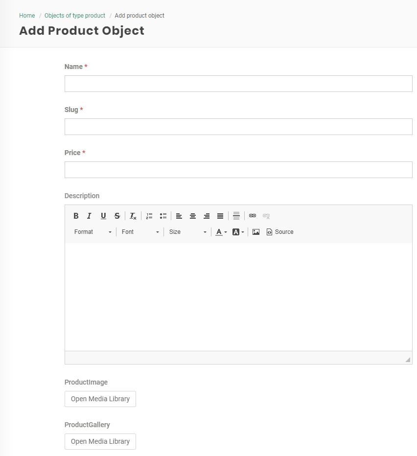{: .center .width75 .border}


Next.js starter for products:

[GitHub](https://github.com/flotiq/flotiq-nextjs-shop-2){:target="_blank"}

[Working example](https://flotiq-nextjs-shop-2.netlify.app){:target="_blank"}

Documentation examples:

[Our API documentation](https://flotiq-apidoc-prod-data.s3.us-east-1.amazonaws.com/organization-codewave-75f6fbed3f4149c8d2ad4345af21107e){:target="_blank"}

[](https://god.postman.co/run-collection/7f5d59a7a21b8e368ed1#?env%5BFlotiq%20API%5D=W3sia2V5IjoiYmFzZVVybCIsInZhbHVlIjoiaHR0cHM6Ly9hcGkuZmxvdGlxLmNvbSIsImVuYWJsZWQiOnRydWV9XQ==){:target="_blank"}

[Postman documentation](https://documenter.getpostman.com/view/10599962/TVzYfZUU){:target="_blank"}

## Project

Type for storing simple project portfolio entries. It contains properties storing name, slug, description, header image, gallery and gallery details for the project:

| Field name          | Field type | Additional attributes                  | Comments                                                       |
|---------------------|------------|----------------------------------------|----------------------------------------------------------------|
| name                | Text       | Required, Unique, Part of object title | Name of your project                                           |
| slug                | Text       | Required, Unique                       | URL of the project (alphanumeric characters, `-` and `_` only) |
| description         | Rich Text  | -                                      | The description of the project, with HTML content              |
| headerImage         | Relation   | Restrict to type: Media                | Header image of the project                                    |
| gallery_name        | Text       | -                                      | Name of the gallery                                            |
| gallery_description | Rich Text  | -                                      | Description of the gallery, with HTML content                  |
| gallery             | Relation   | Restrict to type: Media, Multiple      | Gallery for the project                                        |

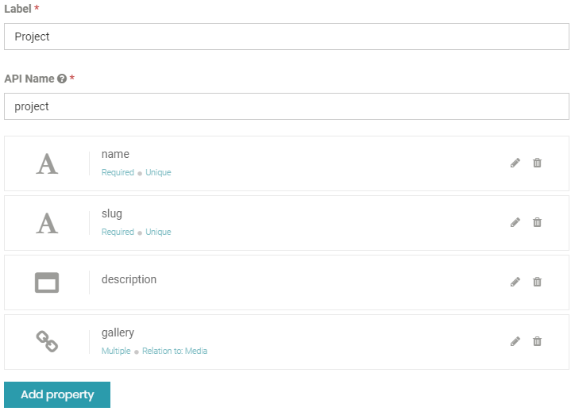{: .center .width75 .border}

Full schema for the Project type:

??? "Project JSON schema"
    ```json
    {
        "name": "project",
        "label": "Project",
        "schemaDefinition": {
            "type": "object",
            "allOf": [
                {
                    "$ref": "#/components/schemas/AbstractContentTypeSchemaDefinition"
                },
                {
                    "type": "object",
                    "properties": {
                        "name": {
                            "type": "string",
                            "minLength": 1
                        },
                        "slug": {
                            "type": "string",
                            "pattern": "^[a-zA-Z0-9-_]*$",
                            "minLength": 1
                        },
                        "gallery": {
                            "type": "array",
                            "items": {
                                "$ref": "#/components/schemas/DataSource"
                            },
                            "minItems": 0
                        },
                        "description": {
                            "type": "string"
                        },
                        "headerImage": {
                            "type": "array",
                            "items": {
                                "$ref": "#/components/schemas/DataSource"
                            },
                            "minItems": 0
                        },
                        "gallery_name": {
                            "type": "string"
                        },
                        "gallery_description": {
                            "type": "string"
                        }
                    }
                }
            ],
            "required": [
                "name",
                "slug"
            ],
            "additionalProperties": false
        },
        "metaDefinition": {
            "order": [
                "name",
                "slug",
                "description",
                "headerImage",
                "gallery_name",
                "gallery_description",
                "gallery"
            ],
            "propertiesConfig": {
                "name": {
                    "label": "Name",
                    "inputType": "text",
                    "unique": true,
                    "helpText": "",
                    "isTitlePart": true
                },
                "slug": {
                    "label": "Slug",
                    "inputType": "text",
                    "unique": true,
                    "helpText": ""
                },
                "gallery": {
                    "label": "Gallery",
                    "inputType": "datasource",
                    "unique": false,
                    "helpText": "",
                    "validation": {
                        "relationMultiple": true,
                        "relationContenttype": "_media"
                    }
                },
                "description": {
                    "label": "Description",
                    "inputType": "richtext",
                    "unique": false,
                    "helpText": ""
                },
                "headerImage": {
                    "label": "Header image",
                    "inputType": "datasource",
                    "unique": false,
                    "helpText": "",
                    "validation": {
                        "relationContenttype": "_media"
                    }
                },
                "gallery_name": {
                    "label": "Gallery name",
                    "inputType": "text",
                    "unique": false,
                    "helpText": ""
                },
                "gallery_description": {
                    "label": "Gallery description",
                    "inputType": "richtext",
                    "unique": false,
                    "helpText": ""
                }
            }
        }
    }
    ```
    { data-search-exclude }

Form generated for Project:

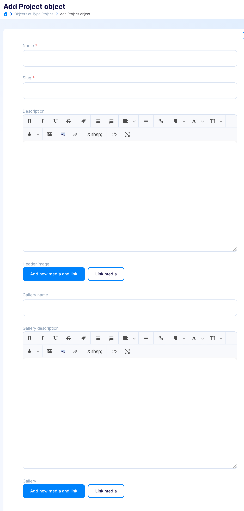{: .center .width75 .border}

Next.js starter for projects:

[GitHub](https://github.com/flotiq/flotiq-nextjs-portfolio-2){:target="_blank"}

[Working example](https://flotiq-nextjs-portfolio-2.netlify.app){:target="_blank"}

Documentation examples:

[Our API documentation](https://flotiq-apidoc-prod-data.s3.us-east-1.amazonaws.com/organization-codewave-a4c90d75d24898295a5a25c571682cef){:target="_blank"}

[](https://god.postman.co/run-collection/1fdce8e3ec5d3d793471#?env%5BFlotiq%20API%5D=W3sia2V5IjoiYmFzZVVybCIsInZhbHVlIjoiaHR0cHM6Ly9hcGkuZmxvdGlxLmNvbSIsImVuYWJsZWQiOnRydWV9XQ==){:target="_blank"}

[Postman documentation](https://documenter.getpostman.com/view/10599962/TVzYfZdG){:target="_blank"}

## Recipe

Type for storing recipes. It contains properties storing name, slug, description, ingredients, steps, cooking time, servings and image for the recipe:

| Field name  | Field type | Additional attributes                  | Comments                                         |
|-------------|------------|----------------------------------------|--------------------------------------------------|
| name        | Text       | Required, Unique, Part of object title | Name of your recipe                              |
| slug        | Text       | Required, Unique                       | URL of the recipe                                |
| image       | Relation   | Restrict to type: Media                | Main image of your recipe                        |
| description | Rich Text  | -                                      | The description of the recipe, with HTML content |
| ingredients | List       | described in the table below           | Detailed list of the ingredients                 |
| steps       | List       | described in the table below           | Detailed list of the steps                       |
| cookingTime | Text       | -                                      | Cooking time of the recipe                       |
| servings    | Number     | -                                      | Servings of the recipe                           |

Ingredients list properties description:

| Field name  | Field type | Additional attributes                                                              | Comments                                 |
|-------------|------------|------------------------------------------------------------------------------------|------------------------------------------|
| amount      | Number     | -                                                                                  | Amount of the product needed             |
| unit        | Select     | Options: "", g, kg, ml, pcs, tablespoon, teaspoon, ounce, pound, cup, clove, pinch | Unit of the amount of the product needed |
| product     | Text       | -                                                                                  | Name of the product                      |

Steps list properties description:

| Field name  | Field type | Additional attributes   | Comments                |
|-------------|------------|-------------------------|-------------------------|
| image       | Relation   | Restrict to type: Media | Image for the step      |
| step        | Textarea   | -                       | Description of the step |


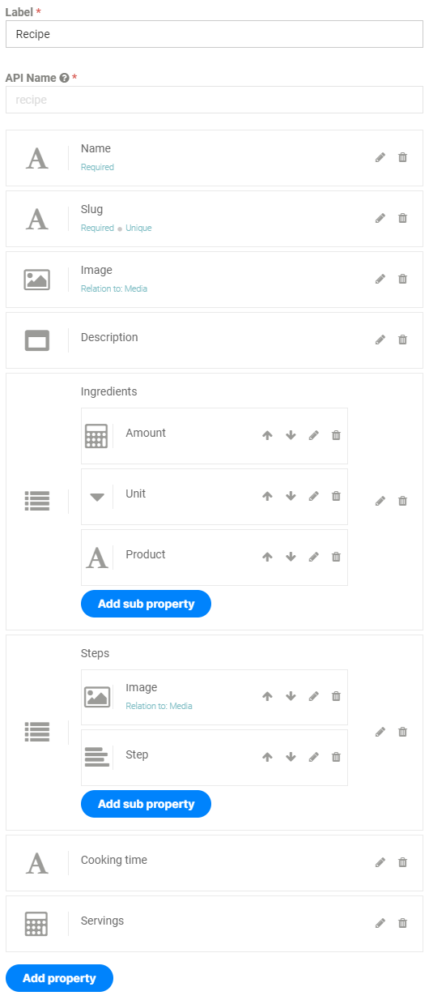{: .center .width75 .border}

Full schema for the Recipe type:

??? "Recipe JSON schema"
    ```json
    {
        "name": "recipe",
        "label": "Recipe",
        "schemaDefinition": {
            "type": "object",
            "allOf": [
                {
                    "$ref": "#/components/schemas/AbstractContentTypeSchemaDefinition"
                },
                {
                    "type": "object",
                    "properties": {
                        "name": {
                            "type": "string",
                            "minLength": 1
                        },
                        "slug": {
                            "type": "string",
                            "minLength": 1
                        },
                        "image": {
                            "type": "array",
                            "items": {
                                "$ref": "#/components/schemas/DataSource"
                            },
                            "minItems": 0
                        },
                        "steps": {
                            "type": "array",
                            "items": {
                                "type": "object",
                                "properties": {
                                    "step": {
                                        "type": "string"
                                    },
                                    "image": {
                                        "type": "array",
                                        "items": {
                                            "$ref": "#/components/schemas/DataSource"
                                        },
                                        "minItems": 0
                                    }
                                }
                            }
                        },
                        "servings": {
                            "type": "number"
                        },
                        "cookingTime": {
                            "type": "string"
                        },
                        "description": {
                            "type": "string"
                        },
                        "ingredients": {
                            "type": "array",
                            "items": {
                                "type": "object",
                                "properties": {
                                    "unit": {
                                        "type": "string"
                                    },
                                    "amount": {
                                        "type": "number"
                                    },
                                    "product": {
                                        "type": "string"
                                    }
                                }
                            }
                        }
                    }
                }
            ],
            "required": [
                "name",
                "slug"
            ],
            "additionalProperties": false
        },
        "metaDefinition": {
            "order": [
                "name",
                "slug",
                "image",
                "description",
                "ingredients",
                "steps",
                "cookingTime",
                "servings"
            ],
            "propertiesConfig": {
                "name": {
                    "label": "Name",
                    "unique": false,
                    "helpText": "",
                    "inputType": "text",
                    "isTitlePart": true
                },
                "slug": {
                    "label": "Slug",
                    "unique": true,
                    "helpText": "",
                    "inputType": "text"
                },
                "image": {
                    "label": "Image",
                    "unique": false,
                    "helpText": "",
                    "inputType": "datasource",
                    "validation": {
                        "relationContenttype": "_media"
                    }
                },
                "steps": {
                    "label": "Steps",
                    "items": {
                        "order": [
                            "image",
                            "step"
                        ],
                        "propertiesConfig": {
                            "step": {
                                "label": "Step",
                                "unique": false,
                                "helpText": "",
                                "inputType": "textarea"
                            },
                            "image": {
                                "label": "Image",
                                "unique": false,
                                "helpText": "",
                                "inputType": "datasource",
                                "validation": {
                                    "relationContenttype": "_media"
                                }
                            }
                        }
                    },
                    "unique": false,
                    "helpText": "",
                    "inputType": "object"
                },
                "servings": {
                    "label": "Servings",
                    "unique": false,
                    "helpText": "",
                    "inputType": "number"
                },
                "cookingTime": {
                    "label": "Cooking time",
                    "unique": false,
                    "helpText": "",
                    "inputType": "text"
                },
                "description": {
                    "label": "Description",
                    "unique": false,
                    "helpText": "",
                    "inputType": "richtext"
                },
                "ingredients": {
                    "label": "Ingredients",
                    "items": {
                        "order": [
                            "amount",
                            "unit",
                            "product"
                        ],
                        "propertiesConfig": {
                            "unit": {
                                "label": "Unit",
                                "unique": false,
                                "options": [
                                    "",
                                    "g",
                                    "kg",
                                    "ml",
                                    "pcs",
                                    "tablespoon",
                                    "teaspoon",
                                    "ounce",
                                    "pound",
                                    "cup",
                                    "clove",
                                    "pinch"
                                ],
                                "helpText": "",
                                "inputType": "select"
                            },
                            "amount": {
                                "label": "Amount",
                                "unique": false,
                                "helpText": "",
                                "inputType": "number"
                            },
                            "product": {
                                "label": "Product",
                                "unique": false,
                                "helpText": "",
                                "inputType": "text"
                            }
                        }
                    },
                    "unique": false,
                    "helpText": "",
                    "inputType": "object"
                }
            }
        }
    }
    ```
    { data-search-exclude }

Form generated for Recipe:

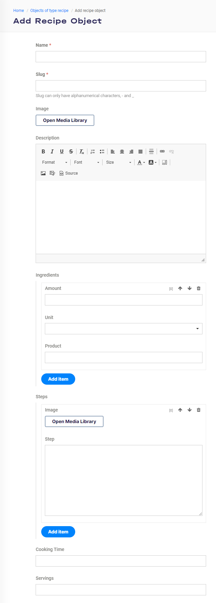{: .center .width75 .border}


Next.js starter for recipes:

[GitHub](https://github.com/flotiq/flotiq-nextjs-recipe-2){:target="_blank"}

[Working example](https://flotiq-nextjs-recipe-2.netlify.app/){:target="_blank"}

Documentation examples:

[Our API documentation](https://flotiq-apidoc-prod-data.s3.us-east-1.amazonaws.com/organization-codewave-4f0955f8eab6309f9e7c0e4120e9db92){:target="_blank"}

[](https://god.postman.co/run-collection/d65e364c6a0e41c2cc1e#?env%5BFlotiq%20API%5D=W3sia2V5IjoiYmFzZVVybCIsInZhbHVlIjoiaHR0cHM6Ly9hcGkuZmxvdGlxLmNvbSIsImVuYWJsZWQiOnRydWV9XQ==){:target="_blank"}

[Postman documentation](https://documenter.getpostman.com/view/10599962/TVzYfZdJ){:target="_blank"}

## Related docs

- [Panel overview](./index.md)
- [API access & scoped keys](../API/index.md)
- [Content Objects](../API/content-objects.md)
- [Webhooks overview](./webhooks/index.md)

