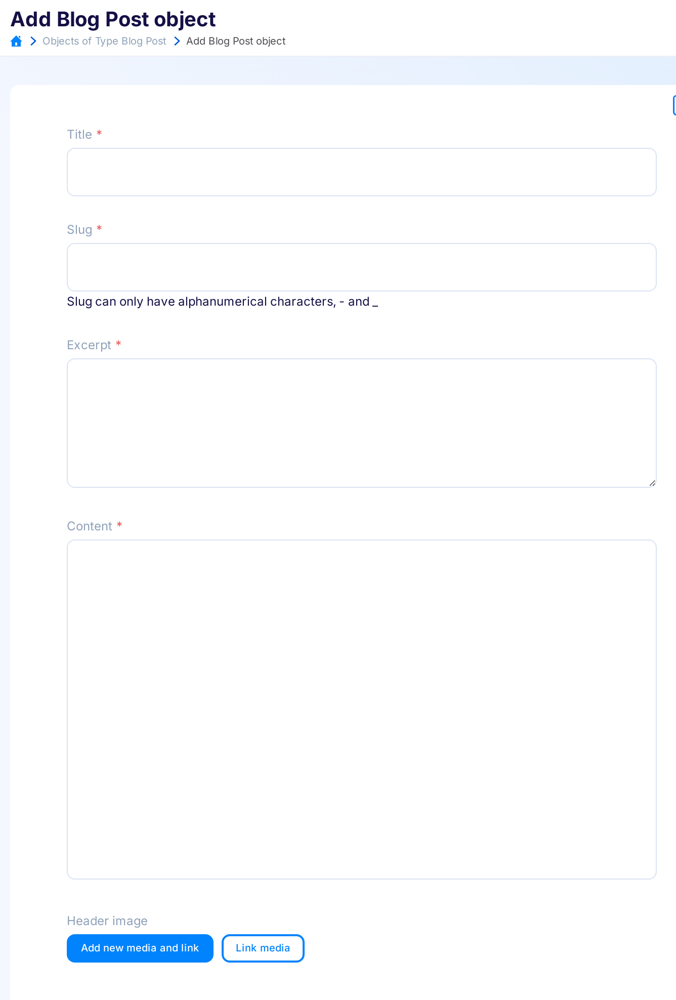
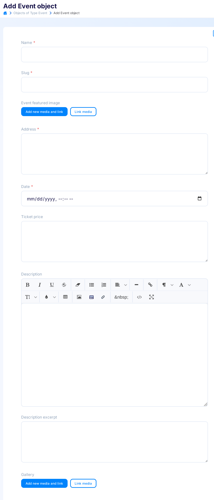
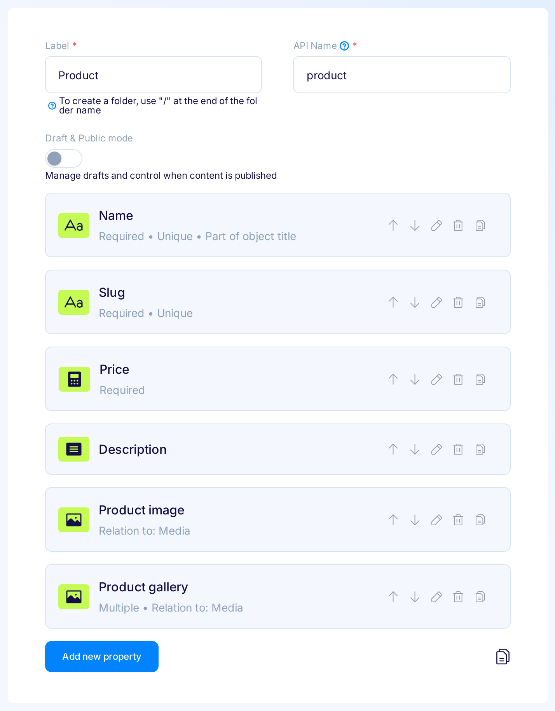
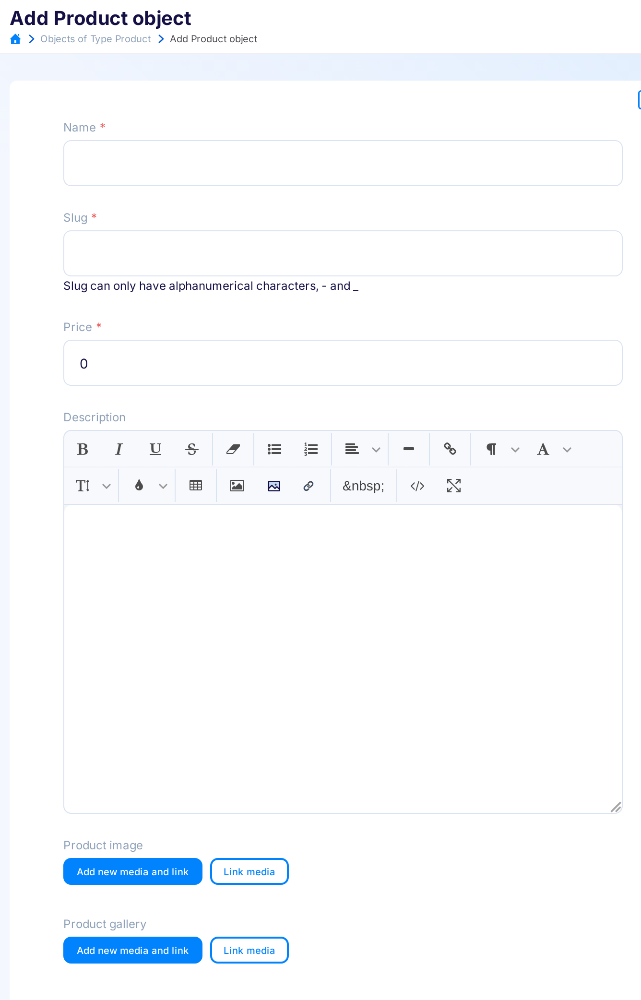
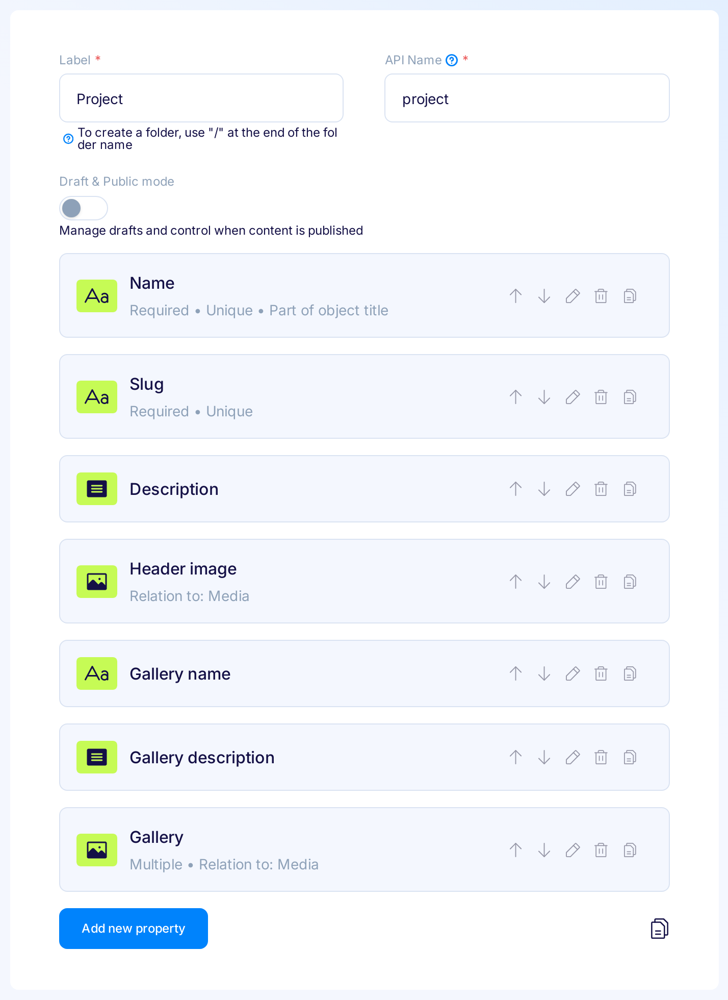
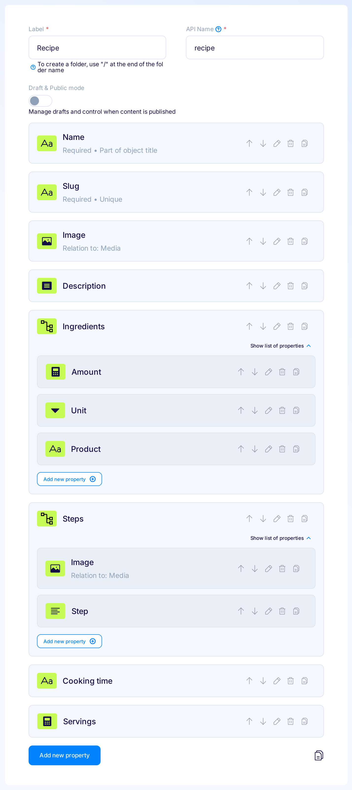
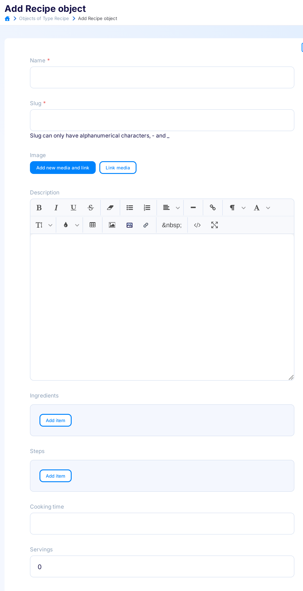

If you don't have any Content Type Definitions (CTD) yet, you see tiles with predefined CTDs from which you can choose your first one by clicking on the tile representing your chosen CTD.

{: .center .width75 .border}

Custom tile opens empty CTD.

If you already have at least one CTD, you can use the dropdown menu on the top right corner to add more predefined CTDs.

{: .center .border}

## Blog Post

Type for storing simple blog posts. It contains properties storing title, slug, content and images for the post:

| Field name  | Field type | Additional attributes          | Comments                           |
|-------------|------------|--------------------------------|------------------------------------|
| title       | Text       | Required, Part of object title | Title of your post                 |
| slug        | Text       | Required, Unique               | URL of the post                    |
| content     | Rich Text  | Required                       | The post itself, with HTML content |
| thumbnail   | Relation   | Restrict to type: Media        | Thumbnail image                    |
| headerImage | Relation   | Restrict to type: Media        | Main image of the post             |

{: .center .width75 .border}

Full schema for the Blog Post type:

??? "Blog Post json schema"
    ```json
    {
        "name": "blogpost",
        "label": "Blog Post",
        "schemaDefinition": {
            "type": "object",
            "allOf": [
                {
                    "$ref": "#/components/schemas/AbstractContentTypeSchemaDefinition"
                },
                {
                    "type": "object",
                    "properties": {
                        "slug": {
                            "type": "string",
                            "minLength": 1
                        },
                        "title": {
                            "type": "string",
                            "minLength": 1
                        },
                        "content": {
                            "type": "string",
                            "minLength": 1
                        },
                        "thumbnail": {
                            "type": "array",
                            "items": {
                                "$ref": "#/components/schemas/DataSource"
                            },
                            "minItems": 0
                        },
                        "headerImage": {
                            "type": "array",
                            "items": {
                                "$ref": "#/components/schemas/DataSource"
                            },
                            "minItems": 0
                        }
                    }
                }
            ],
            "required": [
                "title",
                "slug",
                "content"
            ],
            "additionalProperties": false
        },
        "metaDefinition": {
            "order": [
                "title",
                "slug",
                "content",
                "thumbnail",
                "headerImage"
            ],
            "propertiesConfig": {
                "slug": {
                    "label": "Slug",
                    "unique": true,
                    "helpText": "",
                    "inputType": "text"
                },
                "title": {
                    "label": "Title",
                    "unique": false,
                    "helpText": "",
                    "inputType": "text",
                    "isTitlePart": true
                },
                "content": {
                    "label": "Content",
                    "unique": false,
                    "helpText": "",
                    "inputType": "richtext"
                },
                "thumbnail": {
                    "label": "Thumbnail",
                    "unique": false,
                    "helpText": "",
                    "inputType": "datasource",
                    "validation": {
                        "relationMultiple": false,
                        "relationContenttype": "_media"
                    }
                },
                "headerImage": {
                    "label": "Header image",
                    "unique": false,
                    "helpText": "",
                    "inputType": "datasource",
                    "validation": {
                        "relationContenttype": "_media"
                    }
                }
            }
        }
    }
    ```

Form generated for Blog Post:

{: .center .width75 .border}

Gatsby starter for blog post:

[GitHub](https://github.com/flotiq/gatsby-starter-blog){:target="_blank"}

[Working example](https://flotiq-blog.herokuapp.com/){:target="_blank"}

## Event

Type for storing simple events. It contains name, slug, address, date, description and gallery for the event:

| Field name  | Field type | Additional attributes             | Comments                                              |
|-------------|------------|-----------------------------------|-------------------------------------------------------|
| name        | Text       | Required, Part of object title    | Name of your event                                    |
| slug        | Text       | Required, Unique                  | URL of the event                                      |
| address     | Textarea   | Required                          | Address of the event                                  |
| date        | Text       | Required                          | Date of the event, you can use any format of the date |
| description | Rich Text  | -                                 | Description of the event, with HTML content           |
| gallery     | Relation   | Restrict to type: Media, Multiple | Gallery for the event                                 |

{: .center .width75 .border}

Full schema for the Event type:

??? "Event json schema"
    ```json
    {
        "name": "event",
        "label": "Event",
        "schemaDefinition": {
            "type": "object",
            "allOf": [
                {
                    "$ref": "#/components/schemas/AbstractContentTypeSchemaDefinition"
                },
                {
                    "type": "object",
                    "properties": {
                        "name": {
                            "type": "string",
                            "minLength": 1
                        },
                        "slug": {
                            "type": "string",
                            "minLength": 1
                        },
                        "address": {
                            "type": "string",
                            "minLength": 1
                        },
                        "date": {
                            "type": "string",
                            "minLength": 1
                        },
                        "description": {
                            "type": "string"
                        },
                        "gallery": {
                            "type": "array",
                            "items": {
                                "$ref": "#/components/schemas/DataSource"
                            },
                            "minItems": 0
                        }
                    }
                }
            ],
            "required": [
                "name",
                "slug",
                "address",
                "date"
            ],
            "additionalProperties": false
        },
        "metaDefinition": {
            "propertiesConfig": {
                "name": {
                    "label": "Name",
                    "inputType": "text",
                    "unique": false,
                    "isTitlePart": true
                },
                "slug": {
                    "label": "Slug",
                    "inputType": "text",
                    "unique": true
                },
                "address": {
                    "label": "Address",
                    "inputType": "textarea",
                    "unique": false
                },
                "date": {
                    "label": "Date",
                    "inputType": "text",
                    "unique": false
                },
                "description": {
                    "label": "Description",
                    "inputType": "richtext",
                    "unique": false
                },
                "gallery": {
                    "label": "Gallery",
                    "inputType": "datasource",
                    "unique": false,
                    "validation": {
                        "relationContenttype": "_media",
                        "relationMultiple": true
                    }
                }
            },
            "order": [
                "name",
                "slug",
                "address",
                "date",
                "description",
                "gallery"
            ]
        }
    }
    ```

Form generated for Event:

{: .center .width75 .border}


Gatsby starter for event calendar:

[GitHub](https://github.com/flotiq/gatsby-starter-event-calendar){:target="_blank"}

[Working example](https://flotiq-starter-for-events-cal.herokuapp.com/){:target="_blank"}

## Product

Type for storing simple products. It contains properties storing name, slug, price, description and images for the product:

| Field name     | Field type | Additional attributes                  | Comments                                          |
|----------------|------------|----------------------------------------|---------------------------------------------------|
| name           | Text       | Required, Unique, Part of object title | Name of your product                              |
| slug           | Text       | Required, Unique                       | URL of the product                                |
| price          | Number     | Required                               | Price of the product                              |
| description    | Rich Text  | -                                      | The description of the product, with HTML content |
| productImage   | Relation   | Restrict to type: Media                | Main image                                        |
| productGallery | Relation   | Restrict to type: Media, Multiple      | Gallery for the product                           |

{: .center .width75 .border}

Full schema for the Product type:

??? "Product json schema"
    ```json
    {
        "name": "product",
        "label": "Product",
        "schemaDefinition": {
            "type": "object",
            "allOf": [
                {
                    "$ref": "#/components/schemas/AbstractContentTypeSchemaDefinition"
                },
                {
                    "type": "object",
                    "properties": {
                        "name": {
                            "type": "string",
                            "minLength": 1
                        },
                        "slug": {
                            "type": "string",
                            "minLength": 1
                        },
                        "price": {
                            "type": "number",
                            "minLength": 1
                        },
                        "description": {
                            "type": "string"
                        },
                        "productImage": {
                            "type": "array",
                            "items": {
                                "$ref": "#/components/schemas/DataSource"
                            },
                            "minItems": 0
                        },
                        "productGallery": {
                            "type": "array",
                            "items": {
                                "$ref": "#/components/schemas/DataSource"
                            },
                            "minItems": 0
                        }
                    }
                }
            ],
            "required": [
                "name",
                "slug",
                "price"
            ],
            "additionalProperties": false
        },
        "metaDefinition": {
            "propertiesConfig": {
                "name": {
                    "label": "Name",
                    "inputType": "text",
                    "unique": true,
                    "isTitlePart": true
                },
                "slug": {
                    "label": "Slug",
                    "inputType": "text",
                    "unique": true
                },
                "price": {
                    "label": "Price",
                    "inputType": "number",
                    "unique": false
                },
                "description": {
                    "label": "Description",
                    "inputType": "richtext",
                    "unique": false
                },
                "productImage": {
                    "label": "Product image",
                    "inputType": "datasource",
                    "unique": false,
                    "validation": {
                        "relationContenttype": "_media"
                    }
                },
                "productGallery": {
                    "label": "Product gallery",
                    "inputType": "datasource",
                    "unique": false,
                    "validation": {
                        "relationMultiple": true,
                        "relationContenttype": "_media"
                    }
                }
            },
            "order": [
                "name",
                "slug",
                "price",
                "description",
                "productImage",
                "productGallery"
            ]
        }
    }
    ```

Form generated for Product:

{: .center .width75 .border}


Gatsby starter for products:

[GitHub](https://github.com/flotiq/gatsby-starter-products){:target="_blank"}

[Working example](https://flotiq-starter-products.herokuapp.com/){:target="_blank"}

## Project

Type for storing simple project portfolio entries. It contains properties storing name, slug, description and images for the project:

| Field name  | Field type | Additional attributes                  | Comments                                          |
|-------------|------------|----------------------------------------|---------------------------------------------------|
| name        | Text       | Required, Unique, Part of object title | Name of your project                              |
| slug        | Text       | Required, Unique                       | URL of the project                                |
| description | Rich Text  | -                                      | The description of the project, with HTML content |
| gallery     | Relation   | Restrict to type: Media, Multiple      | Gallery for the project                           |

{: .center .width75 .border}

Gatsby starter for projects:

Full schema for the Project type:

??? "Project json schema"
    ```json
    {
        "name": "project",
        "label": "Project",
        "schemaDefinition": {
            "type": "object",
            "allOf": [
                {
                    "$ref": "#/components/schemas/AbstractContentTypeSchemaDefinition"
                },
                {
                    "type": "object",
                    "properties": {
                        "name": {
                            "type": "string",
                            "minLength": 1
                        },
                        "slug": {
                            "type": "string",
                            "minLength": 1
                        },
                        "description": {
                            "type": "string"
                        },
                        "gallery": {
                            "type": "array",
                            "items": {
                                "$ref": "#/components/schemas/DataSource"
                            },
                            "minItems": 0
                        }
                    }
                }
            ],
            "required": [
                "name",
                "slug"
            ],
            "additionalProperties": false
        },
        "metaDefinition": {
            "propertiesConfig": {
                "name": {
                    "label": "Name",
                    "inputType": "text",
                    "unique": true,
                    "isTitlePart": true
                },
                "slug": {
                    "label": "Slug",
                    "inputType": "text",
                    "unique": true
                },
                "description": {
                    "label": "Description",
                    "inputType": "richtext",
                    "unique": false
                },
                "gallery": {
                    "label": "Gallery",
                    "inputType": "datasource",
                    "unique": false,
                    "validation": {
                        "relationContenttype": "_media",
                        "relationMultiple": true
                    }
                }
            },
            "order": [
                "name",
                "slug",
                "description",
                "gallery"
            ]
        }
    }
    ```

Form generated for Project:

{: .center .width75 .border}


[GitHub](https://github.com/flotiq/gatsby-starter-projects){:target="_blank"}

[Working example](https://flotiq-starter-for-projects.herokuapp.com/){:target="_blank"}

## Recipe

Type for storing recipes. It contains properties storing name, slug, description, ingredients, steps, cooking time, servings and image for the recipe:

| Field name  | Field type | Additional attributes                  | Comments                                         |
|-------------|------------|----------------------------------------|--------------------------------------------------|
| name        | Text       | Required, Unique, Part of object title | Name of your recipe                              |
| slug        | Text       | Required, Unique                       | URL of the recipe                                |
| image       | Relation   | Restrict to type: Media                | Main image of your recipe                        |
| description | Rich Text  | -                                      | The description of the recipe, with HTML content |
| ingredients | List       | described in the table below           | Detailed list of the ingredients                 |
| steps       | List       | described in the table below           | Detailed list of the steps                       |
| cookingTime | Text       | -                                      | Cooking time of the recipe                       |
| servings    | Number     | -                                      | Servings of the recipe                           |

Ingredients list properties description:

| Field name  | Field type | Additional attributes                                                              | Comments                                 |
|-------------|------------|------------------------------------------------------------------------------------|------------------------------------------|
| amount      | Number     | -                                                                                  | Amount of the product needed             |
| unit        | Select     | Options: "", g, kg, ml, pcs, tablespoon, teaspoon, ounce, pound, cup, clove, pinch | Unit of the amount of the product needed |
| product     | Text       | -                                                                                  | Name of the product                      |

Steps list properties description:

| Field name  | Field type | Additional attributes   | Comments                |
|-------------|------------|-------------------------|-------------------------|
| image       | Relation   | Restrict to type: Media | Image for the step      |
| step        | Textarea   | -                       | Description of the step |


{: .center .width75 .border}

Full schema for the Recipe type:

??? "Recipe json schema"
    ```json
    {
        "name": "recipe",
        "label": "Recipe",
        "schemaDefinition": {
            "type": "object",
            "allOf": [
                {
                    "$ref": "#/components/schemas/AbstractContentTypeSchemaDefinition"
                },
                {
                    "type": "object",
                    "properties": {
                        "name": {
                            "type": "string",
                            "minLength": 1
                        },
                        "slug": {
                            "type": "string",
                            "minLength": 1
                        },
                        "image": {
                            "type": "array",
                            "items": {
                                "$ref": "#/components/schemas/DataSource"
                            },
                            "minItems": 0
                        },
                        "steps": {
                            "type": "array",
                            "items": {
                                "type": "object",
                                "properties": {
                                    "step": {
                                        "type": "string"
                                    },
                                    "image": {
                                        "type": "array",
                                        "items": {
                                            "$ref": "#/components/schemas/DataSource"
                                        },
                                        "minItems": 0
                                    }
                                }
                            }
                        },
                        "servings": {
                            "type": "number"
                        },
                        "cookingTime": {
                            "type": "string"
                        },
                        "description": {
                            "type": "string"
                        },
                        "ingredients": {
                            "type": "array",
                            "items": {
                                "type": "object",
                                "properties": {
                                    "unit": {
                                        "type": "string"
                                    },
                                    "amount": {
                                        "type": "number"
                                    },
                                    "product": {
                                        "type": "string"
                                    }
                                }
                            }
                        }
                    }
                }
            ],
            "required": [
                "name",
                "slug"
            ],
            "additionalProperties": false
        },
        "metaDefinition": {
            "order": [
                "name",
                "slug",
                "image",
                "description",
                "ingredients",
                "steps",
                "cookingTime",
                "servings"
            ],
            "propertiesConfig": {
                "name": {
                    "label": "Name",
                    "unique": false,
                    "helpText": "",
                    "inputType": "text",
                    "isTitlePart": true
                },
                "slug": {
                    "label": "Slug",
                    "unique": true,
                    "helpText": "",
                    "inputType": "text"
                },
                "image": {
                    "label": "Image",
                    "unique": false,
                    "helpText": "",
                    "inputType": "datasource",
                    "validation": {
                        "relationContenttype": "_media"
                    }
                },
                "steps": {
                    "label": "Steps",
                    "items": {
                        "order": [
                            "image",
                            "step"
                        ],
                        "propertiesConfig": {
                            "step": {
                                "label": "Step",
                                "unique": false,
                                "helpText": "",
                                "inputType": "textarea"
                            },
                            "image": {
                                "label": "Image",
                                "unique": false,
                                "helpText": "",
                                "inputType": "datasource",
                                "validation": {
                                    "relationContenttype": "_media"
                                }
                            }
                        }
                    },
                    "unique": false,
                    "helpText": "",
                    "inputType": "object"
                },
                "servings": {
                    "label": "Servings",
                    "unique": false,
                    "helpText": "",
                    "inputType": "number"
                },
                "cookingTime": {
                    "label": "Cooking time",
                    "unique": false,
                    "helpText": "",
                    "inputType": "text"
                },
                "description": {
                    "label": "Description",
                    "unique": false,
                    "helpText": "",
                    "inputType": "richtext"
                },
                "ingredients": {
                    "label": "Ingredients",
                    "items": {
                        "order": [
                            "amount",
                            "unit",
                            "product"
                        ],
                        "propertiesConfig": {
                            "unit": {
                                "label": "Unit",
                                "unique": false,
                                "options": [
                                    "",
                                    "g",
                                    "kg",
                                    "ml",
                                    "pcs",
                                    "tablespoon",
                                    "teaspoon",
                                    "ounce",
                                    "pound",
                                    "cup",
                                    "clove",
                                    "pinch"
                                ],
                                "helpText": "",
                                "inputType": "select"
                            },
                            "amount": {
                                "label": "Amount",
                                "unique": false,
                                "helpText": "",
                                "inputType": "number"
                            },
                            "product": {
                                "label": "Product",
                                "unique": false,
                                "helpText": "",
                                "inputType": "text"
                            }
                        }
                    },
                    "unique": false,
                    "helpText": "",
                    "inputType": "object"
                }
            }
        }
    }
    ```

Form generated for Recipe:

{: .center .width75 .border}


Gatsby starter for recipes:

[GitHub](https://github.com/flotiq/gatsby-starter-recipes){:target="_blank"}

[Working example](https://flotiq-starter-recipes.herokuapp.com/){:target="_blank"}
