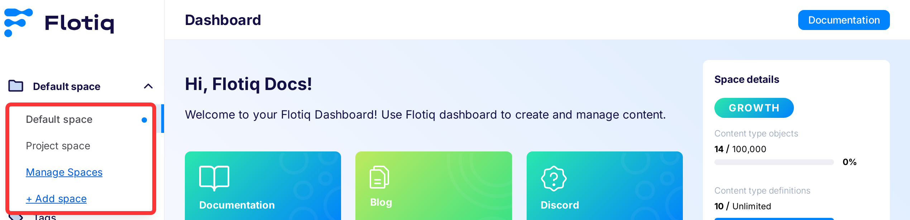
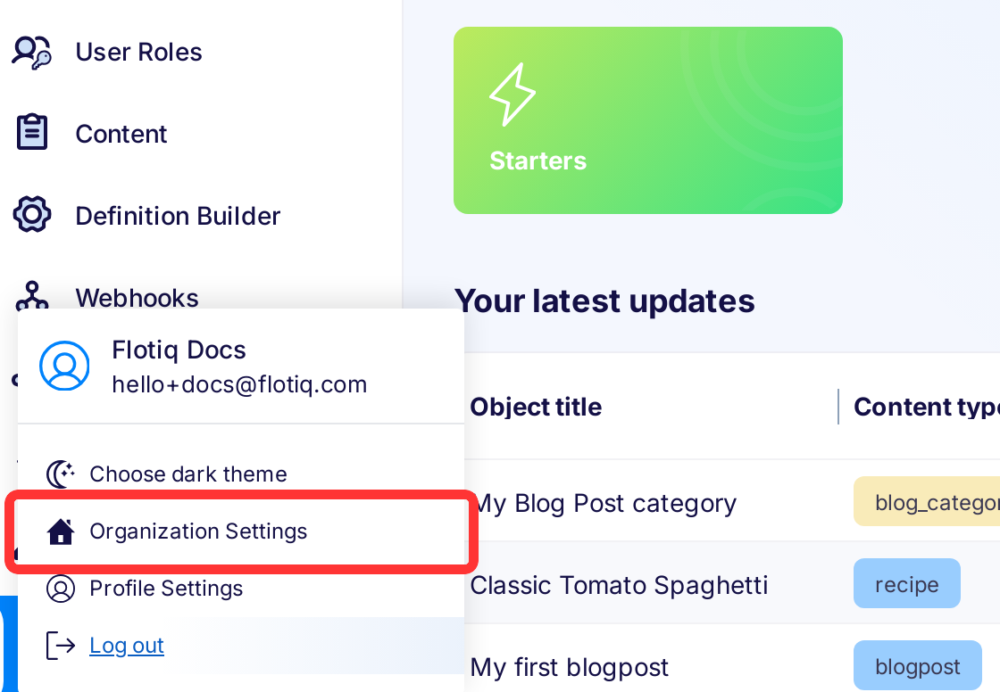
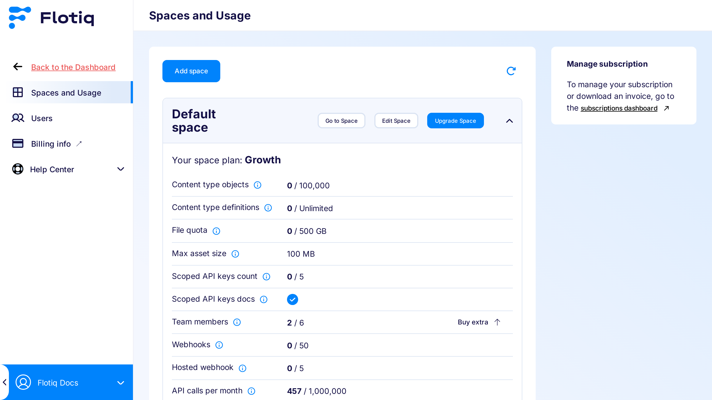
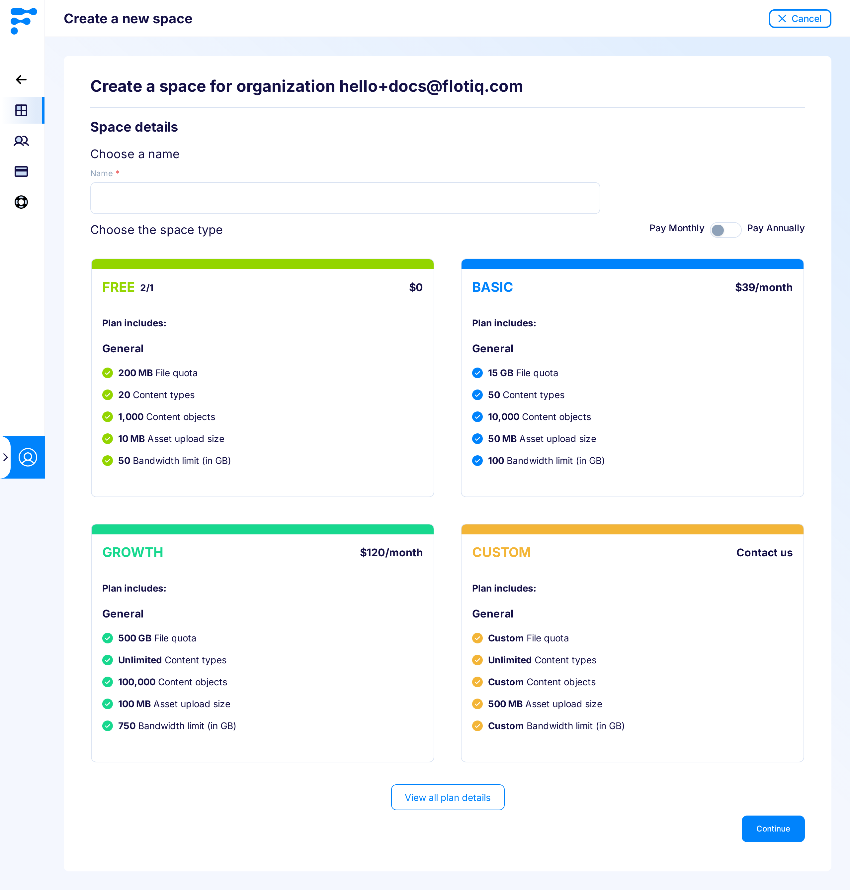
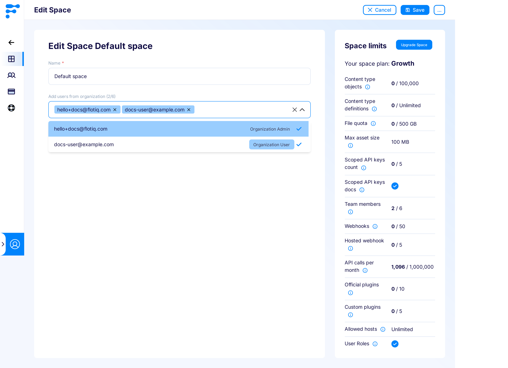
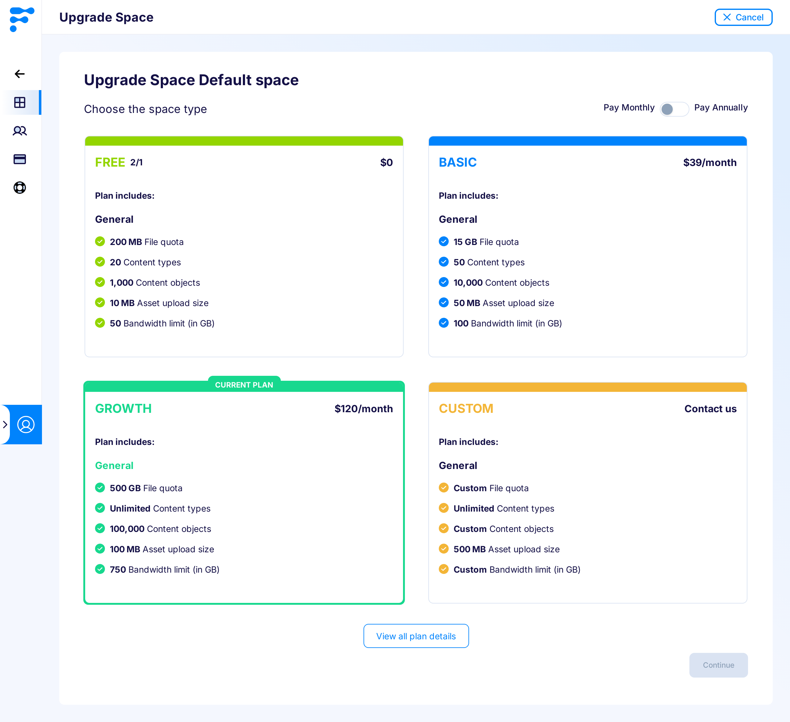
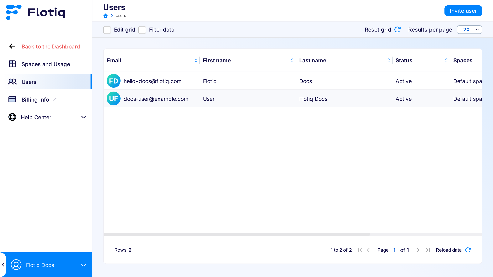
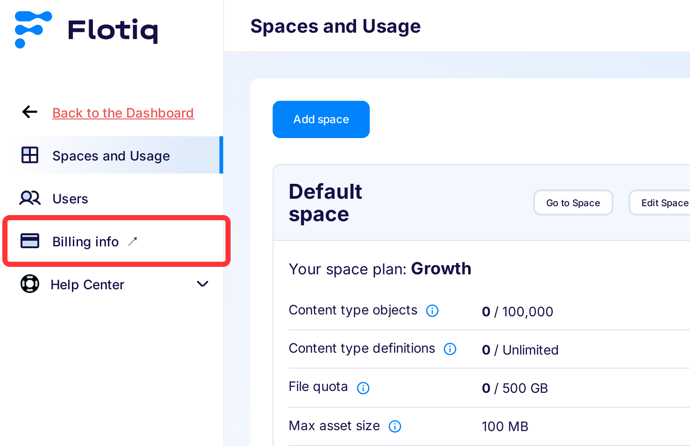

---
tags:
  - Administrator
  - Developer
---

title: Spaces and Organization
description: How to manage Spaces in Flotiq.

## What is a Space?

A Space is a workspace that groups data in terms of a single, separate project.
Content does not overlap between Spaces.
This means that a user assigned to a particular Space will only see content from that Space.

Key Characteristics of a Space:

* **Content Isolation:** Content within a Space does not overlap with other Spaces, ensuring distinct boundaries.
* **Individual Usage Limits:** Each Space maintains its own separate usage limits.
* **Visibility Restrictions:** Users assigned to a particular Space will only have access to content within that Space, enhancing security and relevance of information.

Space groups content of the Organization such as: `Content Objects`, `Content Type Definitions`, `Media`, `API keys`, `Plugins`, `Webhooks`, and `Users`.

!!! Example
    This is what the content of an example Space for the "News Site" project might look like. Notice which elements belong to this specific Space:

    - **Name**: News Site Space
    - **Plan**: << plan_names.paid_2 >>
    - **Content Type Definitions**: Media, News, Category, Author, Comments
    - **API Keys**: ReadOnly, ReadWrite, ReadNews, PostComment
    - **Enabled Plugins**: Netlify Build
    - **Webhooks**: OnNewsUpdate
    - **Users**: admin@flotiq.com, redactor@flotiq.com

Each Space has its own separate payment plan, meaning that **usage limits are calculated separately for each Space**. This ensures clarity in billing and resource management for different projects.

## What is an Organization?

An Organization is essentially a collection of Spaces. Within an Organization, the administrator has several key responsibilities:

- **Manage Spaces:** Administrators can oversee various Spaces, tailoring each to meet specific project needs.
- **Assign Plans and Control Usage:** Administrators are responsible for assigning specific payment plans to each Space and monitoring usage limits.
- **User Management:** Administrators handle the overall user management within the Organization, including assigning users to appropriate Spaces.

Roles within an Organization:

- **Organization Admin:** Has full control over management privileges, including the ability to manage Spaces and users.
- **Organization User:** Restricted to operating within Spaces specifically assigned by an Administrator, focusing solely on content related to that Space.

## Navigating Through Spaces

Every user with access to one or more Spaces will see a Spaces selector above the main application menu.

{: .border}

Depending on the selected Space, the context of the application changes - the contents displayed by the Dashboard are relevant to the chosen Space.

## Managing Spaces

!!! note
    This feature is available to users with the role of `Organization Admin`.

To manage your Spaces, navigate to the `Organization Settings` section of the application.

{: .width25 .border .center}

### List spaces

The `Spaces and Usage` list provides essential details about your Spaces within the Organization. 

This overview allows you to:

* View current usage of resources for each Space.
* Access and modify the settings of a Space (Edit Space).
* Change the payment plan associated with a Space (Upgrade Space).
* Access the subscription dashboard where you can review billing documents (Manage subscription panel).

{: .border}

### Add Space

In the Space addition view, an Organization Administrator can assign a name to the Space and select the usage limits that will be available for the Space. 
If a paid option is selected, the Administrator will be redirected to the payment view.

{: .border}

### Edit Space

In the Space editing view, an Organization Administrator can change the name of the Space, manage users within the Space, and view the limits for the given Space.

{: .border}

### Upgrade Space

To change the plan for a Space, the Administrator can select the “Upgrade Space” option from the Spaces list.

{: .border}

When the administrator changes the plan:

* **From free to paid** - the user will be redirected to the payment screen.
* **From paid to another paid plan** - a confirmation will be displayed, and the details of the billing will be available in the `Manage Subscription` section on the Spaces list. Billing adjustment will occur at the end of the billing period.
* **From paid to free** - the subscription cancellation will be scheduled to coincide with the end of the current billing period.

### Migrating spaces

In Flotiq you can migrate your data between spaces using [Flotiq CLI import and export commands](../CLI/migrating-data-between-spaces.md). Using data migration between spaces allows you for easily setting up testing and production environments for your project, with one space being dedicated to testing and the second for running production.

## Manage Users in Organization

Administrators can manage users outside the Space context.
This allows Administrators to have an overview of all users within the Organization.

Users can be added independently of Spaces, without being assigned to a specific Space.

If a user is assigned to a Space, there are ways to manage their access to space content. If you wish to restrict user actions, consider adding a [Space Role](./user-roles.md) for the user. Users without any assigned role will have unrestricted access to all resources.

To display the user list, navigate to the `Users` tab in the Organization management view.

{: .border}

## Managing subscriptions

After each billing cycle an invoice is generated and available for download for Administrators.

To manage subscriptions or download invoices go to organization settings and open `Billing info` page.

{: .border}
