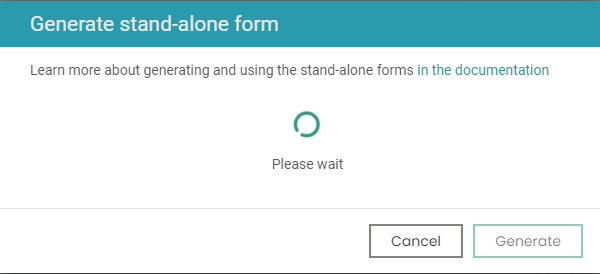
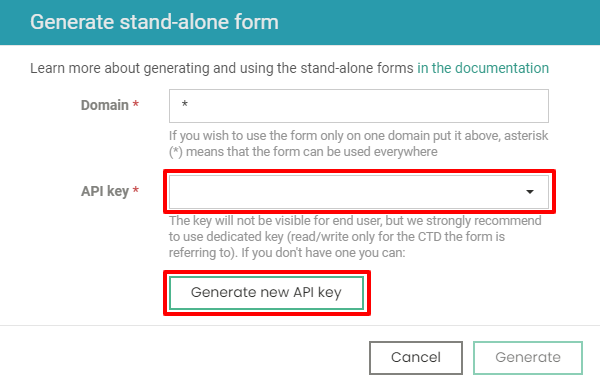

title: Stand-alone forms | Flotiq documentation
description: Put your forms to work using our automated generation and lambda handling.

# Stand-alone Forms

You can generate a form to put on any page you need to. 
The form will be kept up to date with changes made in the definition **without form regeneration**. 
Form generation is available in the Content Type Definition edit form. 
You can generate the stand-alone form for any of your definitions, 
but now you can only use one form on a page at the same time.

To generate new stand-alone form click `Generate` button:

{: .center .width75 .border}

It will display modal where you will be able to put all necessary information, 
the form will be available after a few milliseconds.

{: .center .border}

There are two required fields in the generation form, one is `Domain` with `*` as a default value, you can leave it 
as it, and the domain will not be validated on form post request, but if you know that you will be using the form 
only on one page, it is good practice, to put its domain in that field. The second one is `API key` in which you can 
choose previously created API key or generate the new one with read and write access to the type you generate the form for. 
If you choose to use `Generate new API key` button, it will be selected automatically. 
Your key is secure because it won't be visible for the end-user; it will be only used by the lambdas generated by the 
stand-alone form generator. The lambda functions are stored on the Flotiq AWS account, and only visible for the Flotiq 
development team for monitoring purposes.

{: .center .border}

When domain and API key are in place, you can click on the `Generate` button to generate needed lambda functions.

{: .center .border}

When all the scripts are generated, you will see HTML code you need to put on your page to start using your stand-alone form.
Put the first part when the form should be displayed, and the second one on the end of your page 
(just before closing body tag), you should do that to not block page load.

{: .center .border}

!!! note
    Please be advised that as for now you can add only one type of the form on a page. 
    If you wish to use more than one form, you have to put them on different sub-pages.

You can see working example below:

<flotiq-form></flotiq-form>

You can use the form to tell us what you think about our stand-alone forms :)
